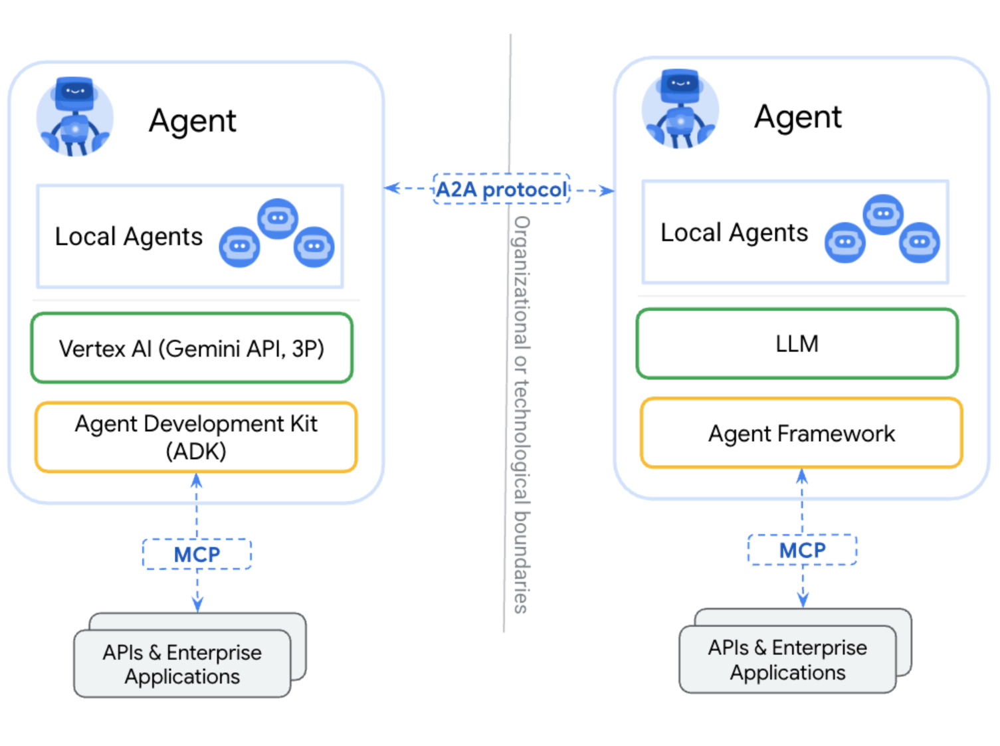

+++
author = "Lucas Huang"
date = '2025-06-23T09:40:00+08:00'
title = "One article to fully understand Agent, Function Calling, MCP, and A2A"
categories = [
    "AI"
]
tags = [
    "MCP",
    "Function Calling",
    "Agent",
    "A2A",
    
]
image = "cover.png"
draft = false
+++
This article will start from the basic concepts and progressively explain Agent, Function Calling, MCP (Model Context Protocol), and A2A (Agent-to-Agent), to help readers understand the knowledge framework of LLM applications.

> This article is summarized based on official documentation and several articles online, aiming to give readers who are unfamiliar with these concepts a general idea after reading. Experts may skip, or you’re welcome to help check for errors, haha~
>
> If you find any mistakes while reading, please leave a comment to correct them, thank you~

This article will start from the basic concepts and progressively explain Agent, Function Calling, MCP (Model Context Protocol), and A2A (Agent-to-Agent), to help readers understand the knowledge framework of LLM applications.

> This article is summarized based on official documentation and several articles online, aiming to give readers who are unfamiliar with these concepts a general idea after reading. Experts may skip, or you’re welcome to help check for errors, haha~  
>  
> If you find any mistakes while reading, please leave a comment to correct them, thank you~

## Agent
### What is an Agent?
**Agent** is an entity capable of **perceiving its environment, making autonomous decisions, and performing actions**. In large language model (LLM) scenarios, Agents usually leverage LLMs as core reasoning engines, and integrate external tools, knowledge bases, and multimodal capabilities to accomplish complex tasks.

> At its core, it is about building an intelligent system with a "Think-Act-Observe" (ReAct) loop.

The core abilities:

*   **Reasoning**: Analyze user intent and plan task steps with an LLM.  
*   **Tool Invocation**: Call external APIs, databases, code, etc.  
*   **Memory & Learning**: Retain historical interaction records and optimize long-term behavior.

In a nutshell: **An Agent is an entity (tool, assistant) that, based on an LLM and supported by external tools, can accomplish complex tasks.**

### Why do we need Agents?

**The two major shortcomings of LLMs**: Large models are limited by computational resources and training time, resulting in outdated information, and their responses based on statistical patterns lack true logical reasoning.

1) **No up-to-date information**: Training large models requires extensive computational resources and time, so their knowledge is often trained on datasets up to a specific point. **For example, GPT-3.5 and GPT-4's knowledge cutoff is September 2021.** This means they cannot provide new information or events after that point. To stay up-to-date, models need to be retrained periodically, but this is expensive and time-consuming—making it hard for models to stay current.
2) **No real logic**: **The text and answers generated by large models are mainly based on statistical patterns in the training data, not strict logical reasoning or formal proofs.** As a result, when dealing with complex problems or those requiring in-depth logical reasoning, they may produce seemingly plausible but actually inaccurate answers. In addition, since LLMs generate text by predicting the next word given context, they may be affected by biases and errors in the training data, weakening logical rigor.

Therefore, to complete more complex tasks, we need to combine LLMs with external tools—this is realized through the concept of an Agent.

### Agent Workflow
For example 🌰: There is a simple task—I want to check the weather in Chongqing.

For an LLM, without current knowledge, it naturally doesn't know today's weather. So we need to use an external tool, such as calling a weather API, to accomplish this task.

The workflow is roughly as follows:


1) User sends a task to the Agent  
2) Agent forwards it to the LLM, along with the configured tools information  
3) LLM, based on the question and tools info, identifies which tool to use in response and what parameters are required, then returns this info to the Agent  
4) Agent calls the specific tool according to the information returned in (3)  
5) The tool returns the result to the Agent  
6) Agent sends the result back to the LLM  
7) LLM, considering the context, integrates the information and generates the final result, returning it to the Agent  
8) Agent returns the result to the user  

From this simple scenario, you can see that the Agent appears to perform two main tasks:

1) Relays between User and LLM  
2) Cooperates with the LLM to call external tools

Of course, a real-world Agent is usually more complex.

### How does the LLM call external tools?
After seeing the demo above, you might wonder: **How does the LLM know which external tool to use to achieve a certain function, and how to pass the necessary parameters?**

Actually, the LLM doesn't know—so we need to inform it about external tools, **for example, by adding tool descriptions in the System Prompt**.

This way, the LLM is aware of which tools it can call, and can independently judge based on the user's query whether an external tool is needed; if so, it extracts parameters from the question and returns them in a fixed format (usually JSON).

For example, the following System Prompt could be used:

```json
You are an intelligent assistant able to select and call suitable external tools upon user requests. The following is your toolkit and invocation specifications: 
[
  {
    "name": "get_weather",
    "description": "Query real-time weather for a designated city",
    "invoke_conditions": [
      "weather",
      "temperature",
      "precipitation",
      "wind"
    ],
    "parameters": [
      {
        "name": "city",
        "type": "string",
        "required": true,
        "extract_rule": "Extract the explicit city name from the query",
        "examples": [
          "Beijing",
          "Shanghai"
        ]
      },
      {
        "name": "date",
        "type": "date",
        "required": false,
        "default": "today",
        "format": "YYYY-MM-DD",
        "examples": [
          "2024-08-15"
        ]
      }
    ]
  }
]
You must strictly return tool call results in the following JSON format, and do not return any extra information:
{
  "tool": "tool_name",  // Must be exactly the same as name in the toolkit
  "params": {
    "parameter1": "value1",   // Parameter names match the tool definition
    "parameter2": "value2"
  }
}
```

Now, suppose we ask:

```
Help me check the weather in Chongqing.
```

The LLM's thought process might be:

```
Okay, the user wants me to check the weather in Chongqing. First, I need to check whether the user's question contains the keyword that triggers a tool. According to the toolkit definition, get_weather can be triggered by "weather," "temperature," "precipitation," "wind," etc. The question explicitly mentions "weather," so invocation is appropriate.
Next, I extract parameters. The tool definition requires a city name (city, required) and optionally a date (date, default is today). The user provided "Chongqing" as the city, so city = "Chongqing". No specific date was mentioned, so use the default ('today').
Double-check the parameters: The user did not specify a date, so date stays default. The city name is "Chongqing"; per the tool's examples, both "Shanghai" (short form) and "Beijing" (full form) are allowed, so "Chongqing" is acceptable.
Finally, I generate the JSON response exactly as requested, with correct tool name and parameters and no extra information.
```

Final return:

```json
{
  "tool": "get_weather",
  "params": {
    "city": "Chongqing"
  }
}
```

As shown, the model can locate the correct tool, parse parameters from the question, and return a JSON-formatted call request. The Agent can then use this JSON info to actually call the weather API.

> Note: Depending on model capability, even with instructions to output JSON, there could be syntax errors, escape issues, or extraneous text.

## Function Calling
### What is Function Calling?
> [https://platform.openai.com/docs/guides/function-calling](https://platform.openai.com/docs/guides/function-calling)

Function Calling was released by OpenAI in June 2023, initially for GPT-3.5 and GPT-4 models, allowing LLMs to connect with external tools, turning natural language into API calls. This addresses the issue of models’ knowledge no longer updating after training.

OpenAI docs describe it:

> Function calling provides a powerful and flexible way for OpenAI models to interface with your code or external services.

**Function Calling is a mechanism specific to LLMs allowing them to call external functions or APIs; it enables models to generate structured JSON output to invoke predefined functions or APIs in external systems.**

By **enabling calls to external tools and services**, Function Calling helps address **real-time issues** such as "what's the temperature today," which LLMs can't answer from static training data.

In short: **Function Calling is a mechanism allowing the model to "call" predefined functions in external systems by generating structured JSON output.**

> Note: "Call" is in quotes—**Function Calling does not grant LLMs the ability to actually execute external code.** Instead, it enables LLMs, given a list of functions, prompts, etc., to select the correct function and produce structured output including the function name and input parameters for external use.

### Why is Function Calling necessary?
**Actually, previously, we could inject tools information in the System Prompt to achieve something similar to Function Calling**—but this is less stable, as models might not always return the correct format (depending on model skill).

*   Function Calling is a capability granted by vendors (e.g., OpenAI, Anthropic) via **fine-tuning or architectural improvements**, letting models output structured instructions (e.g., JSON), with precise matching to predefined functions, not dependent on natural language output.  
*   Function Calling itself is **not standardized**, with differing implementations by each vendor (e.g., OpenAI’s `tools` parameter, Claude’s `tool_use` field).  
    *   This is why a standardized protocol, MCP, was later proposed—to unify the tool call workflow.

Function Calling and System Prompt simulation both let LLMs invoke tools—both are, broadly, types of function calling. The difference:

*   System Prompt simulation: Relies on the model's native natural language capacities; less stable  
    *   Model merely replies per the prompt  
*   Function Calling is fine-tuned, and models can generate structured instructions more accurately.  
    *   These models are specially fine-tuned to handle such requirements, so they map functions more precisely

A simple analogy: solve the problem 1+2+3+...+100.

*   One method is raw addition, which could lead to mistakes if the task is complex  
*   The other is applying the formula n(n+1)/2, which is easy and accurate
### Function Calling Workflow
The workflow is as below:


> Image source: [https://platform.openai.com/docs/guides/function-calling?api-mode=chat#overview](https://platform.openai.com/docs/guides/function-calling?api-mode=chat#overview)

The steps are:

*   1) User defines Tools and notifies the LLM  
*   2) User sends a prompt to the LLM. The LLM determines which tool is required based on the prompt and toolkit, and generates the corresponding JSON for the call  
*   3) User calls the corresponding tool based on the request  
*   4) User returns the result of the tool call to the LLM  
*   5) LLM integrates the result and returns a final reply

Normally, the user does not directly interact with the LLM and invoke tools; there is a middleman—such as an Agent.

## MCP
### What is MCP?
**MCP (Model Context Protocol) is an open standard launched by Anthropic to solve the standardization issue of integrating different LLMs with different external tools.** Officially, its goal is "to provide an open, standardized way for LLMs to connect to external data, tools, and services."

*   It defines the structured transmission of context and requests, and requires that communication follow the JSON-RPC 2.0 standard.  
*   Simply put, MCP is like the "HTTP protocol" for LLMs. It does not bind any particular LLM. This means users can use any LLM to call MCP services within MCP-supported tools.

> The protocol details are in this repo: [modelcontextprotocol](https://github.com/modelcontextprotocol/modelcontextprotocol). Check it out for more info.

In short: **MCP is an open, standardized protocol for LLMs to connect with external data, tools, and services.**

### Why do we need MCP?
Before MCP gained traction, the function calling approach was popular among developers.

But **different vendors had their own standards, optimizations, and iteration paths for function calling**, allowing developers to define their own APIs and functions, leading to **incompatibility**. This made widespread adoption hard and required redundant development, highlighting the importance of a standard like MCP.

> For example, OpenAI uses a `tools` parameter, Claude uses a `tool_use` field.

**Even for models that do not support function calling, developers can use the MCP protocol to call any service, opening up a more democratic age for tool usage.**

Currently, Anthropic's Claude series, OpenAI’s GPT series, Meta’s Llama series, DeepSeek, Alibaba’s Tongyi, Anysphere’s Cursor, and other major models have joined the MCP ecosystem.

### MCP Architecture
The architecture:


MCP involves 5 components or roles:

- **MCP Hosts**: Applications that use MCP for real, such as Claude Desktop, IDEs, or other AI tools

- **MCP Clients**: The client implementing the MCP protocol, maintaining a 1:1 connection to the server

- **MCP Servers**: The server implementing MCP, exposing certain features via the protocol. MCP Servers can provide:
  1. Resources: File-like data clients can read (such as API responses or file contents)
  2. Tools: Functions the LLM can call (when approved by the user)
  3. Prompts: Pre-written templates to help with specific tasks
  4. …

- **Local Data Sources**: Local resources (files, DBs) the MCP Server can safely access

- **Remote Services**: External resources/systems the MCP Server can connect with

**The most important centers are MCP Host, MCP Client, and MCP Server.** Local Data Sources and Remote Services can be considered MCP Server's own feature implementations.

- **MCP Host** is the user-facing app, e.g., Claude; **MCP Client is generally directly integrated into the MCP Host**, so the app can interact with both users and MCP Servers.

- **MCP Server** exposes Resources, Tools, Prompts, etc.—basically, it packages up "function calling" per MCP standards so features can be reused.

### Workflow
The MCP workflow, similar to the Agent/Function Calling model:

1) The MCP client first gets the list of available tools from the MCP server

2) It sends the user prompt and tool descriptions to the LLM

- Whether it uses Function Calling to transmit tools info depends on client implementation

- If the client uses a System Prompt simulation, the model need not support Function Calling

3) The LLM decides, based on prompt, whether and which tool(s) should be used

4) If needed, the MCP client calls the MCP server to execute the tool

5) The result is sent back to the LLM

6) LLM compiles all info into a final answer

7) The response is ultimately shown to the user

The MCP Client is commonly built into the MCP Host (e.g., Claude Desktop), so they're drawn together.

The main difference lies in how external tool info is obtained and calls are made:

- MCP treats external tools as MCP Servers; the Client connects to the MCP Server for a list of tools and calls via MCP protocol

- In Function Calling, tool info is pre-configured and function calls are typically local function calls

Thus, MCP can be seen as the standardized version of Function Calling.

### Difference Between Function Calling and MCP
Function Calling and MCP both enable models to call external tools. Assume we divide this process into three steps:

1) The model perceives tools info

2) The model generates a tool invocation request

3) Tool invocation actually takes place

Step 1: Model perceives tools info, possible methods:

- Use System Prompt to pass tools info

- In Function Calling, implementation is not standardized, e.g., OpenAI’s `tools`, Claude’s `tool_use`

- MCP doesn't mandate this step—it depends on the MCP Host implementation. Once it gets tools info from the Server, it may use Function Calling or other approaches (like System Prompt) to inform the model.

Step 2: The model generates a tool invocation request; here, model differences matter:

- Non-Function Calling models rely on natural language generation to handle the request

- Function Calling models are fine-tuned on special datasets and thus are more accurate

Step 3: How the tool is called also differs:

- With non-MCP, how the tool is called is up to developers: a function call, or a remote API

- With MCP, calls are made according to MCP protocol, to the MCP Server

In short:

- MCP mainly defines: How the MCP Server exposes its abilities, and how others call it.

- Function Calling mainly cares about: How to tell the model about tools, and how the model determines which tool to call.

So they are complementary.

## A2A
### What is A2A?
On April 9, 2025, Google released ["A2A: A new era of agent interoperability"](https://developers.googleblog.com/en/a2a-a-new-era-of-agent-interoperability/), introducing a new open protocol—**A2A (Agent-to-Agent)**, for AI agents to communicate, exchange information securely, and coordinate actions across enterprise platforms or apps.

On April 10, at Google Cloud Next 2025, Google open-sourced the Agent2Agent Protocol.

**A2A (Agent-to-Agent) is** an open standard allowing AI agents across platforms and frameworks to communicate and collaborate, regardless of underlying technology. It aims to fully realize the power of agentic AI through true multi-agent scenarios.

What A2A fundamentally addresses is communication and collaboration among Agents, and their user interactions. Agents can exchange intentions, negotiate tasks, and share information as humans do. A2A lets developers' Agents connect with any other Agent (built on A2A), so users can flexibly assemble Agents from different vendors. Enterprises, most importantly, can manage their Agents across platforms and clouds in a standardized way.

In short: **A2A (Agent-to-Agent) is an open standard protocol enabling AI agents across different platforms and frameworks to communicate and collaborate, regardless of underlying technology.**

### Why do we need A2A?
It's very difficult (if not impossible) to build a single Agent that can solve every problem, so we usually adopt another route: division-of-labor/cooperation among multiple Agents.

Each Agent specializes in an area, and, via A2A, Agents from various domains can cooperate to solve problems, forming an assembly line to finish tasks.

> It almost feels like MoE again 😂

**Agents communicate via A2A; Agents call external tools via MCP.** See the diagram:


> Source: [https://google.github.io/A2A/#a2a-and-mcp-complementary-protocols](https://google.github.io/A2A/#a2a-and-mcp-complementary-protocols)
### Key Principles & Core Capabilities
**A2A was designed with five key principles:**

-  **Embrace agentic capabilities**: supports natural, unstructured collaboration.
    
-  **Build on existing standards**: uses HTTP, Server-Sent Events (SSE), and JSON-RPC, ensuring compatibility with existing systems.
    
-  **Secure by default**: provides enterprise-grade authentication/authorization, in line with OpenAPI by default.
    
-  **Support for long-running tasks**: handles both quick and deep/deliberate tasks, provides real-time feedback, notifications, and status updates.
    
-  **Modality agnostic**: supports multi-modal communication, including text, audio, and video streams.

> Protocol details in this repo: [google/A2A](https://github.com/google/A2A), feel free to check it out.

**A2A's core capabilities:**


-  **Capability discovery**: Agents publish a JSON-formatted 'Agent Card' to publicly describe their capabilities; other Agents can use this to select the best Agent for a task, and communicate using A2A with the target Agent.
    
- **Task management**: Agent-to-Agent communication is directed at completing tasks, as defined by the protocol. For long-tasks, Agents communicate to keep status synchronized.
    
- **Collaboration**: Agents can send messages to one another—including context, replies, artifacts, or user instructions.
    
-  **User experience negotiation**: supports many content types (images, iframes, videos, web forms), enabling rich interactions.
### A2A Workflow
#### Concepts
Key A2A concepts:

-  **Agent Card**: Like an Agent's "ID plus capability manual", for publicly presenting its skills and service endpoints.
    
    -  Stored as JSON at server path `/.well-known/agent.json`
        
    -  Includes name, version, capability descriptions (e.g., supported task types), auth method (API Key/OAuth), reachable HTTP endpoints (e.g. task submission URL)
        
-  **A2A Client**: Task initiator—could be a user app or another Agent.
    
-  **A2A Server**: The Agent's "task processing center", receiving requests and coordinating execution.
    
-  **Task**: The protocol's smallest work unit, representing a user requirement to be completed.
    
    -  Lifecycle: passes through Submitted → Working → Input-Required → Completed/Failed/Canceled
        
    -  Uniqueness: Each Task has a globally unique ID for cross-agent progress tracking
        
    -  Execution modes:
        
        -  Instantaneous tasks (e.g., weather query): results returned synchronously
            
        -  Long-running tasks (e.g., supply chain optimization): server pushes status updates via SSE
            
-  **Message**: The carrier for agent-to-agent comms, supporting multi-modal interaction.
    


> Source: [https://google.github.io/A2A/specification/](https://google.github.io/A2A/specification/)
#### Workflow
Process:

-  1) Discover Agent: Learn agent capability via its Agent Card.
    
-  2) Send task: client sends a task request:
    
    -  Use tasks/send for instant tasks; returns a completed Task object.
        
    -  Use tasks/sendSubscribe for long-running tasks; server streams status updates via SSE.
        
-  3/4) Processing: Server works on the task, may stream updates or return results directly.
    
-  5) Interaction (optional): If task is input-required, client can send further messages, using the same Task ID to provide input.
    
-  6) Completion: Task reaches a terminal state (completed, failed, or canceled).
    
### A2A and MCP Collaboration
A2A community recommends modeling Agents as MCP resources (i.e., storing the Agent Card). Thus, other Agents can retrieve Agent Cards via MCP to become aware of other Agents.


> Source: [https://google.github.io/A2A/topics/a2a-and-mcp/#intersection](https://google.github.io/A2A/topics/a2a-and-mcp/#intersection)

MCP solves standardizing Agent-to-tool connections; A2A solves Agent-to-Agent collaboration. Together, they're the fundamental protocols for agentic AI ecosystems.
## Summary
Concepts:

- **Agent is an entity (tool/assistant) based on an LLM, assisted by external tools, able to accomplish complex tasks.**

Building a powerful Agent is our goal. As per the definition (LLM + External Tool = Agent), how do we let LLMs call tools? Function Calling and MCP are two approaches:

-  **Function Calling is a mechanism for models to "call" (via structured JSON output) predefined functions in external systems.**
    
-   **MCP is an open, standardized protocol for LLMs to connect to external data, tools, and services.**
    

Once Agents are built, how do we make them more powerful? Besides making individual Agents strong, we can let multiple Agents collaborate, reusing each other's capabilities:

- **A2A (Agent-to-Agent) is an open standard for protocol enabling agent communication and collaboration across platforms and frameworks, regardless of underlying technology.**

Personal understanding:

-  LLM is the foundation
    
-  Agent is our implementation goal: an assistant to solve complex tasks
    
-  To tackle complex problems, Agents require external tool support based on LLMs
    
-  Function Calling is one approach for LLMs to call external tools
    
-  MCP is the standardization of that approach
    
-  With LLM + Function Calling or MCP, we can build a powerful Agent
    
-  But it’s hard to make an all-in-one "six-hexagon" agent, so we allow each Agent to focus on its strength, letting multiple Agents cooperate (via A2A) to solve problems


## Recommended Reading

-  [https://platform.openai.com/docs/guides/function-calling](https://platform.openai.com/docs/guides/function-calling)
    
-  [https://modelcontextprotocol.io/introduction](https://modelcontextprotocol.io/introduction)
    
-  [Function-Calling vs. Model Context Protocol (MCP): Choosing the Right Approach for LLM Integration |](https://www.runloop.ai/blog/function-calling-vs-model-context-protocol-mcp)
    
-  [a-a-new-era-of-agent-interoperability](https://developers.googleblog.com/en/a2a-a-new-era-of-agent-interoperability/)
    
-  [https://google.github.io/A2A/topics/what-is-a2a/](https://google.github.io/A2A/topics/what-is-a2a/)
    
-  [https://agent2agent.biz/](https://agent2agent.biz/)
    
-  [MCP vs Function Call - Guo Guo Jun - Cnblogs](https://www.cnblogs.com/ghj1976/p/18602070/mcp-yu-function-call-qu-bie)
    
-  [Discussion: Who Can Unify Agent Interfaces? MCP vs A2A vs Function Calling](https://my.oschina.net/u/4209276/blog/18168155)
