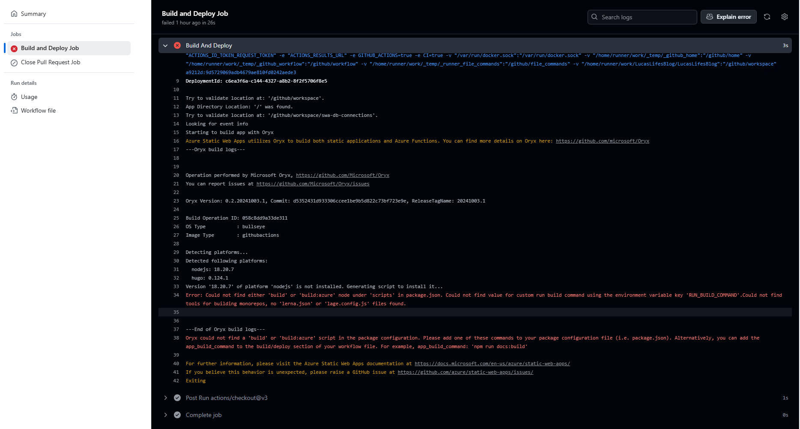

+++
author = "Lucas Huang"
date = '2025-04-16T13:52:22+08:00'
title = "Deploy Hugo App to Azure Static Web App"
description = "This article demonstrates how to deploy a Hugo web application to Azure Static Web Apps"
categories = [
    "Azure"
]
tags = [
    "Azure Static Web App",
    "Hugo"
]
image = "the-creative-exchange-d2zvqp3fpro-unsplash.jpg"
# draft = true
+++

# Background
Although [Microsoft’s documentation](https://learn.microsoft.com/en-us/azure/static-web-apps/publish-hugo) on deploying Hugo sites to Azure Static Web Apps looks straightforward, following it as-is will cause your GitHub Actions build to fail with errors. The missing piece is the `app_build_command` setting in the workflow.



# Resolution
The cause is that Azure don't add `app_build_command` in the workflow, which makes the build fail. We will need to add `app_build_command: "hugo --gc --minify"` and everything will be fine. Here is the complete workflow content.
```yml
name: Azure Static Web Apps CI/CD

on:
  push:
    branches:
      - master
  pull_request:
    types: [opened, synchronize, reopened, closed]
    branches:
      - master

jobs:
  build_and_deploy_job:
    if: github.event_name == 'push' || (github.event_name == 'pull_request' && github.event.action != 'closed')
    runs-on: ubuntu-latest
    name: Build and Deploy Job
    permissions:
       id-token: write
       contents: read
    steps:
      - uses: actions/checkout@v3
        with:
          submodules: true
          lfs: false
      - name: Install OIDC Client from Core Package
        run: npm install @actions/core@1.6.0 @actions/http-client
      - name: Get Id Token
        uses: actions/github-script@v6
        id: idtoken
        with:
           script: |
               const coredemo = require('@actions/core')
               return await coredemo.getIDToken()
           result-encoding: string
      - name: Build And Deploy
        id: builddeploy
        uses: Azure/static-web-apps-deploy@v1
        with:
          azure_static_web_apps_api_token: ${{ secrets.AZURE_STATIC_WEB_APPS_API_TOKEN_BLACK_MUD_072BA1D00 }}
          action: "upload"
          ###### Repository/Build Configurations - These values can be configured to match your app requirements. ######
          # For more information regarding Static Web App workflow configurations, please visit: https://aka.ms/swaworkflowconfig
          app_location: "/" # App source code path
          api_location: "" # Api source code path - optional
          app_build_command: "hugo --gc --minify"
          output_location: "public" # Built app content directory - optional
          github_id_token: ${{ steps.idtoken.outputs.result }}
          ###### End of Repository/Build Configurations ######

  close_pull_request_job:
    if: github.event_name == 'pull_request' && github.event.action == 'closed'
    runs-on: ubuntu-latest
    name: Close Pull Request Job
    steps:
      - name: Close Pull Request
        id: closepullrequest
        uses: Azure/static-web-apps-deploy@v1
        with:
          action: "close"
```
