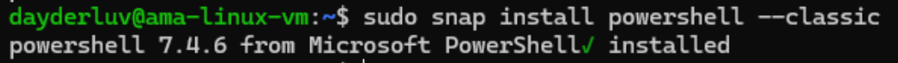

+++
author = "Lucas Huang"
date = '2025-05-13T07:48:22+08:00'
title = "Troubleshoot Azure Monitor Linux Agent Sending Logs to Event Hub"
# description = "This article demonstrates how to deploy a Hugo web application to Azure Static Web Apps"
categories = [
    "Azure"
]
tags = [
    "Azure Monitor Linux Agent",
    "Azure Monitor",
    "Event Hub"
]
# image = "azure-monitor.png"
# draft = true
+++
# Overview

This guide simplifies troubleshooting Azure Monitor Agent's (AMA) preview feature for sending data to Event Hubs. When AMA collects VM data and sends it directly to Event Hubs, you might need to confirm:

1. ✅ Does the VM have proper RBAC access to the Event Hub?
2. 🌐 Is private link connectivity properly configured?
3. 📨 Can the VM successfully push data to the Event Hub?

**Reference**: [Microsoft Learn Documentation](https://learn.microsoft.com/en-us/azure/azure-monitor/agents/azure-monitor-agent-send-data-to-event-hubs-and-storage?tabs=windows%2Cwindows-1)

# Prerequisites

- **Azure Linux VM** with managed identity (system/user-assigned)
- **Event Hub** resource (Standard tier recommended)
  
  > 💡 Basic tier works but lacks advanced networking controls
  

# Step-by-Step Validation

## Install PowerShell Core
```bash
sudo snap install powershell --classic
```


## Create Test Script
```bash
mkdir -p /tmp/test && cd /tmp/test
touch send_events.ps1
nano send_events.ps1
```

**Script Content**:
```powershell
# This script sends test messages to an Azure Event Hub using the REST API and Managed Identity for Azure Resources.
# The VM utilized must have system assigned or managed assigned identity on it. This script uses the Azure meta-data service
# to get access to the event hub. 
#
# When running this script, it will send $loopCount messages to the event hub. The messages are string with the
# time the message was sent in UTC and the string "Test message". The script will wait 100 milliseconds between each message.
#
# This will allow a user to
# (1) Make sure the path from the VM to the event hub is open
# (2) Capture a sample of data in the event hub to test the arrival of the data
#
# This script was run on PowerShell Core 7.4, but should be compatible with PowerShell 5.1 and later.

# Variables to set
$eventHubNamespaceName = '<event_hub_namespace>'
$eventHubName = '<event_hub_name>'
$clientId = '<client_id>' # Client ID of the managed identity to authenticate with
$loopCount = 10

$tokenUrl = "http://169.254.169.254/metadata/identity/oauth2/token?api-version=2018-02-01&client_id=$($clientId)&resource=https://eventhubs.azure.net"

try {
        $token = Invoke-RestMethod -Uri $tokenUrl -Headers @{ Metadata = "true" }
        $accessToken = $token.access_token
} catch {
       Write-Output "Error: $_"
}

$eventHubAddress = "https://$($eventHubNamespaceName).servicebus.windows.net:443/$eventHubName/messages"
$headers = @{
    "Authorization" = "Bearer $accessToken"
    "Content-Type" = "application/json"
}

for ($i = 0; $i -lt $loopCount; $i++) {
    $body = @{
        "body" = "$(Get-Date ([datetime]::UtcNow)) - Test message"
    } | ConvertTo-Json

    Write-Output "Sending message $i"
	try {
       Invoke-RestMethod -Uri $eventHubAddress -Method Post -Headers $headers -Body $body
       
    } catch {
       Write-Output "Error: $_"
    }

   Start-Sleep -Milliseconds 100   
}
```

## Configure Script Parameters

### Finding Required Values:
1. **Event Hub Namespace** ($eventHubNamespaceName) 
   

2. **Event Hub Instance**  ($eventHubName)  
   

3. **Managed Identity Client ID**  
   This is the Microsoft Entra Client ID of your VM's managed identity.
   - **System-assigned**:  
     
     > 🔎 **Search Tip**: Look in "Enterprise Applications" (not App Registrations) for the VM name.
   - **User-assigned**: 
      
     


## Execute & Verify
```bash
pwsh send_events.ps1
```


**Verify in Azure Portal**:  


# Common Failure Scenarios

## 401 Unauthorized (RBAC Issue)
**Error**:  
`Error: Response status code does not indicate success: 401 (SubCode=40100: Unauthorized : Unauthorized access for 'Send' operation on endpoint 'sb://<eventhubname>.servicebus.windows.net/<eventhubinstancename>/messages'. Tracking Id: f13db8ec-xxxx-xxxx-xxxx-af87a56d48b7_G2)`

**Cause**:
The assigned System/User Identity does not have permission to access the Event Hub.

**Solution**:  
- Assign **Azure Event Hubs Data Sender** role to VM identity

## Network Blocking
**Error**:  
```xml
<Error>
<ErrorCode>401</ErrorCode>
<Detail>Ip has been prevented to connect to the endpoint.
For more information see:
Virtual Network service endpoints:
Event Hubs: https://go.microsoft.com/fwlink/?linkid=2044192 
Service Bus: https://go.microsoft.com/fwlink/?linkid=2044235 
IP Filters:
Event Hubs: https://go.microsoft.com/fwlink/?linkid=2044428 
Service Bus: https://go.microsoft.com/fwlink/?linkid=2044183 
TrackingId:4f9e0fff-31c3-4c39-a735-1280ca63a0cc_G20, SystemTracker:log-playground-hub.servicebus.windows.net:hub2/messages, Timestamp:2025-01-29T11:43:33</Detail>
</Error>
```

**Cause**:
Event Hub has no private endpoint set up and has Public network access disabled


**Solution**:  
Properly set a Private Endpoint, or enable Public Network.
