+++
author = "Lucas Huang"
date = '2025-05-16T07:48:22+08:00'
title = "Testing Connectivity to Azure Instance Metadata Service (IMDS)"
# description = "This article demonstrates how to deploy a Hugo web application to Azure Static Web Apps"
categories = [
    "Azure",
    "Azure Monitor Agent"
]
tags = [
    "Network Connectivity"
]
image = "cover.png"
# draft = true
+++
The Azure Instance Metadata Service (IMDS) provides a REST endpoint for Azure Monitot Agent (AMA) to retrieve metadata and access tokens from Azure Virtual Machines (VMs) and Azure Arc-enabled servers. This is a baseline for AMA to be functioning. This guide outlines how to test connectivity to IMDS and verify its functionality.


## **Overview**
IMDS allows you to fetch metadata and access tokens for further use by AMA. Testing connectivity involves two steps:
1. **Metadata Response**: Retrieve a JSON response containing details about the VM or Arc-enabled server.
2. **Access Token**: Verify that your identity is accepted by IMDS and an access token is issued.


## **IMDS with Proxy Servers**
Proxy servers are **not supported** with IMDS. If a proxy is configured, ensure the IMDS address (`169.254.169.254` for VMs or `localhost:40342` for Arc) is added to the bypass list.

> **Reference**: [IMDS Proxy Documentation](https://learn.microsoft.com/azure/virtual-machines/instance-metadata-service?tabs=linux#proxies)


## **Testing IMDS on Azure Virtual Machines**

### **Metadata Retrieval**
Verify that you receive a **200 response** and a **JSON response** with VM details.

#### **Using `curl` (Linux/Windows)**
```bash
curl -v -s -S -k -H "Metadata: true" "http://169.254.169.254/metadata/instance?api-version=2019-11-01&format=json"
```
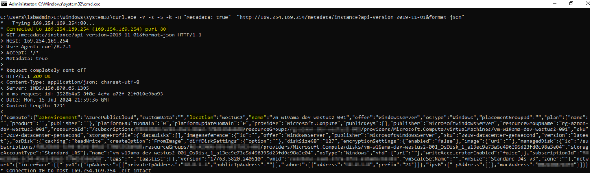


#### **Using PowerShell**
```powershell
Invoke-WebRequest -Uri "http://169.254.169.254/metadata/instance?api-version=2019-11-01&format=json" -Headers @{"Metadata"="true"} -Debug
```
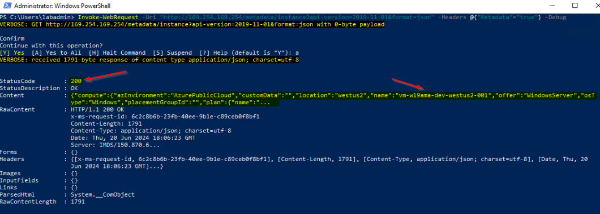

### **Access Token Retrieval**
Verify that you receive a **200 response** and a **JSON response** with an access token.

> **Note**: Treat the `access_token` as sensitive information.

#### **System Managed Identity**
##### **Using `curl`**
```bash
curl -v -s -S -k -H "Metadata: true" "http://169.254.169.254/metadata/identity/oauth2/token?api-version=2018-02-01&resource=https%3A%2F%2Fmanagement.azure.com%2F"
```
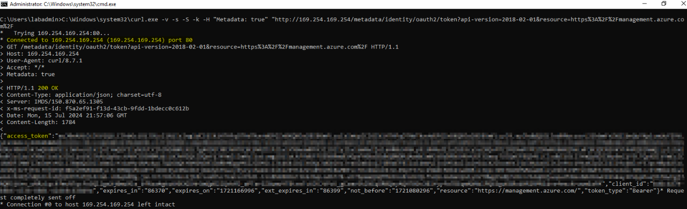

##### **Using PowerShell**
```powershell
Invoke-WebRequest -Uri "http://169.254.169.254/metadata/identity/oauth2/token?api-version=2018-02-01&resource=https%3A%2F%2Fmanagement.azure.com%2F" -Headers @{"Metadata"="true"} -Debug
```
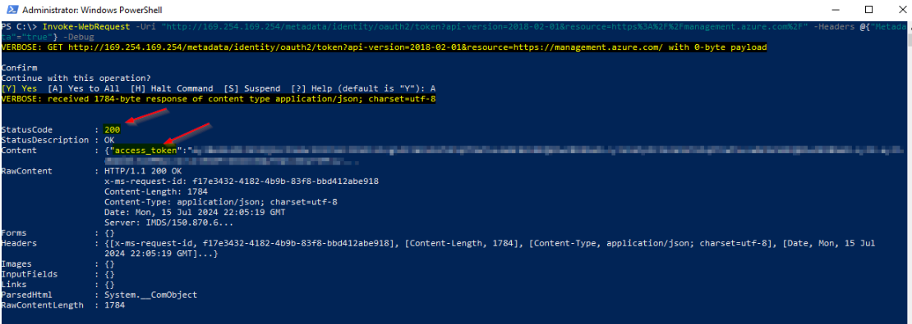


#### **User Managed Identity**
Replace `{subscriptionId}`, `{resourceGroup}`, and `{userAssignedIdentityName}` with your values.

##### **Using `curl`**
```bash
userAssignedIdentity="/subscriptions/{subscriptionId}/resourcegroups/{resourceGroup}/providers/microsoft.managedidentity/userassignedidentities/{userAssignedIdentityName}"
curl -v -s -S -k -H "Metadata: true" "http://169.254.169.254/metadata/identity/oauth2/token?api-version=2018-02-01&resource=https%3A%2F%2Fmanagement.azure.com%2F&msi_res_id=$userAssignedIdentity"
```
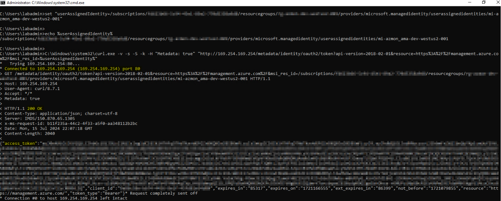

##### **Using PowerShell**
```powershell
$userAssignedIdentity = "/subscriptions/{subscriptionId}/resourcegroups/{resourceGroup}/providers/microsoft.managedidentity/userassignedidentities/{userAssignedIdentityName}"
Invoke-WebRequest -Uri "http://169.254.169.254/metadata/identity/oauth2/token?api-version=2018-02-01&resource=https%3A%2F%2Fmanagement.azure.com%2F&msi_res_id=$userAssignedIdentity" -Headers @{"Metadata"="true"} -Debug
```
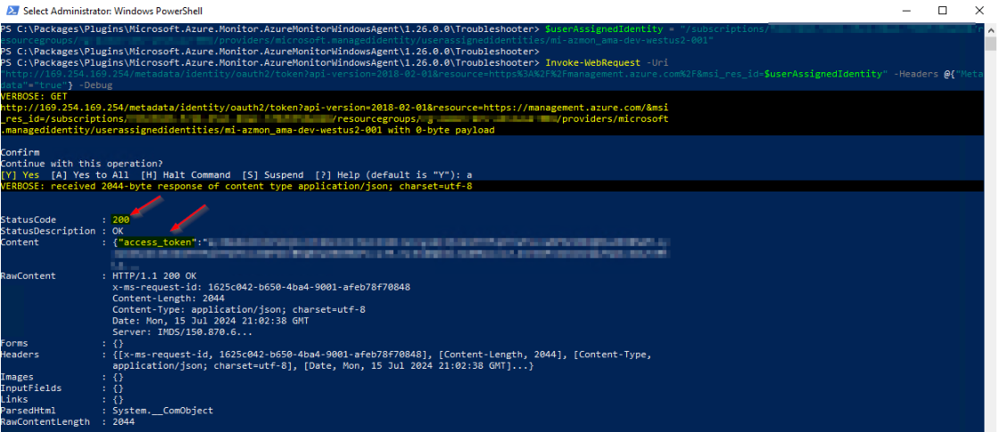


## **Testing IMDS on Azure Arc-Enabled Servers**

### **4.1 Metadata Retrieval**
Verify that you receive a **200 response** and a **JSON response** with server details.

#### **Using `curl`**
```bash
curl -v -s -S -k -H "Metadata: true" "http://localhost:40342/metadata/instance?api-version=2019-11-01&format=json"
```
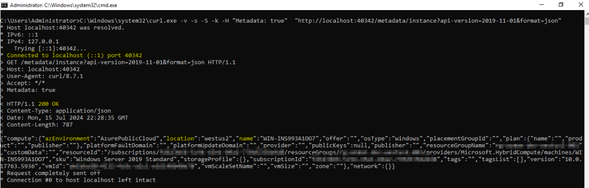


#### **Using PowerShell**
```powershell
Invoke-WebRequest -Uri "http://localhost:40342/metadata/instance?api-version=2019-11-01&format=json" -Headers @{"Metadata"="true"} -Debug
```
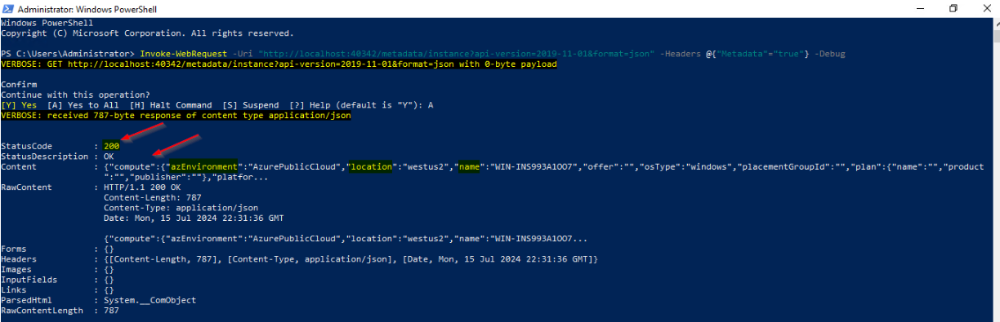


### **4.2 Access Token Retrieval**
Verify that you receive a **200 response** and a **JSON response** with an access token.

> **Note**: Treat the `access_token` as sensitive information.

#### **Using `curl`**
```bash
curl -v -s -S -k -H "Metadata: true" "http://localhost:40342/metadata/identity/oauth2/token?api-version=2019-11-01&resource=https%3A%2F%2Fmanagement.azure.com"
```
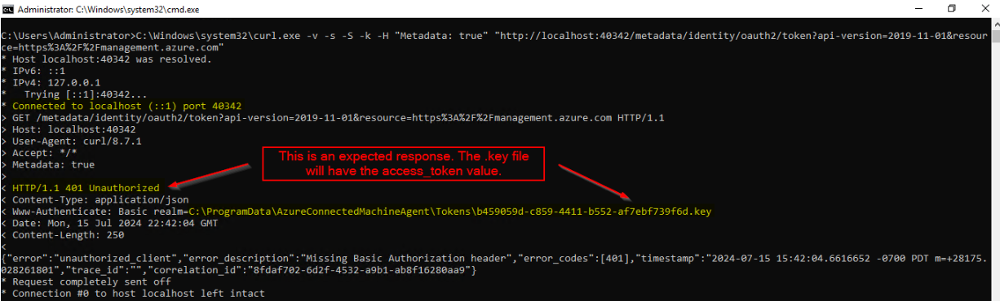

#### **Using PowerShell**
```powershell
$apiVersion = "2020-06-01"
$resource = "https://management.azure.com/"
$endpoint = "{0}?resource={1}&api-version={2}" -f $env:IDENTITY_ENDPOINT,$resource,$apiVersion
$secretFile = ""
try
{
    Invoke-WebRequest -Method GET -Uri $endpoint -Headers @{Metadata='True'} -UseBasicParsing
}
catch
{
    $wwwAuthHeader = $_.Exception.Response.Headers["WWW-Authenticate"]
    if ($wwwAuthHeader -match "Basic realm=.+")
    {
        $secretFile = ($wwwAuthHeader -split "Basic realm=")[1]
    }
}
Write-Host "Secret file path: " $secretFile`n
$secret = cat -Raw $secretFile
$response = Invoke-WebRequest -Method GET -Uri $endpoint -Headers @{Metadata='True'; Authorization="Basic $secret"} -UseBasicParsing
if ($response)
{
    $token = (ConvertFrom-Json -InputObject $response.Content).access_token
    Write-Host "Access token: " $token
}

```
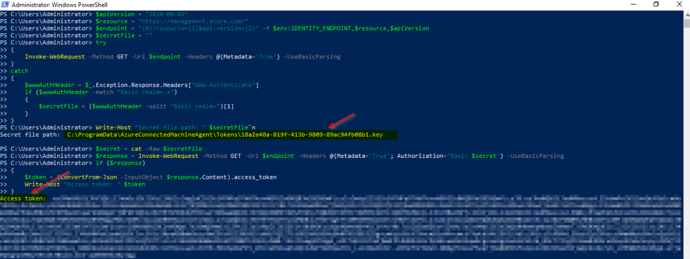

## **Common Errors**
Here's an example of what a failure would look like if we didn't have TCP connectivity (for instance, if a firewall was blocking):

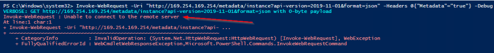


## **Conclusion**
By following these steps, you can verify connectivity to IMDS and ensure your Azure VMs or Arc-enabled servers can retrieve metadata and access tokens. If issues arise, check proxy settings and ensure the IMDS endpoint is reachable.

For further details, refer to the [IMDS documentation](https://learn.microsoft.com/azure/virtual-machines/instance-metadata-service?tabs=linux).