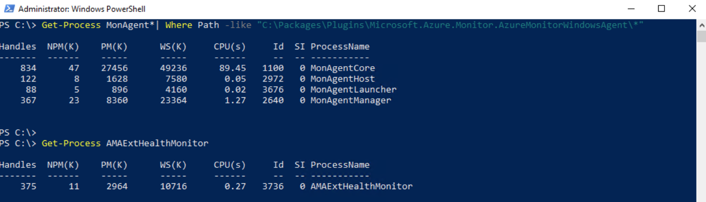
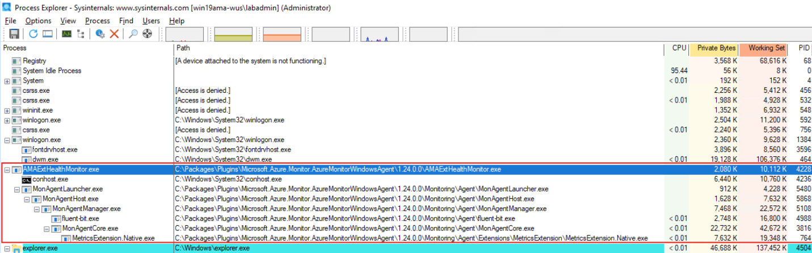

+++
author = "Lucas Huang"
date = '2025-05-09T15:49:22+08:00'
title = "Understanding Azure Monitor Windows Agent Processes"
# description = "This article demonstrates how to deploy a Hugo web application to Azure Static Web Apps"
categories = [
    "Azure",
    "Azure Monitor Agent"
]
tags = [
    "Azure Monitor Windows Agent",
    "Azure Monitor",
]
image = "cover.png"
# draft = true
+++
Azure Monitor s Windows Agent (AMA) is your gateway to collecting metrics, logs, and diagnostics data from Windows VMs, Scale Sets, or even on-premises servers. If you’ve ever wondered what’s happening under the covers, in this article we’ll:

  • Show you how to verify that all five AMA processes are running  
  • Reveal the exact launch order  
  • Break down the role of each executable  

Whether you’re troubleshooting a missing data stream or simply curious about AMA’s inner mechanics, read on!

## Verifying the AMA Processes

First, let’s confirm that the AMA extension service and its child processes are up and healthy. Run these two PowerShell commands:

```powershell
Get-Process MonAgent*| Where Path -like "C:\Packages\Plugins\Microsoft.Azure.Monitor.AzureMonitorWindowsAgent\*"

Get-Process AMAExtHealthMonitor
```

You should see output similar to this:



If any of these processes are missing, Azure Monitor won’t collect or ship data properly. The one to watch is **AMAExtHealthMonitor.exe** - it’s the “parent of all parents” and will auto-recover any child that goes down.

## AMA Process Startup Order

Process Monitor (ProcMon) reveals the exact sequence in which AMA components fire up:

```text
AMAExtHealthMonitor.exe
  → MonAgentLauncher.exe
    → MonAgentHost.exe
      → MonAgentManager.exe
        → MonAgentCore.exe
```



This structured chain ensures robust health checks, seamless updates, and automatic recovery - all without your intervention.

## Deep Dive: What Each Process Does

1. **AMAExtHealthMonitor.exe**  
   • Runs as a Windows Service (“Azure Monitor Agent Extension”)  
   • Monitors the health of the entire AMA stack  
   • Automatically restarts any child process if it stops unexpectedly  
   • You can disable or re-enable it manually - see our [AMA Restart Guide]() for details.

2. **MonAgentLauncher.exe**  
   • A lightweight wrapper invoked by AMAExtHealthMonitor  
   • Reads startup parameters from environment variables  
   • Hands off execution to MonAgentHost.exe

3. **MonAgentHost.exe**  
   • Responsible for update orchestration  
   • Detects if a new agent version is available and switches to the latest MonAgentManager  
   • Restarts the manager if it crashes or once an update is applied

4. **MonAgentManager.exe**  
   • Supervises MonAgentCore.exe in a Windows Job Object for resource isolation  
   • Performs continuous health monitoring and automatic restarts  
   • Manages rolling back to a prior version if the new core misbehaves  
   • Maintains local host logs under the AMA plugin folder

5. **MonAgentCore.exe**  
   • The heart of Azure Monitor Windows Agent  
   • Collects performance counters, event logs, and custom logs  
   • Streams data to Azure Monitor, Log Analytics, or Event Hubs  
   • Manages Node Diagnostics and keeps a live connection to the Azure backend

## Why This Matters

  • **Reliability** – Each layer adds resilience; one failure doesn’t bring the whole agent down.  
  • **Upgradability** – You’ll always be running the latest, most secure version, with no downtime.  
  • **Observability** – If data isn’t arriving, you know exactly which process to inspect or restart.

## Wrapping Up

Understanding AMA’s process hierarchy is more than just geek trivia. It equips you to troubleshoot faster, maintain better uptime, and trust that your telemetry pipeline is healthy. Next time you onboard a Windows VM into Azure Monitor, you’ll know exactly what’s running behind the scenes—and where to look if anything goes awry.

