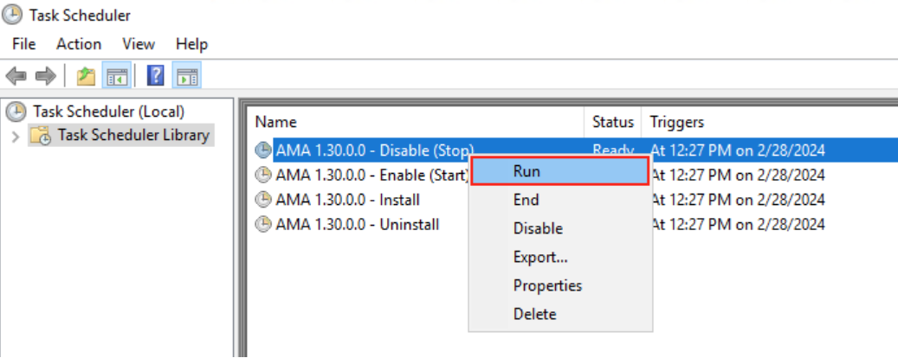

+++
author = "Lucas Huang"
date = '2025-05-10T15:49:22+08:00'
title = "Azure Monitor Windows Agent Extension Operations: Disable/Enable/Uninstall/Install)"
# description = "This article demonstrates how to deploy a Hugo web application to Azure Static Web Apps"
categories = [
    "Azure"
]
tags = [
    "Azure Monitor Windows Agent",
    "Azure Monitor",
]
image = "azure-monitor.png"
# draft = true
+++


When you need to perform operations on the Azure Monitor Windows Agent Extension (AMA)—disable, enable, uninstall or install—and you require the full privileges of the SYSTEM account, Task Scheduler is a handy tool. You don’t have to build a full automation pipeline; you can simply register a scheduled task that runs the AMA extension executable with the right arguments under SYSTEM, then trigger it on demand.

Below is a step-by-step example showing how to:

  • Detect the current AMA version  
  • Create a one-off scheduled task definition (XML)  
  • Register it under the SYSTEM account  
  • Manually start and later remove the task  

# 1. Read the Installed AMA Version

AMA’s handler state is stored in the registry. Use PowerShell to extract the version string:

```powershell
$currentVersion = (
  Get-ChildItem `
    -Path "Registry::HKEY_LOCAL_MACHINE\SOFTWARE\Microsoft\Windows Azure\HandlerState\" |
  Where-Object Name -like "*AzureMonitorWindowsAgent*" |
  Get-ItemProperty |
  Where-Object InstallState -eq "Enabled"
).PSChildName -split '_' | Select-Object -Last 1

Write-Host "Detected AMA version: $currentVersion"
```

# 2. Prepare a Task XML Template

Below is a minimal XML template for Task Scheduler. Notice the `<UserId>` is `S-1-5-18` (the SYSTEM account). 

```xml
<?xml version="1.0" encoding="UTF-16"?>
<Task version="1.2" xmlns="http://schemas.microsoft.com/windows/2004/02/mit/task">
  <RegistrationInfo>
    <Author>SYSTEM</Author>
    <URI>\AMA Operation</URI>
  </RegistrationInfo>
  <Principals>
    <Principal id="Author">
      <UserId>S-1-5-18</UserId>          <!-- SYSTEM account -->
      <RunLevel>LeastPrivilege</RunLevel>
    </Principal>
  </Principals>
  <Triggers>
    <TimeTrigger>
      <StartBoundary>2025-01-01T00:00:00</StartBoundary>
      <Enabled>true</Enabled>
    </TimeTrigger>
  </Triggers>
  <Settings>
    <AllowStartOnDemand>true</AllowStartOnDemand>
    <Enabled>true</Enabled>
    <ExecutionTimeLimit>PT1H</ExecutionTimeLimit>
  </Settings>
  <Actions Context="Author">
    <Exec>
      <Command>
        C:\Packages\Plugins\Microsoft.Azure.Monitor.AzureMonitorWindowsAgent\$currentVersion\AzureMonitorAgentExtension.exe
      </Command>
      <Arguments>arg1</Arguments>
      <WorkingDirectory>
        C:\Packages\Plugins\Microsoft.Azure.Monitor.AzureMonitorWindowsAgent\$currentVersion\
      </WorkingDirectory>
    </Exec>
  </Actions>
</Task>
```

Save this as, for example, `AmaOperation.xml`.

# 3. Register the Task for a Specific Operation

In PowerShell, load the XML, Replace arg1 with the desired operation: disable, enable, uninstall, or install.

```powershell
# Choose an operation: disable, enable, uninstall, install
$operation = "disable"
$taskName  = "AMA $currentVersion - $operation"

# Load and customize the XML
[xml]$xmlDoc = Get-Content .\AmaOperation.xml
$xmlString = $xmlDoc.OuterXml.Replace("arg1", $operation)

# Register under SYSTEM
Register-ScheduledTask `
  -TaskName $taskName `
  -Xml $xmlString `
  -ErrorAction Stop

Write-Host "Registered task '$taskName' as SYSTEM"
```

# 4. Run the Task on Demand

Once registered, you can trigger it immediately:

```powershell
Start-ScheduledTask -TaskName "AMA $currentVersion - disable"
```

Check the Task Scheduler GUI or use `Get-ScheduledTask` to monitor history and status.



# 5. Clean Up

When you no longer need the task, unregister it:

```powershell
Unregister-ScheduledTask `
  -TaskName "AMA $currentVersion - disable" `
  -Confirm:$false

Write-Host "Removed task"
```

Repeat registration, start, and cleanup for other operations (`enable`, `uninstall`, `install`) as needed.

---

By registering ad-hoc scheduled tasks under the SYSTEM account, you get:

  • Full privilege execution without interactive prompts  
  • A clear, audit-able history in Task Scheduler  
  • Simple on-demand invocation via PowerShell or the GUI  

Feel free to adapt the XML (add more triggers, logging, retry settings, etc.) or wrap these steps in scripts to suit your maintenance workflow.