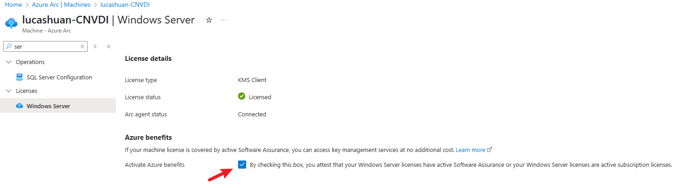
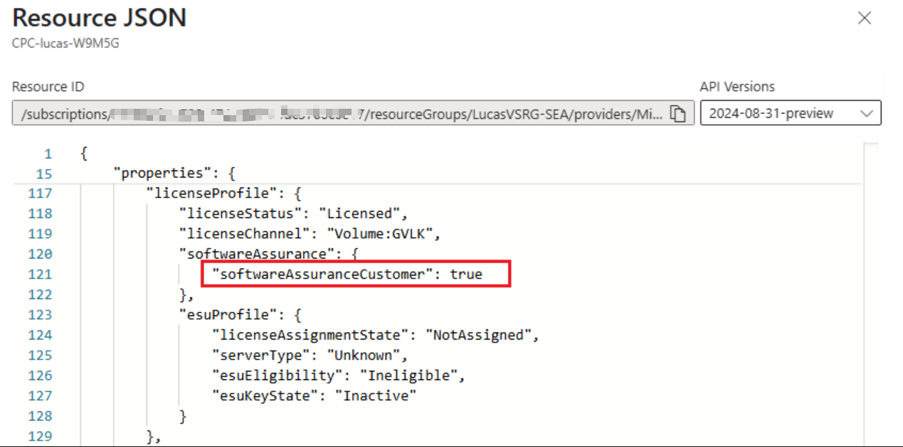
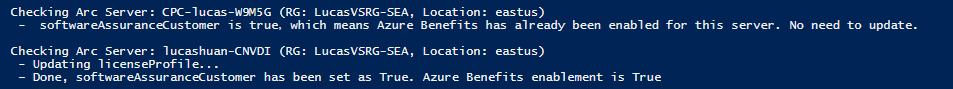

+++
author = "Lucas Huang"
date = '2025-04-19T20:49:22+08:00'
title = "Batch Enable Azure Benefits on Azure Arc Servers"
# description = "This article demonstrates how to deploy a Hugo web application to Azure Static Web Apps"
categories = [
    "Azure"
]
tags = [
    "Azure Arc",
    "Azure Benefits"
]
image = "cover.png"
# draft = true
+++
In many customer scenarios, there's a mounting need to automate the process of enabling Azure Benefits across multiple Azure Arc Servers – especially since there isn't a native Azure Policy or CLI command to handle this. In this article, I'll share a PowerShell solution that tackles this challenge seamlessly.

## Scenario   
Imagine managing a large environment where numerous Azure Arc Servers are deployed, but not all have Azure Benefits enabled. Below is a snapshot of the Azure Portal showing where you can view the Azure Benefits feature:



## How it works
The core of the approach is to leverage a PUT event that updates the property `softwareAssuranceCustomer` to `true` in the Arc Server’s properties. Once this flag is set, Azure Benefits become active. Based on this understanding, the script below iterates through all Azure Arc Servers in a specified subscription, checks the current state of the `softwareAssuranceCustomer` property, and updates it if necessary.


## Step-by-Step Script Explanation  
1. The script starts by setting up your subscription context and connecting to Azure using a system managed identity.  
2. It then retrieves a Bearer token, needed to construct the proper HTTP header for subsequent API calls.  
3. Next, it fetches all resources of type Microsoft.HybridCompute/machines (which represent Azure Arc Servers).  
4. For each Arc Server, it performs the following:  
  a. Checks the current "softwareAssuranceCustomer" property by issuing a GET request using Invoke-RestMethod.  
  b. If the property is already true, the script skips the update for this server.  
  c. If the property is absent or returns a 404 (license not found), the script prepares a data object with the property enabled and sends a PUT request to update the server.  
5. Finally, the script outputs the result of the operation, letting you verify that the update has been applied successfully.

Below is the complete PowerShell script for reference:

```powershell
# Your subscription id      
$subscriptionId = 'xxxxxxxx-xxxx-xxxx-xxxx-xxxxxxxxxxxx' 
# Connect to Azure. Below is using System Managed Identity. Switch to other parameter if System MI is not the way you are using.
Connect-AzAccount -Identity
$context = Set-azContext -Subscription $subscriptionId
# Fetch Bearer Token and compose HTTP header.
$token = Get-AzAccessToken -ResourceUrl "https://management.azure.com/"
$headers = @{
'Content-Type'='application/json'
'Authorization'='Bearer ' + $token.Token
}
# Fetch all Azure Arc Servers from given subscirption.
$arcServers= Get-AzResource -ResourceType "Microsoft.HybridCompute/machines"
foreach($arcServer in $arcServers){
    $resourceGroupName = $arcServer.ResourceGroupName
    $machineName = $arcServer.Name
    $location = $arcServer.Location

    Write-Host "`nChecking Arc Server: $machineName (RG: $resourceGroupName, Location: $location)"

    $licenseProfileUri = "https://management.azure.com/subscriptions/$subscriptionId/resourceGroups/$resourceGroupName/providers/Microsoft.HybridCompute/machines/$machineName/licenseProfiles/default?api-version=2023-10-03-preview"
    $needUpdate = $true
    try {
        # Check the current licenseProfile
        $currentLicenseProfile = Invoke-RestMethod -Method GET -Uri $licenseProfileUri -Headers $headers -ErrorAction Stop
        if ($currentLicenseProfile.properties -and
            $currentLicenseProfile.properties.softwareAssurance -and
            $currentLicenseProfile.properties.softwareAssurance.softwareAssuranceCustomer -eq $true) {
            Write-Host " -  softwareAssuranceCustomer is true，which means Azure Benefits has already been enabled for this server. No need to update."
            $needUpdate = $false
        }
    }
    catch {
        # 404 error means no license, still need to be updated.
        if ($_.Exception -and $_.Exception.Response -and $_.Exception.Response.StatusCode.value__ -eq 404) {
            $needUpdate = $true
        }
        else {
            Write-Host " - Error reading licenseProfile $($_.Exception.Message)"
            $needUpdate = $false 
        }
    }
    if ($needUpdate) {
        Write-Host " - Updating licenseProfile..."
        $data = @{
            location   = $location
            properties = @{
                softwareAssurance = @{
                    softwareAssuranceCustomer = $true
                }
            }
        }
        $jsonBody = $data | ConvertTo-Json

        try {
            $updateResponse = Invoke-RestMethod -Method PUT -Uri $licenseProfileUri -ContentType "application/json" -Headers $headers -Body $jsonBody -ErrorAction Stop
            Write-Host " – Done, softwareAssuranceCustomer has been set as $($updateResponse.properties.softwareAssurance.softwareAssuranceCustomer). Azure Benefits enablement is $($updateResponse.properties.softwareAssurance.softwareAssuranceCustomer)"
        }
        catch {
            Write-Host " - Error occur: $($_.Exception.Message)"
        }
    }

}
```

## Expected Output  

Once you run the script, you should see output similar to the following, where each server is checked and updated only if necessary:



## Conclusion  

This PowerShell script provides a practical method to automate enabling Azure Benefits on your Azure Arc Servers. Although it's not possible to toggle this setting with a simple policy or CLI command, leveraging REST API calls within PowerShell bridges that gap efficiently.

