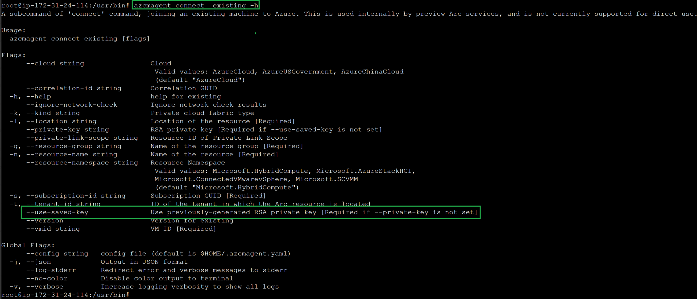

+++
author = "Lucas Huang"
date = '2025-08-07T09:25:22+08:00'
title = "Revealing How Azure Multicloud Connector Onboards AWS EC2 Machines Without Authentication"
categories = [
    "Azure"
]
tags = [
    "Azure Arc",
    "Arc Service Errors"
]
image = "cover.png"
# draft = true
+++

When you manually onboard an Arc Agent to Azure, you typically run `azcmagent connect` and complete an interactive sign-in or use a Service Principal Name (SPN) for authentication. However, Azure’s Multicloud Connector can automate this end-to-end, no user interaction or SPN required. Below, we break down how it works under the hood.

## Generating a Key Pair via AWS SSM

The Multicloud Connector leverages AWS Systems Manager (SSM) to remotely invoke the [azcmagent genkey CLI reference - Azure Arc | Microsoft Learn](https://learn.microsoft.com/en-us/azure/azure-arc/servers/azcmagent-genkey) command on the EC2 instance. This command:

- Creates a public/private key pair.
- Prints the **public key** to stdout.
- Saves the **private key** to `C:\ProgramData\AzureConnectedMachineAgent\Certs\genPrivateKey.pem`

## Registering the Machine Resource in Azure

Once the public key is captured, the Multicloud Connector service create a `Microsoft.HybridCompute/machines` resource.

At this point, Azure knows about the new machine and trusts the accompanying public key.

## Connecting the Agent Using the Saved Key

Finally, the MultiCloud Connector uses AWS SSM again to execute `azcmagent connect existing --use-saved-key` against the EC2 instance. Under the covers, this flag instructs the Arc Agent to:

- Locate the previously saved private key (`genPrivateKey.pem`).
- Use it to authenticate against Azure.
- Complete the onboarding process - without any interactive sign-in or SPN.

> **Note:** The `--use-saved-key` option isn’t yet documented publicly. If you install the Arc agent yourself and run `azcmagent connect existing -h`, you will spot this flag in the help output:

---

By orchestrating key generation and connection steps entirely through AWS SSM and the Azure REST API, MultiCloud Connector provides a seamless, passwordless onboarding experience for EC2 machines. This approach minimizes manual intervention and reduces the risk of credential exposure—ideal for at-scale, automated infrastructure deployments.