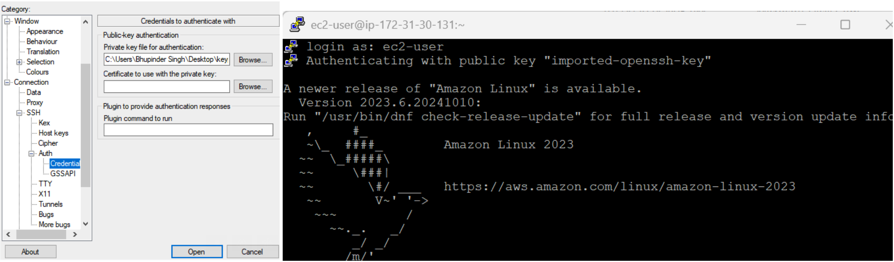

+++
author = "Lucas Huang"
date = '2025-08-06T15:49:22+08:00'
title = "Multicloud Connector Lab Practice with AWS EC2 Instance"
categories = [
    "Azure"
]
tags = [
    "Azure Arc",
    "Multicloud Connector",
    "AWS EC2"
]
image = "cover.png"
# draft = true
+++

## Prerequisites
- Create a free AWS account
  1. login web console https://aws.amazon.com/console/, click Signin
  2. follow [the AWS doc](https://aws.amazon.com/resources/create-account/) to create a free AWS account 
     
  

- Create AWS EC2 instance
  1. login web console https://aws.amazon.com/console/, select [the support region](https://learn.microsoft.com/azure/azure-arc/multicloud-connector/overview#supported-regions), then click EC2 to create instance

      

  2. follow [this hands on lab](https://platform.qa.com/lab/create-your-first-amazon-ec2-instance/?context_id=1&context_resource=lp) to create EC2 instance (linux) and [this hands on lab](https://platform.qa.com/lab/create-your-first-amazon-ec2-instance-windows/?context_id=1&context_resource=lp) to create EC2 instance (windows), for linux instance, you are able to connect the instance via SSH:

      

  3. once deployed, you can find your instance in web console -> EC2 -> Instances:

      

  4. login EC2 instance with private key that you created in step 2 and login as ec2-user:

      

  - **Note**: don't terminate instance unless you don't need it, otherwise it will destroy all data on its root volume and instance.

## MultiCloud Connector Setup
1. Get your account Id in above AWS web console, click your account -> Account
  
    

2. Follow [the steps in public doc](https://learn.microsoft.com/azure/azure-arc/multicloud-connector/connect-to-aws#add-your-public-cloud-in-the-azure-portal) to create MultiCloud connector with AWS EC2 instance, go through the following tips for each step to move forward:

  - For step 4: select [the supported Azure region](https://learn.microsoft.com/azure/azure-arc/multicloud-connector/overview#supported-regions), provide account Id in step 1:

    

  - For step 5 - Inventory settings, check both '**add all supported AWS services**' and '**all supported AWS regions**' for lab testing, otherwise your EC2 instances might not be visible:

    

  - For step 5 - Arc onboarding settings, select '**Public endpoint**' and check '**Include all supported AWS regions**' for lab testing, otherwise your EC2 instances might not be able to onboard as Arc servers:

    

  - For step 6: hold on this step, download the CloudFormation template and [create a stack in AWS web console](https://docs.aws.amazon.com/AWSCloudFormation/latest/UserGuide/cfn-console-create-stack.html), keep all permissions and configuration as default for lab testing, wait until all resources are created as below:

    
    

  - For step 6: Once all resources are created, in AWS web console page, go to your EC2 instance by clicking the instance id, then add the **ArcForServerSSMInstanceProfile** role to your EC2 instance, otherwise Arc agent will not be installed to the EC2 instance:

    
    

## What do we have after setup
- [All supported AWS services](https://learn.microsoft.com/azure/azure-arc/multicloud-connector/view-multicloud-inventory#supported-aws-services) will be scanned and represented under resources tab:

  

- All above resources are stored in a resource group using the naming convention aws_yourAwsAccountId

  

- Login your EC2 instance, you can check Arc agent with azcmagent as other Arc enabled servers:

  

## Common issues
### Issue 1: I uploaded the CloudFormation template to AWS, why does it still show 'permission failure' in Azure portal as below?

**Solution**
  1. you uploaded template and create a stack after created multicloud connector, so you need to wait for the next periodic sync for AWS authentication to be validated. If you upload the template within 10 minutes, AWS authentication will succeed immediately.

  2. you might use old template to create a stack, in this case, please find the template in created multicloud connector and create a new stack again.

### Issue 2: I followed all steps in public doc, as result, Arc server is not connected

**Solution**
  1. Check and add the **ArcForServerSSMInstanceProfile** role to your EC2 instance to grant permissions for Arc onboarding.

  2. Check permissions and modify them for EC2 instances if any issue under Solutions tab.
  

## Reference
- [AWS public docs](https://docs.aws.amazon.com/AWSCloudFormation/latest/UserGuide/cfn-console-create-stack.html)
- [Onboard VMs to Azure Arc through the multicloud connector](https://learn.microsoft.com/azure/azure-arc/multicloud-connector/onboard-multicloud-vms-arc)
- [Supported AWS services](https://learn.microsoft.com/azure/azure-arc/multicloud-connector/view-multicloud-inventory#supported-aws-services)