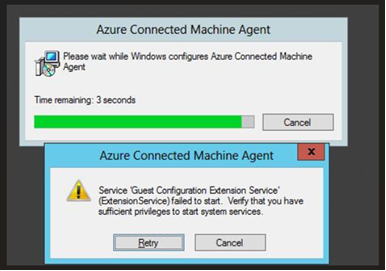
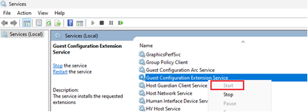
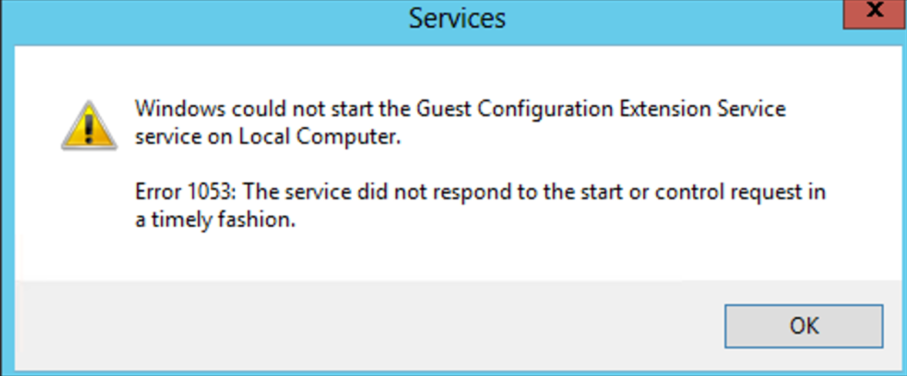
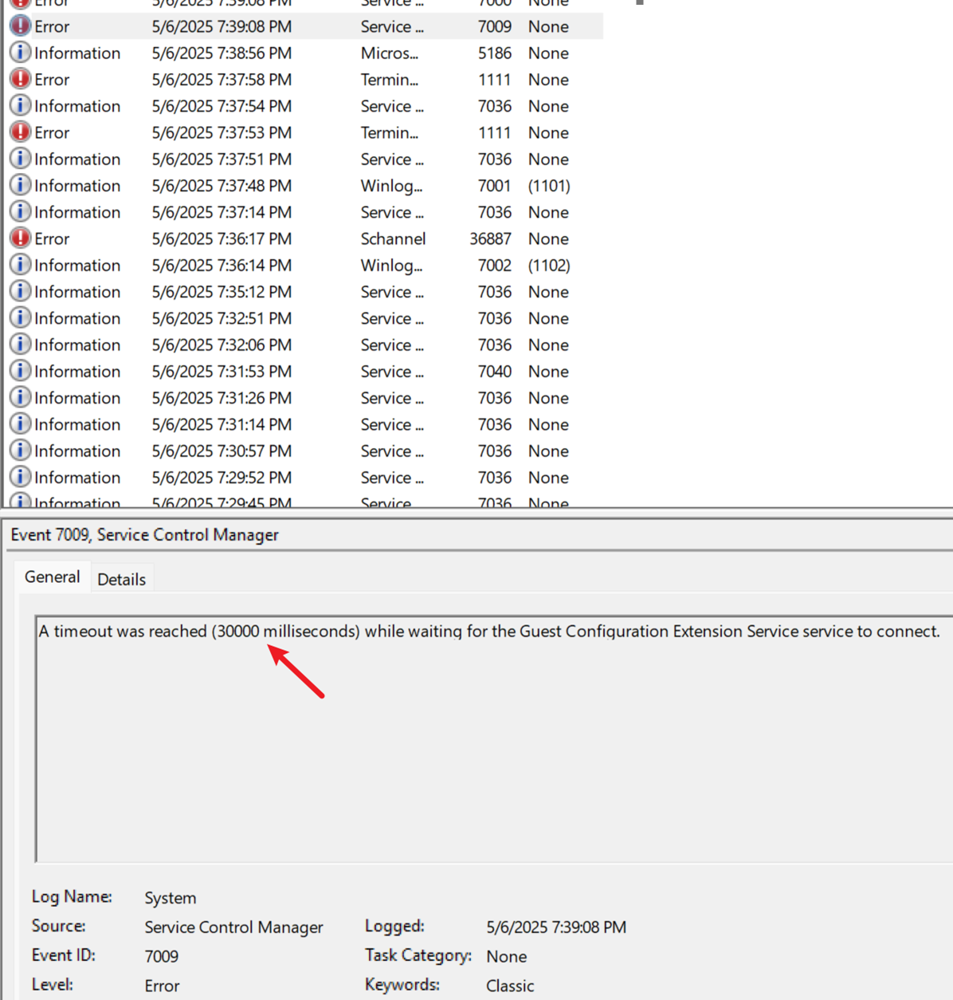
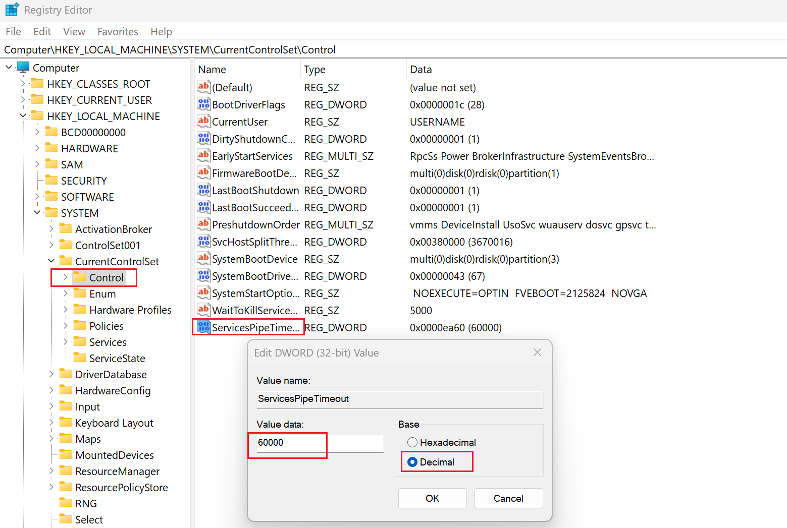

+++
author = "Lucas Huang"
date = '2025-05-07T15:49:22+08:00'
title = "Troubleshooting Installation fails with Cannot start service ExtensionService/Guest Configuration Service"
# description = "This article demonstrates how to deploy a Hugo web application to Azure Static Web Apps"
categories = [
    "Azure"
]
tags = [
    "Azure Arc",
    "Arc Service Errors"
]
image = "arc-installation-failed.png"
# draft = true
+++

## Introduction
Installing the Azure Connected Machine Agent (azcmagent) should be straightforward, but sometimes you may encounter issues that Guest Configuration Extension service (ExtensionService) or the Guest Configuration Arc Service (GCArcService) fails to start and the MSI rolls back. 

This guide walks through the symptoms, root cause, and resolution for this common installation problem.



## TroubleShooting Steps 
### 1. Enable Installation Logging  
Since the Azure Arc Installation Package is a MSI file, we can accually use the `msiexec` so that we can output the installation log, and append additional parameters.

```powershell
msiexec /i AzureConnectedMachineAgent.msi /l*v installationlog.txt /qn
```
Typical error in logs:

```
Start-Service : Service 'Guest Configuration Extension service 
(ExtensionService)' cannot be started due to the following error: Cannot start 
service ExtensionService on computer '.'.
```

Alternative error you might see:

```
Error 1920. Service 'Guest Configuration Arc Service' (GCArcService) failed to start.
```

### 2. Skip Service Startup During Installation
Since the error and roll back happens when trying to start the services but failed, we can actually add a parameter `SKIPSTART=1` to skip the start service, so that the installation can be finished first. 

```powershell
msiexec /i AzureConnectedMachineAgent.msi /l*v installationlog.txt /qn SKIPSTART=1
```

### 3. Manually Start the Service

Once the installation finishes, please open the Services window and try to start the Guest Configuration Extension Service or Guest Configuration Arc Service. 



Now we can see the real error about why this is failing to be started.



### 4. Check System Event Logs
The same error can be also observed in the System Event log.




Sometimes systems with fewer resources cannot start the service in time. Thus we will need to increase the limit. 

## Resolution: Increase Service Timeout Threshold
Change the amount of time allowed for a service to start or stop on the server. The default value of this is 30 seconds, so doubling this to 60 (or if still not work, try 120) will increase the chances of the service starting in time.

To increase the timeout value in the registry, follow these steps:

- Start Registry Editor (Regedit.exe).

- Locate and then click the following registry key: `Computer\HKEY_LOCAL_MACHINE\SYSTEM\CurrentControlSet\Control`

- Right-click the **ServicesPipeTimeout** DWORD value, and then click Modify (add this key if not exist).

- Click Decimal.

- Type 60000, and then click OK.

  


> Note: The value is 60000 milliseconds and is equivalent to 60 seconds or to one minute. This change does not take effect until the computer is restarted.


## Conclusion  
This solution addresses the root cause by giving resource-constrained systems adequate time to initialize the required services. For extremely limited systems, you may need to increase the value further to 120000 (120 seconds).

Remember to:
1. First install with `SKIPSTART=1`
2. Apply the registry modification
3. Restart the system
4. Verify successful service startup