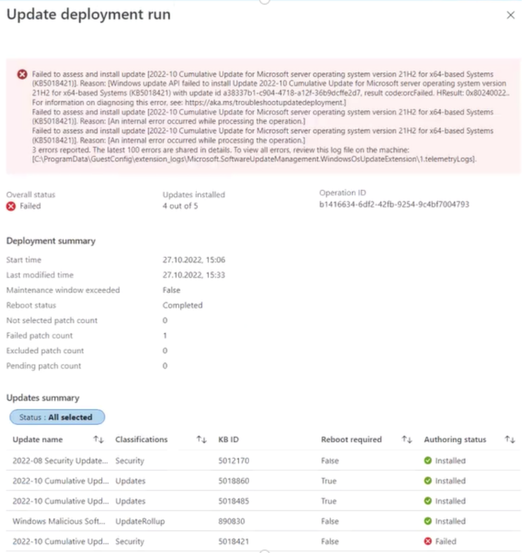

+++
author = "Lucas Huang"
title= "Troubleshooting Common Windows Update HRESULT Errors in Azure Update Manager"
date= '2026-02-21T09:30:00+08:00'
draft= false
tags = [
    "Azure Update Manager",
    "HRESULT",
    "Windows Update Client"
]
categories= ["Azure"]
image = "cover.png"
+++

When managing updates across your server fleet using Azure Update Manager, you might occasionally run into patching or assessment failures. Often, these failures surface as cryptic `HRESULT` error codes in your logs, the Azure Portal UI, or Azure Resource Graph query outputs.

For example, you might see an error string like this:
```
Assessment failed due to this reason: '['Windows update API failed to assess the machine for available updates. Error:Exception from HRESULT: 0x8024402C, Hresult:0'    at UpdateManagementAction.concrete.UpdateAssessment.GetAvailableUpdates()
   at UpdateManagementAction.concrete.AssessmentAction.Assess(UpdateManagementResultSummary updateActionResultSummary)].'
'83 errors reported. The latest 3 errors are shared in details. To view all errors, review this log file on the machine:[C:\\WindowsAzure\\Logs\\Plugins\\Microsoft.CPlat.Core.WindowsPatchExtension\\1.5.54]
```


These are standard error codes returned by the underlying Windows Update Client on the machine, and each one points to a specific failure reason. In this post, we will break down the most common `HRESULT` errors, explain what they mean, and provide actionable steps to resolve them.


## The Golden Rule: Can you patch locally?
Before diving into specific error codes, it's important to establish a baseline: **Can the machine be patched manually using the local Windows Update client in the Control Panel/Settings?**

If local patching fails, the issue lies within the Windows Operating System, the local network, or the Windows Update agent itself — not Azure Update Manager. In these cases, you are dealing with a core Windows OS issue.

If you are stuck, reviewing the `C:\Windows\WindowsUpdate.log` file is always a great starting point for deeper investigation.


## Decoding Common HRESULT Errors

Here is a breakdown of the most frequently encountered `HRESULT` codes and how to fix them.

### 0x80070005 (E_ACCESSDENIED)
**What it means:** General access denied error.

**How to fix:** This is usually caused by incorrect Windows Update settings, file permission errors within the `%WinDir%\SoftwareDistribution` folder, or simply insufficient disk space on the system drive (C:). Free up some space and verify system permissions.

### 0x80070643 (ERROR_INSTALL_FAILURE)
**What it means:** A generic installation failure.

**How to fix:** Recently, this has been heavily associated with a lack of sufficient disk space on the **Windows Recovery Environment (WinRE) partition** when trying to install specific security updates (like KB5034439, KB5034440, or KB5034441). You may need to manually resize the WinRE partition to allow the update to install successfully.

### 0x80072EE2 (WININET_E_TIMEOUT)
**What it means:** The operation timed out.

**How to fix:** This is a classic network connectivity issue. The machine is failing to communicate with either your internal WSUS server, the public Windows Update site, or your configured proxy. Check your firewall rules and run a network trace to see where the traffic is dropping.

### 0x80072EE6 (WININET_E_UNRECOGNIZED_SCHEME)
**What it means:** The URL does not use a recognized protocol.

**How to fix:** This typically happens when a WSUS server is defined in Group Policy or the Registry, but the `http://` or `https://` prefix is missing.
Check `HKEY_LOCAL_MACHINE\SOFTWARE\Policies\Microsoft\Windows\WindowsUpdate\WUServer`. If the value is just `wsus.contoso.com`, change it to `http://wsus.contoso.com`.

### 0x80072EFE (WININET_E_CONNECTION_ABORTED)
**What it means:** The connection with the server was terminated abnormally.

**How to fix:** This means the connection was forcibly reset by a firewall, proxy, or the Windows Update server itself. Check your network security appliances to ensure traffic to Windows Update endpoints isn't being blocked or inspected improperly.

### 0x80072F8F (WININET_E_DECODING_FAILED)
**What it means:** Content decoding has failed (Cryptographic/TLS failure).

**How to fix:** This usually happens for one of three reasons:
1. The Windows Server clock is out of sync. Verify the system time.
2. The VM cannot reach `https://ctldl.windowsupdate.com`.
3. There is a TLS or cipher suite mismatch. Check your cipher suites in `HKLM\SYSTEM\CurrentControlSet\Control\Cryptography\Configuration\Local\SSL\00010002\Functions` and ensure they align with default Windows requirements.

### 0x800f0982 (PSFX_E_MATCHING_COMPONENT_NOT_FOUND)
**What it means:** Cannot identify a matching component for hydration.

**How to fix:** This is often related to language pack mismatches or known servicing stack issues (for example, hitting non-US-English Windows Server 2019 machines during specific Patch Tuesdays). Check Microsoft's known release health issues for your specific OS build.

### 0x80240009 (WUEOPERATIONINPROGRESS)
**What it means:** Another conflicting operation was in progress.

**How to fix:** The machine was already busy installing updates when Azure Update Manager triggered. You simply need to wait for the existing patching operation to finish. Ensure you don't have overlapping update schedules.

### 0x8024000E
**What it means:** Windows Update Agent found invalid information in the update's XML data.

**How to fix:** While it sounds like an XML formatting issue, this frequently points to severe resource exhaustion on the VM. Check if the VM is out of memory or if the storage drive is completely full.

### 0x80240016 (WU_E_INSTALL_NOT_ALLOWED)
**What it means:** Another installation is in progress, or the system is pending a mandatory restart.

**How to fix:** Similar to 0x80240009, wait for current installations to finish. If the system requires a reboot from a previous patch, reboot the server and try again.

### 0x8024001E (WU_E_SERVICE_STOP)
**What it means:** Operation did not complete because the service or system was shutting down.

**How to fix:** The Windows Update service (or the entire server) was stopped while the patch job was running. Ensure the `Windows Update` service is running in `services.msc` and try again.

### 0x8024002E (WU_E_WU_DISABLED)
**What it means:** Access to an unmanaged server is not allowed.

**How to fix:** The Windows Update Client service has been disabled by policy. Check the registry key `HKLM\SOFTWARE\Policies\Microsoft\Windows\WindowsUpdate\DisableWindowsUpdateAccess`. If it is set to `1`, change it to `0` (ideally via Group Policy).

### 0x80240438 (WU_E_PT_ENDPOINT_UNREACHABLE)
**What it means:** No route or network connectivity to the endpoint.

**How to fix:** A network misconfiguration. Often, the machine is configured to use a WSUS server, but there is no valid network route to actually reach it. Investigate the routing tables and VNet configurations.

### 0x8024401C
**What it means:** The server timed out waiting for the request (HTTP 408).

**How to fix:** This usually means your internal WSUS server is overloaded and dropping connections. You will need to perform maintenance on your WSUS server (e.g., cleaning up obsolete updates, increasing IIS application pool memory).

### 0x8024402C
**What it means:** The proxy server or target server name cannot be resolved.

**How to fix:** A DNS or Proxy issue.
*   Run `netsh winhttp show proxy` to see if a bad proxy is set.
*   Check if your configured WSUS server name can actually be resolved via DNS (`Resolve-DnsName <wsus-server-name>`).

### 0x8024402F
**What it means:** External cab file processing completed with some errors.

**How to fix:** This is a client-side corruption issue. Attempt to patch the machine manually. If it fails, you may need to reset the Windows Update components (renaming the `SoftwareDistribution` and `catroot2` folders).


## Summary

Troubleshooting patching in the cloud ultimately boils down to standard Windows Server administration. Azure Update Manager acts as the orchestrator, but the heavy lifting is still done by the Windows Update Agent. Whenever you see an `HRESULT` error, grab the code, check your network, ensure adequate disk space, and verify that manual patching works.