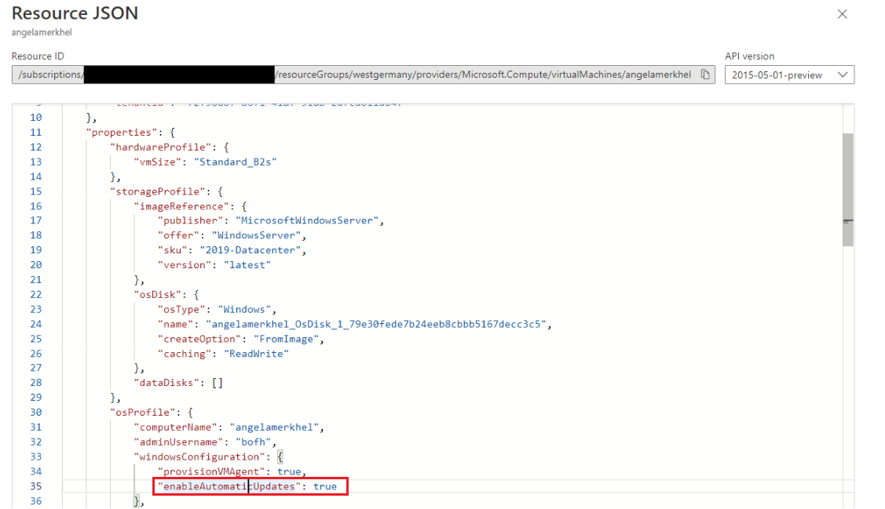

+++
author = "Lucas Huang"
date = '2025-05-18T015:48:22+08:00'
title = "How Azure Update Manager (AUM) Plays with the Windows Update Client’s NoAutoUpdate Setting"
# description = "This article demonstrates how to deploy a Hugo web application to Azure Static Web Apps"
categories = [
    "Azure"
]
tags = [
    "Azure Update Manager",
    "NoAutoUpdate",
    "Windows Update Client"
]
image = "aum.png"
# draft = true
+++
Keeping your Windows Servers patched and secure is critical, and when you use Azure Update Manager (AUM) to orchestrate patching, it actually talks to the **Windows Update Client** on each Windows Machine via API calls, no matter it is a Azure VM or Azure Arc Server. Under the hood, the Windows Update Client obeys a special registry flag called **NoAutoUpdate**, and that flag can be flipped by multiple “masters of ceremony” (ARM properties, patch extensions, Group Policy) - sometimes even in conflict! In this post, we’ll:

- Explain the **NoAutoUpdate** registry key  
- Show you how Azure VM creation will affect this registry key  
- Show you how AUM controls it  
- Walk through how an altervative control via Group Policy

---

## Windows Update Client Settings at a Glance

All core Windows Update Client settings live under:

```
HKLM\SOFTWARE\Policies\Microsoft\Windows\WindowsUpdate\AU
```

The one we care about is:

  • **NoAutoUpdate** (DWORD = 0 or 1)  
    - 0 = Automatic download/install according to your other AU settings  
    - 1 = Fully disable auto-assessment, download, and install (manual only)  

---

## Who (or What) Can Change NoAutoUpdate?

1. **Azure VM ARM Property**  
   - `osProfile.windowsConfiguration.enableAutomaticUpdates`  
      - If you select "Manual updates", ARM writes the properties as `false` and result in `NoAutoUpdate = 1` on the OS.  
      - If you select "Automatic by OS" or "Azure-orchestrated", ARM writes the properties as `true` and result in `NoAutoUpdate = 0` on the OS.  
   > Note: This is a one-time, deployment-time action. You must redeploy to change it.

   

   

2. **Azure Update Manager**  
   - When you choose **Customer-Managed** or **Azure-Managed (Safe Deployment)** patch schedules, the AUM extension (Microsoft.CPlat.Core.WindowsPatchExtension) runs on each “Assess” or “Patch” operation. The expected NoAutoUpdate value is 1 in these modes.  
   - During each run, it checks the registry and **resets** the NoAutoUpdate flag if it doesn’t match your requested patch mode. 

   

3. **Group Policy (Local or Domain)**  
   - Path:  
     ```
     Computer Configuration 
       → Administrative Templates 
         → Windows Components 
           → Windows Update 
             → Manage end user experience
     ```  
   - **Configure Automatic Updates = Disabled** → sets `NoAutoUpdate = 1`  
   - **Enabled** → sets `NoAutoUpdate = 0`  
   - **Not Configured** → leaves it alone  
   - GP refreshes at every boot and every ~90–120 minutes, so it can "fight" Azure’s extension.

   
---

## AUM ←→ NoAutoUpdate: The Dance in Action

When you trigger a patch assessment or deployment via AUMv2:

1. **AUM** triggers a COM API call into the Windows Update Client.  
2. The **Microsoft.CPlat.Core.WindowsPatchExtension** (part of AUM) inspects `HKLM\SOFTWARE\Policies\Microsoft\Windows\WindowsUpdate\AU\NoAutoUpdate`.  
3. If the flag doesn’t match your **RequestedPatchMode** (e.g., `AutomaticByPlatform`), it writes the desired value.  
4. If it already matches, you’ll see a “No change applied” message.

### Sample WindowsUpdateExtension.log Snippet

```text
[Info]  Patch operation is successfully started. 
[Info]  Core patch process starting to configure the patch setting. 
[Info]  Automatic windows update setting is already at the desired setting of NoAutoUpdate=[1]. No change is applied.
```

With the **Customer-Managed** schedule, you’ll typically see the extension ensuring `NoAutoUpdate=1`. If your Group Policy disagrees—say, GP is set to **Enabled**—you’ll see:

```text
[Warn]  Group Policy changed NoAutoUpdate from 1 → 0
[Info]  Extension reset NoAutoUpdate from 0 → 1
```

…and this can repeat every GP refresh cycle or extension run.

---

## Best Practices & Troubleshooting

- Always **decide** whether you want Azure or Group Policy to be the “source of truth.”  
- If you favor Azure, scope your GPO so it **does not** cover these VMs (or use **Not Configured**).  
- To **trace** issues, search `WindowsUpdateExtension.log` for `NoAutoUpdate`.  
- Remember: the ARM property is _static_ after deployment, but the patch extension and GPO are _dynamic_.

---

## Conclusion

Understanding how AUM, the WindowsPatchExtension, and Group Policy interact over the `NoAutoUpdate` flag is key to a stable, predictable patching workflow. With Azure’s extension constantly enforcing your chosen patch mode and GP capable of flipping the flag on its own schedule, it pays to align both systems or disable the one you don’t intend to use. Armed with these details and log-level insights, you’ll keep your Windows Servers up-to-date without the unwanted tug-of-war.