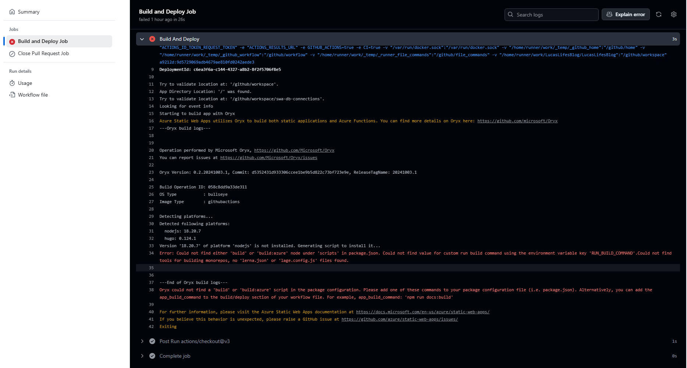

+++
author = "Lucas Huang"
date = '2025-04-16T13:52:22+08:00'
title = "将 Hugo 站点部署到 Azure 静态 Web 应用"
# description = "This article demonstrates how to deploy a Hugo web application to Azure Static Web Apps"
categories = [
    "Azure"
]
tags = [
    "Azure Static Web App",
    "Hugo"
]
# image = "the-creative-exchange-d2zvqp3fpro-unsplash.jpg"
# draft = true
+++

# 背景
虽然[这一篇微软文档](https://learn.microsoft.com/zh-cn/azure/static-web-apps/publish-hugo)中介绍了如何将 Hugo 网站部署到 Azure Static Web Apps，看起来一步一步跟着做就能成功，但实际上照着做会导致 GitHub Actions 构建失败，报错提示。



# 解决方法
究其原因，是工作流中缺少了 `app_build_command` 设置，所以构建失败.我们只需要加入 `app_build_command: "hugo --gc --minify"` 这一行就可以使其构建成功. 以下是一个完整的工作流：
```yml
name: Azure Static Web Apps CI/CD

on:
  push:
    branches:
      - master
  pull_request:
    types: [opened, synchronize, reopened, closed]
    branches:
      - master

jobs:
  build_and_deploy_job:
    if: github.event_name == 'push' || (github.event_name == 'pull_request' && github.event.action != 'closed')
    runs-on: ubuntu-latest
    name: Build and Deploy Job
    permissions:
       id-token: write
       contents: read
    steps:
      - uses: actions/checkout@v3
        with:
          submodules: true
          lfs: false
      - name: Install OIDC Client from Core Package
        run: npm install @actions/core@1.6.0 @actions/http-client
      - name: Get Id Token
        uses: actions/github-script@v6
        id: idtoken
        with:
           script: |
               const coredemo = require('@actions/core')
               return await coredemo.getIDToken()
           result-encoding: string
      - name: Build And Deploy
        id: builddeploy
        uses: Azure/static-web-apps-deploy@v1
        with:
          azure_static_web_apps_api_token: ${{ secrets.AZURE_STATIC_WEB_APPS_API_TOKEN_BLACK_MUD_072BA1D00 }}
          action: "upload"
          ###### Repository/Build Configurations - These values can be configured to match your app requirements. ######
          # For more information regarding Static Web App workflow configurations, please visit: https://aka.ms/swaworkflowconfig
          app_location: "/" # App source code path
          api_location: "" # Api source code path - optional
          app_build_command: "hugo --gc --minify"
          output_location: "public" # Built app content directory - optional
          github_id_token: ${{ steps.idtoken.outputs.result }}
          ###### End of Repository/Build Configurations ######

  close_pull_request_job:
    if: github.event_name == 'pull_request' && github.event.action == 'closed'
    runs-on: ubuntu-latest
    name: Close Pull Request Job
    steps:
      - name: Close Pull Request
        id: closepullrequest
        uses: Azure/static-web-apps-deploy@v1
        with:
          action: "close"
```
