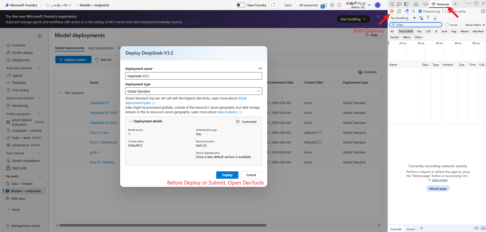
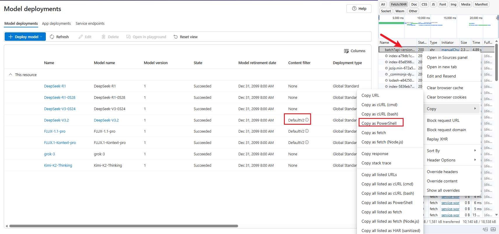
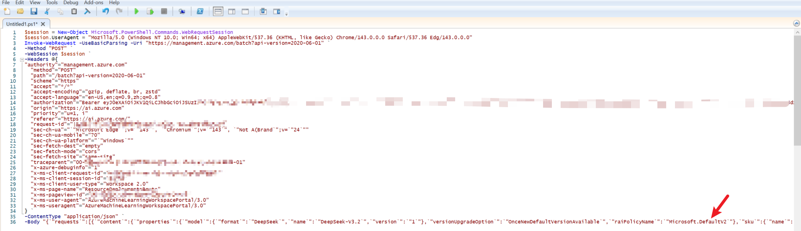
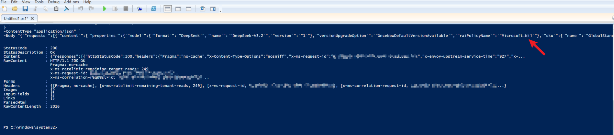

+++
author = "Lucas Huang"
date = '2025-12-29T10:00:00+08:00'
title = "How to Remove Content Filter from Azure Foundry/OpenAI Models"

categories = [
    "Azure"
]
tags = [
    "Azure Foundry",
    "Azure OpenAI"
]
image = "cover.png"
# draft = true
+++

## Background

When deploying models in Azure Foundry AI/Azure OpenAI, the system applies the `Microsoft.DefaultV2` content filter by default. While the content filter is designed to ensure safety and compliance of generated content, overly strict filtering in certain scenarios can lead to the following issues:

- Model responses being truncated or incomplete
- Output content being incoherent, affecting readability
- Normal technical discussions being mistakenly flagged as sensitive content

For development/testing environments or specific business scenarios, we may need to remove or adjust this content filter.

## Solution

Follow these steps to modify the content filter from `Microsoft.DefaultV2` to `Microsoft.Nil` (no filtering) when creating a model deployment.

### Open Browser Developer Tools

In the Azure Foundry Portal, before creating a new model deployment or modifying an existing model, press `F12` to open the browser's Developer Tools and switch to the Network tab. Here I use creating `DeepSeek-V3.2` as an example.

### Create/Modify Model Deployment and Capture Request

In the Azure Foundry Portal, click submit. We'll see `DeepSeek-V3.2` being created with the content filter set to `DefaultV2`.

At this point, the developer tools have already captured the request submitted to the backend. In the network request list, find the API request for creating the deployment (the first POST request to the `management.azure.com` endpoint).

Right-click on the request and select **Copy** → **Copy as PowerShell**.

### Modify Request Parameters

Open a text editor. Here I use Windows built-in **PowerShell ISE** as an example, and paste the command we just copied.

In the JSON payload of the last line, find the `raiPolicyName` field and change its value from `Microsoft.DefaultV2` to `Microsoft.Nil`.

### Execute the Modified Request

Execute the modified command in PowerShell ISE. We can see a 200 OK response.

Now go back to the Azure Foundry Portal, and you'll see that the content filter has been removed.

## Conclusion

By capturing and modifying Azure Portal's API requests, we can specify the `Microsoft.Nil` content filter when creating model deployments, thus removing the default content restrictions. This method is suitable for development and testing scenarios that require more flexible output control. However, please carefully evaluate security and compliance risks and use this method cautiously in production environments.
