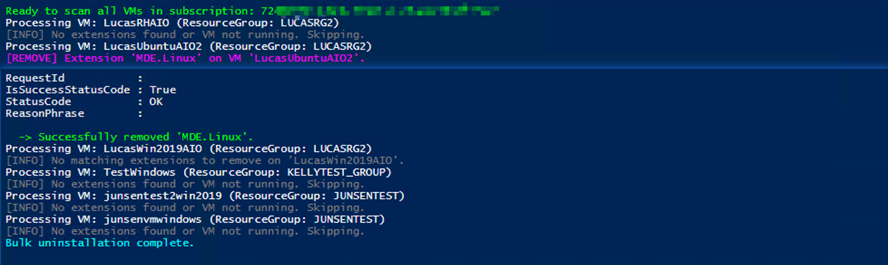

+++
author = "Lucas Huang"
date = '2025-04-25T09:49:22+08:00'
title = "Automating Bulk Uninstallation of Any Azure VM Extensions"
# description = "This article demonstrates how to deploy a Hugo web application to Azure Static Web Apps"
categories = [
    "Azure",
    "Azure VM"
]
tags = [
    "Azure VM Extensions"
]
image = "cover.png"
# draft = true
+++
## Background 
Managing hundreds of Azure Virtual Machines (VMs) can become tedious when you need to install or uninstall VM extensions—especially if you’re decommissioning agents like Microsoft Monitoring Agent (MMA) or OMS Agent. Manually drilling into each VM in the Azure portal is time‑consuming and error‑prone. This blog post walks you through a reusable PowerShell script that:

- Targets all VMs in a specific Azure subscription
- Skips any VMs you explicitly exclude
- Uninstalls one or more specified extensions in one shot
- Provides clear logging and error handling

## Prerequisites
- **Azure PowerShell Az Module** installed (Az.Accounts, Az.Compute).  
- Permissions to read VMs and remove extensions in your target subscription.  
- You’ve authenticated to Azure via `Connect-AzAccount`.

## How it works
1. **Connect-AzAccount**  
   Authenticate you with Azure AD.

2. **Select-AzSubscription**  
   Targets the subscription where your VMs live.

3. **Get-AzVM**  
   Retrieves all VMs in that subscription.

4. **Exclusion Logic**  
   Skips any VMs listed in `$excludeVMNameList`.

5. **Extension Discovery**  
   Uses `Get-AzVM -Status` to gather installed extensions.

6. **Removal**  
   For each extension name matching your `$uninstallExtensionNameList`, calls `Remove-AzVMExtension`.

7. **Logging & Error Handling**  
   Color‐coded output lets you quickly scan successes, failures, and skips.

## The Script

Below is the complete PowerShell script for reference:
```powershell
<#
.SYNOPSIS
    Bulk-uninstalls specific VM extensions across all VMs in a subscription, 
    with the ability to exclude certain VMs.

.DESCRIPTION
    - Connects to Azure.
    - Switches context to the given subscription.
    - Iterates through all VMs in that subscription.
    - Skips any VM in the exclusion list.
    - Checks for installed extensions matching your uninstall list.
    - Removes matching extensions, logging successes and failures.

.PARAMETER subscriptionId
    The target Azure Subscription ID.

.PARAMETER excludeVMNameList
    An array of VM names to skip entirely.

.PARAMETER uninstallExtensionNameList
    An array of extension names to remove.

.EXAMPLE
    # Run this script after setting your variables to clean up monitoring agents
    .\Bulk-Uninstall-AzVMExtensions.ps1
#>

# --------------------------------------
# 1. Authentication & Subscription Setup
# --------------------------------------
Write-Host "Authenticating to Azure..." -ForegroundColor Cyan
Connect-AzAccount -ErrorAction Stop

# Target Subscription
$subscriptionId =  "xxxxxxxx-xxxx-xxxx-xxxx-xxxxxxxxxxxx"
Select-AzSubscription -SubscriptionId $subscriptionId

# --------------------------------------
# 2. Configure Exclusions & Targets
# --------------------------------------
# VMs to skip (prefix comma to initialize as array)
$excludeVMNameList = , "LucasVMWinJP", "VMName2"

# Extensions to remove
$uninstallExtensionNameList = , "MMAExtension", `
    "MicrosoftMonitoringAgent", "OmsAgentForLinux", "OMSExtension"

Write-Host "Ready to scan all VMs in subscription: $subscriptionId" -ForegroundColor Green

# --------------------------------------
# 3. Iterate Through Each VM
# --------------------------------------
$vmList = Get-AzVM

foreach ($vm in $vmList) {
    $vmName       = $vm.Name
    $rgName       = $vm.ResourceGroupName
    $vmLocation   = $vm.Location

    # 3.1 Skip excluded VMs
    if ($excludeVMNameList -icontains $vmName) {
        Write-Host "[SKIP] VM '$vmName' is in the exclusion list." -ForegroundColor Yellow
        continue
    }

    Write-Host "Processing VM: $vmName (ResourceGroup: $rgName)" -ForegroundColor White

    # Retrieve installed extensions with status
    $vmStatus   = Get-AzVM -ResourceGroupName $rgName -Name $vmName -Status
    $extensions = $vmStatus.Extensions

    # 3.2 No extensions or VM not in a running state
    if (-not $extensions -or $extensions.Count -eq 0) {
        Write-Host "[INFO] No extensions found or VM not running. Skipping." -ForegroundColor DarkGray
        continue
    }

    # 3.3 Remove matching extensions
    $removedAny = $false

    foreach ($ext in $extensions) {
        $extName = $ext.Name

        if ($uninstallExtensionNameList -icontains $extName) {
            $removedAny = $true
            Write-Host "[REMOVE] Extension '$extName' on VM '$vmName'." -ForegroundColor Magenta

            try {
                Remove-AzVMExtension `
                    -ResourceGroupName $rgName `
                    -VMName $vmName `
                    -Name $extName `
                    -Force `
                    -ErrorAction Stop

                Write-Host "  -> Successfully removed '$extName'." -ForegroundColor Green
            }
            catch {
                Write-Host "  -> Failed to remove '$extName': $_" -ForegroundColor Red
            }
        }
    }

    if (-not $removedAny) {
        Write-Host "[INFO] No matching extensions to remove on '$vmName'." -ForegroundColor DarkGray
    }
}

Write-Host "Bulk uninstallation complete." -ForegroundColor Cyan
```

## Expected Output  

Once you run the script, you should see output similar to the following, where each server is checked and updated only if necessary:



