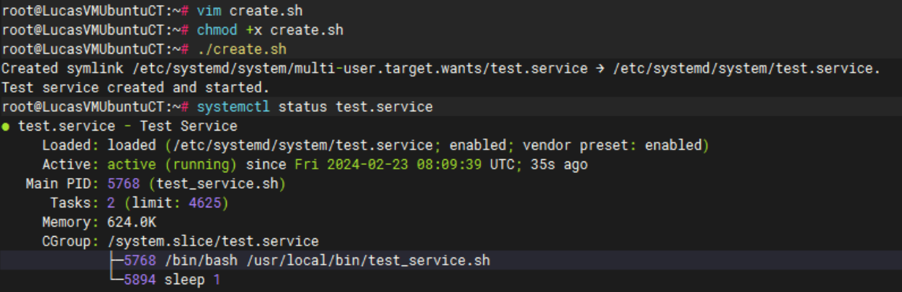
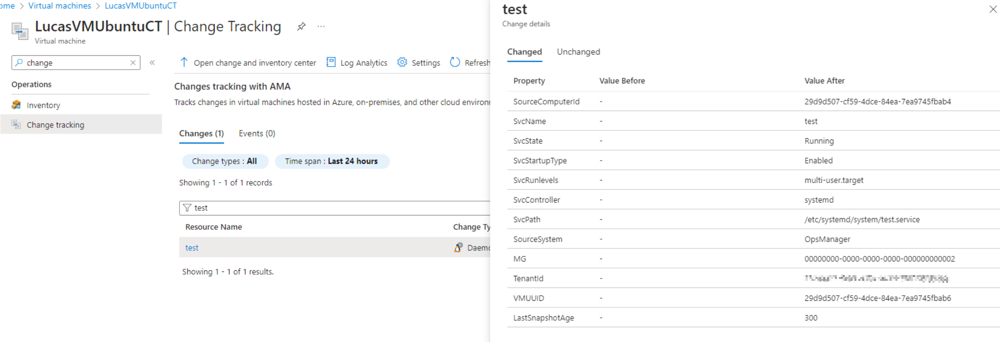
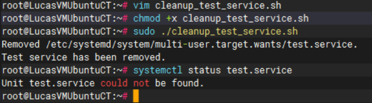
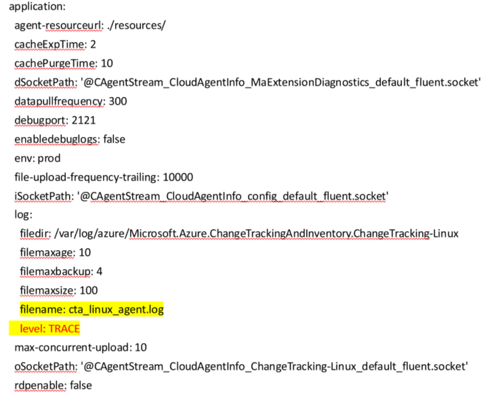
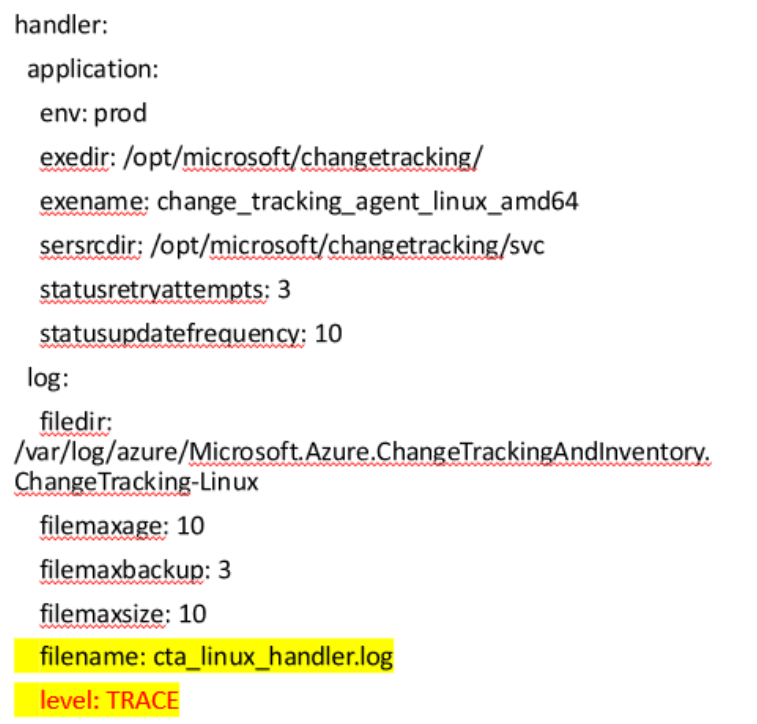
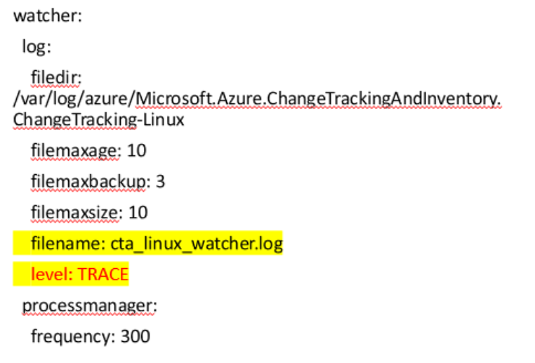

+++
author = "Lucas Huang"
date = '2025-06-24T13:31:00+08:00'
title = "Frequent How-To Qestions related to Linux Change Tracking and Inventory with Azure Montior Agent"
categories = [
    "Azure"
]
tags = [
    "Azure Monitor Agent",
    "Change Tracking and Inventory"
]
image = "cover.png"
# draft = true
+++


## How To: Create a test Linux Service

### Scenario
This how-to applies to creating a test service on customer's Linux machine. This may help identify issues of CT&I Agent detecting Linux Services.

### Create a test service
1. Create a script named `create_test_service.sh` to create and set up the service, with below content. The service named `test.service`, and will keep writing a log to `/tmp/test_service.log` every 30s. 
    ```bash
    #!/bin/bash

    # Create the script that the service will execute
    cat <<EOF > /usr/local/bin/test_service.sh
    #!/bin/bash
    touch /tmp/test_service.log
    while true; do
    echo "Test Service: \$(date)" >> /tmp/test_service.log
    sleep 30
    done
    EOF

    # Give the script execution permissions
    chmod +x /usr/local/bin/test_service.sh

    # Create the systemd service file
    cat <<EOF > /etc/systemd/system/test.service
    [Unit]
    Description=Test Service

    [Service]
    Type=simple
    ExecStart=/usr/local/bin/test_service.sh
    Restart=always

    [Install]
    WantedBy=multi-user.target
    EOF

    # Reload systemd to make the new service take effect
    systemctl daemon-reload

    # Start the service
    systemctl start test.service

    # Enable the service to start on boot
    systemctl enable test.service

    echo "Test service created and started."
    ```

2. Use following commands to run the script
    ```bash
    chmod +x create_test_service.sh
    sudo ./create_test_service.sh
    ```

3. Use `systemctl status test.service` to check the service status. The output would look similar to below.

    

4. Let the service run for more than 5 mins so that CT&I Agent should be able to detect it. The result will look similar to below on Azure Portal

    


### Clean up environment
1. Once test is done, create a script named `cleanup_test_service.sh` to clean up the test service, with below content. 

    ```bash
    #!/bin/bash

    # Stop the service
    systemctl stop test.service

    # Disable the service to prevent it from starting on boot
    systemctl disable test.service

    # Remove the service file
    rm /etc/systemd/system/test.service

    # Remove the script that the service was executing
    rm /usr/local/bin/test_service.sh

    # Remove tmp logging
    rm /tmp/test_service.log

    # Reload systemd to apply changes
    systemctl daemon-reload
    systemctl reset-failed

    echo "Test service has been removed."
    ```

2. Use following commands to run the script
    ```
    chmod +x cleanup_test_service.sh
    sudo ./cleanup_test_service.sh
    ```

3. Double check the service removal by `systemctl status test.service`. The result will look similar to below



## How To: Manually Restart CT&I Linux Agent
### Scenario
If you are ever in the position where you need to restart the CT&I Agent for Linux, the following process will give you some guidance.


### **Method 1** (Recommended)
This is using the same commands the Azure VM Guest Agent uses to maintain the agent. You will need to browse the installation directory from a shell and execute the script using either the -disable parameter or the -enable parameter. This will need to be done as the root user.

- Go to /var/lib/waagent/Microsoft.Azure.ChangeTrackingAndInventory.ChangeTracking-Linux-{extension-version}
- As high privilege user run  `./cta_linux_handler disable`
- Wait for few minutes until following processes are finished
/usr/sbin/changetracking/changetracking
/opt/microsoft/changetracking/change_tracking_agent_linux_amd64

- To enable the agent back `./cta_linux_handler enable`


### **Method 2** (If method 1 does not work)
- `systemctl restart cxp.service`

## How To: Manually Purge CT&I Linux Agent

### Scenario
If you are ever in the position where you need to manually purge the CT&I Agent for Linux, the following process will give you some guidance.

Make sure to uninstall the CT&I extension from Azure Portal first, regardless of a failed uninstallation, as below process is only for the agent on OS, not for extension itself.

### **Method 1** (Recommended)
This is using the same commands the Azure VM Guest Agent uses to maintain the agent.
```bash
cd /var/lib/waagent/Microsoft.Azure.ChangeTrackingAndInventory.ChangeTracking-Linux-*
./cta_linux_handler disable
./cta_linux_handler uninstall
```
### **Method 2** (If method 1 does not work)
1. Remove cxp service
```bash
systemctl stop cxp
systemctl disable cxp
rm /lib/systemd/system/cxp.service
rm /etc/systemd/system/cxp.service
rm /usr/lib/systemd/system/cxp.service
systemctl daemon-reload (**This is optional**)
```
2. At this stage, cxp.service is still available via `systemctl status cxp`, though in failed state.. Optionally run `systemctl reset-failed` to remove cxp.service from systemd.
3. Remove change-tracking-retail package
    - Redhat series : `yum remove -y change_tracking_retail `
    - Debian series : `apt remove -y change-tracking-retail `
4. Remove local files
    - /opt/microsoft/changetracking/*
    - /usr/sbin/changetracking/*
    - Optional: /var/lib/waagent/Microsoft.Azure.ChangeTrackingAndInventory.ChangeTracking-Linux-*/*
    - Optional: /var/log/azure/Microsoft.Azure.ChangeTrackingAndInventory.ChangeTracking-Linux/*


## How To: Manually Onboard CT&I Linux Agent
### Scenario
If you are ever in the position where you need to manually onboard the CT&I Agent for Linux, the following process will give you some guidance.


### **Method 1** (Recommended)
This is using the same commands the Azure VM Guest Agent uses to maintain the agent. 
```bash
# Install package “change-tracking-retail” & setup cxp.service
cd /var/lib/waagent/Microsoft.Azure.ChangeTrackingAndInventory.ChangeTracking-Linux-*
./cta_linux_handler install

# Enable cxp.service
./cta_linux_handler enable

# Start cxp.service
systemctl start cxp.service
```

### **Method 2** (If method 1 does not work)
1. Manually install "change-tracking-retail" package
- rpm series (Redhat, CentOS, SUSE, etc.)
    ```bash
    cd /var/lib/waagent/Microsoft.Azure.ChangeTrackingAndInventory.ChangeTracking-Linux-*
    rpm --force -i change-tracking-retail_<version>.rpm
    ```
- dpkg series (Ubuntu, Debian, etc.)
    ```bash
    cd /var/lib/waagent/Microsoft.Azure.ChangeTrackingAndInventory.ChangeTracking-Linux-*
    dpkg -i change-tracking-retail_<version>.deb
    ```
2. Manually setup cxp.service
- create and add below content to `/lib/systemd/system/cxp.service` . 

    > **Note**: Below content has one place that needs to be modified to the correct extension version. For checking the current extension version, please use command `ls /var/lib/waagent/ | grep ChangeTracking`
    ```bash
    [Unit]
    Description=Azure change tracking Parent Daemon
    Wants=network-online.target
    After=network-online.target

    [Service]
    ExecStart=/usr/sbin/changetracking/changetracking /opt/microsoft/changetracking/change_tracking_agent_linux_amd64 /var/lib/waagent/Microsoft.Azure.ChangeTrackingAndInventory.ChangeTracking-Linux-<**replace-correct-version**>
    Restart=on-failure

    [Install]
    WantedBy=multi-user.target
    ```
- `chmod 0644  /lib/systemd/system/cxp.service`
- `cp /opt/microsoft/changetracking/svc/changetracking /usr/sbin/changetracking/`
- `chmod 0755 /usr/sbin/changetracking/changetracking`
- `systemctl enable cxp`
- `systemctl start cxp`

  **Note**: You may backup any files in `/usr/sbin/changetracking/` if exists prior to these scripts.

## How To: Enable Trace Logging of CT&I Linux Agent

### Scenario
If you are ever in the position where you need to trace down details on how CT&I Agent Linux works, the following process will give you some guidance.

### Step 1: Change Log Level in Configuration File
In order to enable debug logging of CT&I Agent, we need to edit the configuration file `/var/lib/waagent/Microsoft.Azure.ChangeTrackingAndInventory.ChangeTracking-Linux-*/application.yml`. There is three parts we need to take care of:
1. Enable trace logging for `/var/log/azure/Microsoft.Azure.ChangeTrackingAndInventory.ChangeTracking-Linux/cta_linux_agent.log`. The is the main agent log, which contains communication with AMA and details of Files/Services/Software inventory and changes. Edit the level to `TRACE`.

    

2. Enable trace logging for `/var/log/azure/Microsoft.Azure.ChangeTrackingAndInventory.ChangeTracking-Linux/cta_linux_handler.log`. The is the log of handler services, brings up agent main process, provides basic environment parameters to the agent. Edit the level to `TRACE`.

    

3. Enable trace logging for `/var/log/azure/Microsoft.Azure.ChangeTrackingAndInventory.ChangeTracking-Linux/cta_linux_watcher.log`. The is the log of checking whether agent main process/service are running. Edit the level to `TRACE`.

    

### Step 2: Restart CT&I Linux Agent
- For how to restart CT&I Agent, Please refer to [How To: Manually Restart CT&I Linux Agent](#how-to-manually-restart-cti-linux-agent).

**Note:** 
- After restarted the CT&I Agent, we need to wait for some time for debug logs being populated. Typically 1 hour would be good to collect a cycle run of Services, Software and Files. 
- Please change the collection level back to avoid filling up disk space after debug logs are collected.

