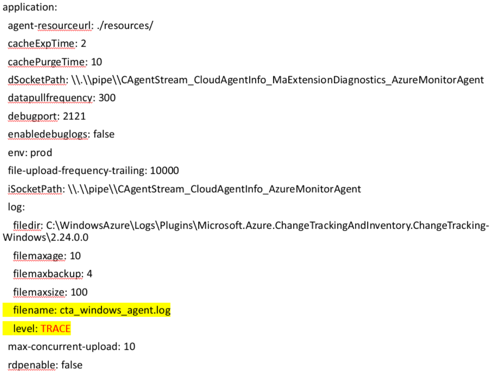
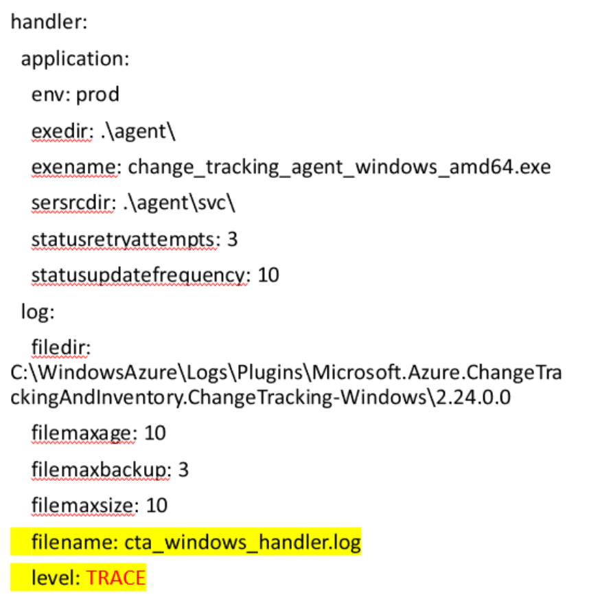
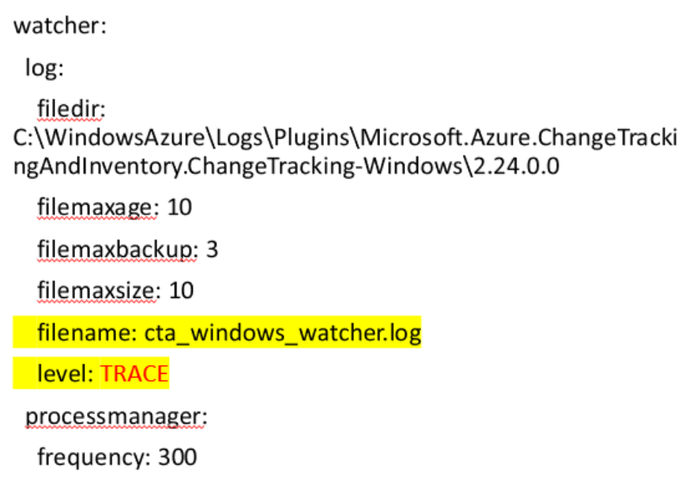

+++
author = "Lucas Huang"
date = '2025-06-24T13:46:00+08:00'
title = "Frequent How-To Qestions related to Windows Change Tracking and Inventory with Azure Montior Agent"
categories = [
    "Azure"
]
tags = [
    "Azure Monitor Agent",
    "Change Tracking and Inventory"
]
image = "cover.png"
# draft = true
+++

## How To: Manually Restart CT&I Windows Agent

### Scenario
If you are ever in the position where you need to restart the CT&I Agent for Windows, the following process will give you some guidance.


### **Method 1** (Recommended)
This is using the same commands the Guest Agent uses to maintain the agent. Run below commands in a PowerShell session.
```powershell
cd C:\Packages\Plugins\Microsoft.Azure.ChangeTrackingAndInventory.ChangeTracking-Windows\<version>
# Stop Change Tracking Service
.\cta_windows_handler.exe disable

# Start Change Tracking Service
.\cta_windows_handler.exe enable
```

### **Method 2** (If method 1 does not work)
```powershell
$serviceName = "change_tracking_service"

# Stop Change Tracking Service
Stop-Service -Name $serviceName -Force

# Start Change Tracking Service
Start-Service -Name $serviceName
```

## How To: Manually Purge CT&I Windows Agent


### Scenario
If you are ever in the position where you need to manually purge the CT&I Agent for Windows, the following process will give you some guidance.

Make sure to uninstall the CT&I extension from Azure Portal first, regardless of a failed uninstallation, as below process is only for the agent on OS, not for extension itself.

### **Method 1** (Recommended)
This is using the same commands the Guest Agent uses to maintain the agent. Run below commands in a PowerShell session.
```powershell
cd C:\Packages\Plugins\Microsoft.Azure.ChangeTrackingAndInventory.ChangeTracking-Windows\<version>
.\cta_windows_handler.exe disable
.\cta_windows_handler.exe uninstall
```
### **Method 2** (If method 1 does not work)
1. Remove change_tracking_service
    ```powershell
    $serviceName = "change_tracking_service"

    # Stop the service if it is running
    Stop-Service -Name $serviceName -Force

    # Remove the service using sc.exe
    sc.exe delete $serviceName
    ```

2. Remove local files
- C:\Program Files\ChangeAndInventory\ *
- Optional: C:\WindowsAzure\Logs\Plugins\Microsoft.Azure.ChangeTrackingAndInventory.ChangeTracking-Windows\<version>\ *
- Optional: C:\Packages\Plugins\Microsoft.Azure.ChangeTrackingAndInventory.ChangeTracking-Windows\<version>\ *


## How To: Manually Onboard CT&I Windows Agent
### Scenario
---
If you are ever in the position where you need to manually onboard the CT&I Agent for Windows, the following process will give you some guidance.


### **Method 1** (Recommended)
This is using the same commands the Guest Agent uses to maintain the agent. Run below commands in a PowerShell session.
```powershell
# Setup change_tracking_service
cd C:\Packages\Plugins\Microsoft.Azure.ChangeTrackingAndInventory.ChangeTracking-Windows\<version>
.\cta_windows_handler.exe install

# Start change_tracking_service
.\cta_windows_handler.exe enable
```
### **Method 2** (If method 1 does not work)
Manually setup change_tracking_service. This needs PowerShell in elevated session.

```powershell
# Define service parameters
$serviceName = "change_tracking_service"
$displayName = "ChangeTrackingOneAgent"
$description = "This is a Go service that runs the ChangeTracking agent process."
$version = "2.24.0.0"
$exePath = "C:\Program Files\ChangeAndInventory\svc\change_tracking_service.exe"
$exeArgs = "C:\Packages\Plugins\Microsoft.Azure.ChangeTrackingAndInventory.ChangeTracking-Windows\$version\agent\change_tracking_agent_windows_amd64.exe change_tracking_service C:\Packages\Plugins\Microsoft.Azure.ChangeTrackingAndInventory.ChangeTracking-Windows\$version"
$startMode = "Automatic" # For start mode 'Auto'
$delayedAutoStart = $true

# Create the service
New-Service -Name $serviceName -BinaryPathName "$exePath $exeArgs" -DisplayName $displayName -Description $description -StartupType $startMode

# Set the delayed auto start
$regPath = "HKLM:\SYSTEM\CurrentControlSet\Services\$serviceName"
Set-ItemProperty -Path $regPath -Name "DelayedAutostart" -Value 1

# Start the service
Start-Service -Name $serviceName
```

> **Note**: You may backup any files in `C:\Program Files\ChangeAndInventory\` if exists prior to these scripts.


## How To: Enable Trace Logging of CT&I Windows Agent

### Scenario
If you are ever in the position where you need to trace down details on how CT&I Agent Linux works, the following process will give you some guidance.

### Step 1: Change Log Level in Configuration File
In order to enable debug logging of CT&I Agent, we need to edit the configuration file `C:\Packages\Plugins\Microsoft.Azure.ChangeTrackingAndInventory.ChangeTracking-Windows\<version>\application.yml`. There are three parts we need to take care of 
1. Enable trace logging for `cta_windows_agent.log`. Enable debug log for this is usually enough as this is the main agent log, which contains communication with AMA and details of Files/Services/Software/Registry inventory and changes. Edit the level to `TRACE`.

    

2. Enable trace logging for `cta_windows_handler.log`. The is the log of handler services, brings up agent main process, provides basic environment parameters to the agent. Edit the level to `TRACE`.

    

3. Enable trace logging for `cta_windows_watcher.log`. The is the log of checking whether agent main process/service are running. Edit the level to `TRACE`.

    

### Step 2: Restart CT&I Agent
- For how to restart CT&I Agent, Please refer to [How To: Manually Restart CT&I Windows Agent](#how-to-manually-restart-cti-windows-agent).

**Note:** 
- After restarted the CT&I Agent, we need to wait for some time for debug logs being populated. Typically 1 hour would be good to collect a cycle run of Registry Keys, Services, Software and Files. 
- Please change the collection level back to avoid filling up disk space after logs are collected.

