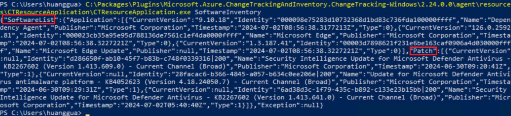

+++
author = "Lucas Huang"
date = '2025-06-24T13:30:00+08:00'
title = "Deep Dig into Windows Change Tracking and Inventory with Azure Montior Agent"
# description = "This article demonstrates how to deploy a Hugo web application to Azure Static Web Apps"
categories = [
    "Azure"
]
tags = [
    "Azure Monitor Agent",
    "Change Tracking and Inventory"
]
image = "cover.png"
series = ["Windows CT&I With AMA"]
+++


## Architecture

### Overview
As for a big picture, Azure Monitor Agent (AMA) is responsible for uploading Change Tracking and Inventory (CT&I) data to Azure backend, while CT&I agent is just responsible for collecting data from Operation System and pass them to AMA.


### Extension Portal view 


## How Change Tracking & Inventory for AMA Windows Data is Collected

This section has two parts involved, namely what AMA does and what CT&I Agent does. 

### Part 1: AMA Initialization


1. Azure Monitor Windows Agent (AMA) fetches all the DCRs and the MCSConfiguration, stores them at `C:\WindowsAzure\Resources\AMADataStore.LucasWin2019AIO\mcs\configchunks\*.json` and `C:\WindowsAzure\Resources\AMADataStore.LucasWin2019AIO\mcs\mcsconfig.latest.xml` respectively.

2. As per the mcsconfig details, AMA loads the datasources and initializes the LocalStore(cache) at `C:\WindowsAzure\Resources\AMADataStore.<machine-name>\Tables`. Specifically for CT&I DCR, below tables will be created under the above cache directory (they will not be created until first data arrives).
    - &lt;stream&gt;_18299827115690051523.tsf (CONFIG_DATA_BLOB_V2)

    - &lt;stream&gt;_13148241926187733235.tsf (CONFIG_CHANGE_BLOB_V2)

    - &lt;stream&gt;_11545608512621991890.tsf (CONFIG_CHANGE_BLOB)
    
    

3. AMA initializes extension pipes. 
    - `\\.\\pipe\\CAgentStream_CloudAgentInfo_AzureMonitorAgent` - CT&I agent will connect to this socket to obtain DCR config from AMA. 

    - `\\.\\pipe\\CAgentStream_ChangeTracking-Linux_<stream-name>_AzureMonitorAgent` - isn't used by Windows CT&I Agent.

    - `\\.\\pipe\\CAgentStream_ChangeTracking-Windows_<stream-name>_AzureMonitorAgent` - CT&I will write collected data(Software ,Services, Files, Registry Keys) to AMA via this named pipe.  
    
    
    
### Part 2: CT&I Agent Workflow

1. CT&I Agent gets DCR from AMA via  `\\.\\pipe\\CAgentStream_CloudAgentInfo_AzureMonitorAgent`. This behaviour refreshes every 5 mins. 
    > **Note**: CT&I Agent does not support multiple DCRs. At a time only 1 DCR is supported. If there are multiple CT DCRs assigned to AMA, which DCR finally CT&I Agent gets is random.

2. Per the frequency defined in DCR, Files Scheduler, Services Scheduler, Software Scheduler and Registry Scheduler will be initialized. These schedulers will then trigger corresponding workers to fetch the CT&I data. Please refer to detailed workflow chart as below.
3. When CT&I data are collected, CT&I Agent forwards these data to AMA via `\\.\\pipe\\CAgentStream_ChangeTracking-Windows_<stream-name>_AzureMonitorAgent`. AMA will be then responsible for data upload to Azure backend. 

#### Services Collection Workflow


Equivalence: 
```
Get-WmiObject -Query "SELECT * FROM Win32_Service" | Select-Object Name, DisplayName, State, PathName, StartMode, StartName, Description | Format-Table
```


#### Software Collection Workflow (Patches data included)


Equivalence: 
```
C:\Packages\Plugins\Microsoft.Azure.ChangeTrackingAndInventory.ChangeTracking-Windows\<version>\agent\resources\CTResourceApplication\CTResourceApplication.exe SoftwareInventory
```

**Sample Output**:




#### Files Collection Workflow


#### Registry Keys Collection Workflow


> **Note**: There is no inventory blob for registry keys inventory. All Registry Keys data are just sent to CONFIG_CHANGE_BLOB


### What is DB in above workflows
---
The CT&I Agent will store collected data in the DB file `%SystemDrive%\Program Files\ChangeAndInventory\db\changetracking.db`. The DB file can be directly open by any text editor like below, or use https://github.com/ShoshinNikita/boltBrowser. 


Though it contains all the data, it is not recommended to analyze the DB file directly as it is hard to read. We have friendly readable json files (Registry data is not exported to json) at below folder for Azure Arc and Azure VM respectively,  which corresponds to the workers results, and are the same with the DB's content.
- Azure VM: `C:\WindowsAzure\Logs\Plugins\Microsoft.Azure.ChangeTrackingAndInventory.ChangeTracking-Windows\<version>`
- Azure Arc: `C:\Packages\Plugins\Microsoft.Azure.ChangeTrackingAndInventory.ChangeTracking-Windows\<version>`
  - File.json             
  - Applications.json         
  - Services.json     
  - Patches.json 

> **Note**: both DB and the json files only stores the latest collected data (last worker run result). 


## Documentation 

Here is the link to CT&I with AMA documents: 

- [Overview of change tracking and inventory using Azure Monitoring Agent](https://learn.microsoft.com/azure/automation/change-tracking/overview-monitoring-agent)

- [Supported Regions](https://learn.microsoft.com/azure/automation/change-tracking/region-mappings-monitoring-agent)

- [Enable Change Tracking and Inventory using Azure Monitoring Agent](https://learn.microsoft.com/azure/automation/change-tracking/enable-vms-monitoring-agent?tabs=singlevm)

- [Configure Alerts](https://learn.microsoft.com/azure/automation/change-tracking/configure-alerts)

- [Extension Version Details and Known Issues](https://learn.microsoft.com/azure/automation/change-tracking/extension-version-details)
