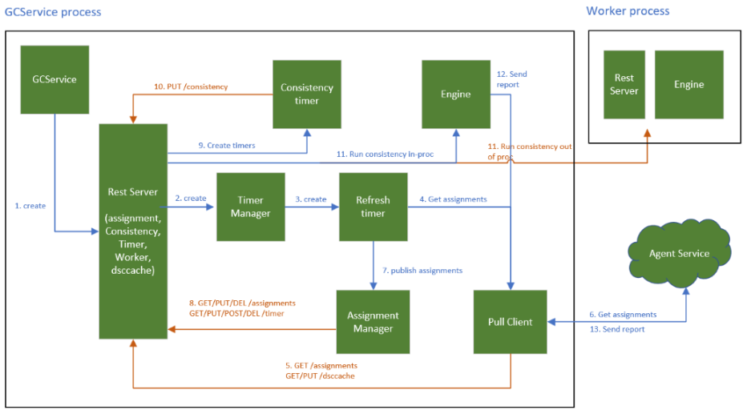

+++
author = "Lucas Huang"
date = '2025-05-19T07:52:22+08:00'
title = "A Comprehensive Look at the Azure Guest Configuration Agent: High-Level Design and Execution Flow"
# description = "This article demonstrates how to deploy a Hugo web application to Azure Static Web Apps"
categories = [
    "Azure"
]
tags = [
    "Machine Configuration",
    "Guest Configuration"
]
image = "cover.png"
# draft = true
+++

## Introduction
The Machine Configuration, or previously known as Guest Configuration (GC), is a vital component in Azure that helps audit and ensure compliance of your virtual machines (VMs). When you apply a guest configuration policy, the platform uses two policy definitions—DeployIfNotExists and AuditIfNotExists—to install and manage the GC Agent that collects audit information. Let’s explore how this happens and see how the GC Agent performs its tasks.

## The Two Policies Behind a Guest Configuration Policy
Each guest configuration policy is actually a combination of two policy definitions:

1. **DeployIfNotExists**  
   - Creates a system-assigned managed identity on the target VM.  
   - Deploys the Guest Configuration extension, which in turn installs the GC Agent on the target machine.  
   - Issues a PUT call to the guest configuration policy, storing policy information for the VM in the Agent Service’s Regional DB.

2. **AuditIfNotExists**  
   - Checks the compliance status of the applied policy.

When you deploy the DeployIfNotExists policy on a VM, the GC Agent is installed by the Guest Configuration extension on that VM. Once installed, the GC Agent begins its execution flow to audit and report the policy’s compliance status.

## GC Agent Execution Flow
After the GC Agent is deployed, here’s what happens behind the scenes:

1. **Agent Startup and Metadata Retrieval**
   - Upon startup (and every five minutes), the Agent retrieves an MSI token, VM location, and VM resource ID from IMDS/HIMDS services.  
   - Next, the Agent contacts a global endpoint to obtain the regional endpoint of the Agent Service. After receiving the regional endpoint, all subsequent calls are made to that regional endpoint.

2. **Fetching Assigned Policies**
   - The Agent calls “get assignments” from the regional endpoint to retrieve a list of all assigned policies for the VM.  
   - Each policy in the list provides a package location (a ZIP file) that contains the DSC (Desired State Configuration) scripts necessary for auditing and collecting information on the VM.

3. **Downloading and Scheduling Policy Packages**
   - The Agent downloads each policy package (for example, policies named “abc” and “def”).  
   - For each policy package, the Agent creates a timer (one per policy). These timers trigger every 15 minutes, running the DSC configuration defined in the policy package.

4. **Generating and Sending Audit Reports**
   - Each timer execution collects audit data from the VM based on the policy’s DSC configuration.  
   - The collected audit report is sent back to the Agent Service, one by one.  
   - Users can then view these audit reports from the Policy UI in Azure.

## GC Agent Logs, Binaries, and Configuration Paths
Depending on the operating system and whether the VM is Azure-based or Azure Arc-enabled, the GC Agent stores logs, binaries, and policy configurations in specific locations:

### Azure (Non-Arc) Machines

#### Windows
- Logs:  
  C:\ProgramData\GuestConfig\gc_agent_logs  
- Binary:  
  C:\Packages\Plugins\Microsoft.GuestConfiguration.ConfigurationForWindows  
- Configurations/Policy:  
  C:\ProgramData\GuestConfig\Configuration  

#### Linux
- Logs:  
  /var/lib/GuestConfig/gc_agent_logs  
- Binary:  
  /var/lib/waagent/Microsoft.GuestConfiguration.ConfigurationforLinux-1.24.1/GCAgent/GC  
- Configurations/Policy:  
  /var/lib/GuestConfig/Configuration  

### Arc-enabled Machines

#### Windows
- Logs:  
  C:\ProgramData\GuestConfig\gc_agent_logs  
- Binary:  
  C:\Program Files\AzureConnectedMachineAgent\GCService\GC  
- Configurations/Policy:  
  C:\ProgramData\GuestConfig\Configuration  

#### Linux
- Logs:  
  /var/lib/GuestConfig/gc_agent_logs  
- Binary:  
  /opt/GC_Service/GC/  
- Configurations/Policy:  
  /var/lib/GuestConfig/Configuration  

## Final Thoughts
By combining DeployIfNotExists and AuditIfNotExists, guest configuration policies enable automatic creation of the GC Agent’s prerequisites while ensuring that each VM remains continuously audited. The GC Agent’s periodic checks not only help maintain compliance but also provide an auditable trail that you can review to confirm your systems are configured and operating correctly.

Understanding how the GC Agent works—how it obtains and applies policies, how often it checks for changes, and where to locate its logs—gives you valuable insights into managing and troubleshooting your Azure VMs or Arc-enabled servers. With this knowledge, you can ensure that your infrastructure remains secure and compliant with the policies you set.
