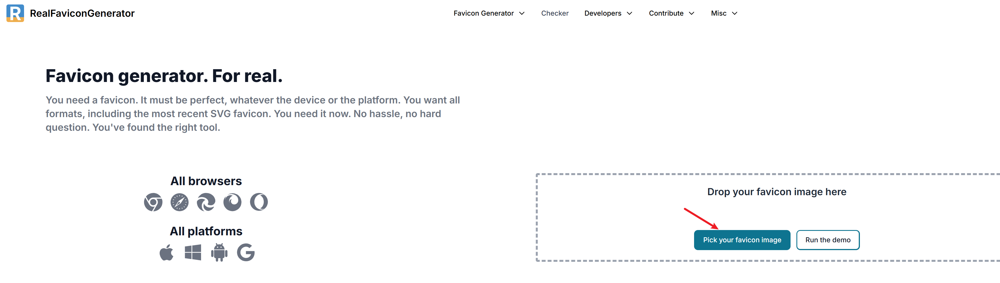
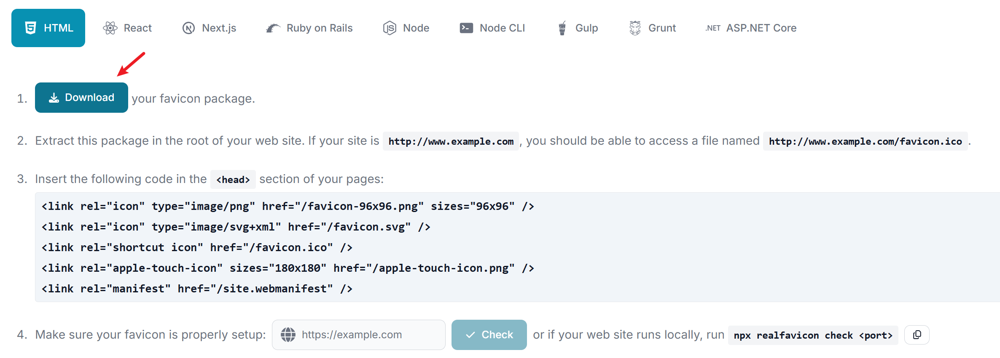

+++  
author = "Lucas Huang"  
date = '2025-04-17T13:52:22+08:00'  
title = "Customizing the Hugo Static Site Icon"  
# description = "This article demonstrates how to deploy a Hugo web application to Azure Static Web Apps"  
categories = [  
    "Personal Blog"  
]  
tags = [  
    "Hugo",  
    "Stack-Theme"  
]  
image = "cover.png"  
draft = false  
+++  

# Background
When generating static sites with Hugo, we often encounter minor issues that, while not critical, can trigger a bit of OCD-like not having a custom site icon. If we follow a theme's default settings, the generated site typically either has no icon or just uses the theme’s built-in icon, which clearly doesn't satisfy my strong DIY urge.

The Hugo theme used on this site is [hugo-theme-stack](https://github.com/CaiJimmy/hugo-theme-stack). It supports custom Favicon icon code, and the author has simplified it so that you only need to adjust the configuration file—eliminating the hassle of editing multiple HTML files. This way, we can focus solely on using the icon we like.

# Generating a Favicon
Adding a favicon to a Hugo site is very simple. First, visit [RealFaviconGenerator](https://realfavicongenerator.net/), which is my go-to online tool for quickly generating favicons. There are many other similar favicon generators available, so feel free to choose one that suits your preferences as their basic functionalities are generally the same. Click on "Pick your favicon image" to upload an image as the source.  


Once the image is uploaded, you will automatically be taken to the settings page. One of the great advantages of RealFaviconGenerator is that it allows you to adjust the image’s display size, corner radius, and color online—saving you a lot of time in image editing, especially if the original image (square or circular) isn't visually appealing enough. After adjusting the "Classic and SVG favicons", you may continue configuring other sections if needed. However, for our Hugo site we only need to modify the "Classic and SVG favicons". Click "Next" to proceed to the next page.  


Soon enough, your favicon is generated! Click "Download" at Step 1. The remaining steps don't require any action because hugo-theme-stack has already incorporated the necessary settings, so there is no need to manually edit any HTML files.  


# Adding the Favicon to Your Site
After unzipping the downloaded package, you'll notice many files inside, but we only need the file named "favicon.ico".  


Simply copy "favicon.ico" into your site's "static" directory (create one if it doesn't exist). Then add the following lines to your hugo.yaml file, and you're all set!  

```yml
params:
    # e.g.: favicon placed in `static/favicon.ico` of your site folder, then set this field to `/favicon.ico` (`/` is necessary)
    favicon: /favicon.ico
```

Check out the final result below—it looks great, doesn't it?

