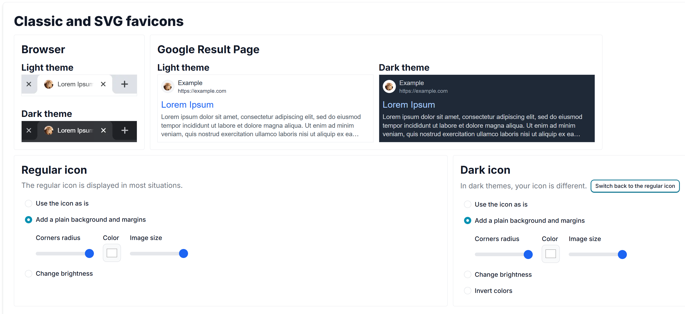
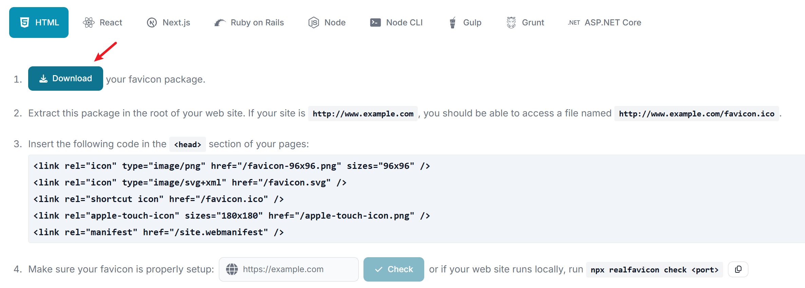
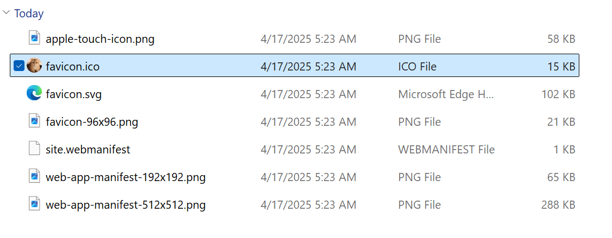
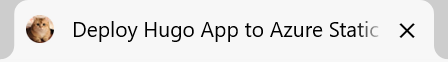

+++
author = "Lucas Huang"
date = '2025-04-17T13:52:22+08:00'
title = "自定义Hugo静态站点图标"
# description = "This article demonstrates how to deploy a Hugo web application to Azure Static Web Apps"
categories = [
    "个人博客"
]
tags = [
    "Hugo",
    "Stack主题"
]
image = "cover.png"
draft = false
+++

# 背景
我们在使用 Hugo 生成静态站点时，经常会遇到一些虽不致命，但唤起强迫症的小问题，例如没有自定义站点图标的问题。假如我们跟随了所用主题的默认配置，通常情况下生成的站点要么没有图标，要么直接套用主题自带的图标，这显然无法满足我那强烈的DIY欲望。

本站所使用的Hugo主题是[hugo-theme-stack](https://github.com/CaiJimmy/hugo-theme-stack), 它是支持自定义Favicon图标代码的，而且作者已经将它简化成了配置文件，不再需要繁琐的配置各种html，我们只需要专注于自己喜欢的图标即可。

# 生成Favicon
为Hugo站点添加Favicon的方法非常简单。首先访问[RealFaviconGenerator](https://realfavicongenerator.net/), 这是我常用的快速生成Favicon在线工具网站。其它类似的 Favicon 生成器还有很多，大家可以根据自己的习惯或喜好自由选择，基本功能都是一样的。点击`Pick your favicon image`上传图片作为母本。


图片上传完成后，会自动跳转到参数配置页面。RealFaviconGenerator最大的好处是他可以在线调整图片的显示大小、圆角和颜色，毕竟有些图片可能方形/圆形不美观，在线调整可以为我们省去很多编辑图片的时间。我们调整完`Classic and SVG favicons`后，可根据需要继续调整其他栏目，由于我们只需要为Hugo站点设置图片，所以只调整`Classic and SVG favicons`就已经足够。点击`Next`进入下一页。


随后我们的Favicon就已经生成好了！我们点击步骤1的`Download`即可。后续的步骤我们不需要去执行，因为`hugo-theme-stack`·都已经帮我们继承好了，我们无需手动编辑任何html文件。


# 添加Favicon到网站
将下载好的压缩包解压，发现其中有很多文件，我们需要用到的只有`favicon.ico`


我们只需要将`favicon.ico`复制到`static`目录下 (不存在则新建)，随后在`hugo.yaml`中添加如下内容，就大功告成了！
```yml
params:
    # e.g.: favicon placed in `static/favicon.ico` of your site folder, then set this field to `/favicon.ico` (`/` is necessary)
    favicon: /favicon.ico
```

看看下面的最终效果是不是很好呢！




