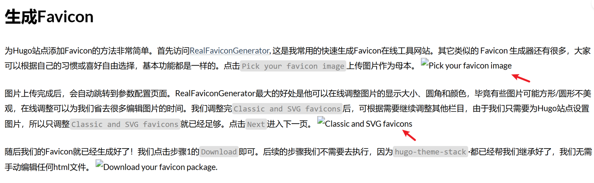

+++
author = "Lucas Huang"
date = '2025-04-17T13:52:22+08:00'
title = "Hugo多语言文章的那些坑"
# description = "This article demonstrates how to deploy a Hugo web application to Azure Static Web Apps"
categories = [
    "个人博客"
]
tags = [
    "Hugo",
    "多语言模式"
]
draft = false
+++

最近在使用 Hugo 生成静态站点时，遇到了一次颇具迷惑性的多语言问题：明明一篇中文文章（index.zh-cn.md）已将 front matter 里的“draft = false”设置好，并且发布日期也是当前时间，然而站点在运行 `hugo server`时却始终无法正常预览这篇文章的图片,比如下图。

再三排查后无果，`public`文件夹下没有生成对应文章的资源。偶然的一次尝试下发现使用`hugo server -D`后就可以正常显示图片了。仔细检查后却发现，居然是对应的英文版本（index.en.md）中依然处于`draft = true`状态，导致一整个多语言页面被 Hugo 判定为**未发布**，从而在非 -D 模式下图片资源未被正确生成起来。

以下是这次排查中的几个值得记录的关键点：

1. Hugo 对多语言的页面通常会视作同一个“内容集合”。  
   当同一内容但不同语言版本的 Markdown 文件处于同一 bundle 或者在同一内容目录下时，如果其中一个语言版本被标记为 draft，那就会影响到整个内容的**发布状态**。换句话说，哪怕你的中文稿件已经`draft = false`，只要英文稿件状态依然是`draft = true`，Hugo 可能就把这一组内容都当成**未完成**，导致它无法在普通模式下被编译。

2. `-D` 参数仅仅适用于本地测试，最终发布前最好了解 draft/future 的来龙去脉。  
   许多时候，我们会在开发调试时习惯使用 `hugo server -D`。这能同时构建草稿、未来发布等所有内容，当然就没有问题。可是一旦切换到不带 -D 的模式，或者部署到生产环境时，`draft = true` 的文章就会被排除在外。如果只盲目加 -D，那么很可能忽略了多语言中的一篇还处于 draft 状态，或者上级目录、配置里有隐藏的草稿标识。

3. 注意每个语言版本 front matter 的一致性。  
   不止是 draft，还有如 date、slug 等配置，如果在多语言版本中出现重大偏差，也会让 Hugo 的多语言处理出现逻辑上的“彼此冲突”。保证所有语言版本都使用一致或合理的 front matter，是让多语言站点按预期运行的关键。

4. 调试方法：命令行工具 + 翻阅配置。  
   当怀疑某篇文章未被正常编译时，可以执行下列命令排查：  
   • `hugo list drafts`：列出哪些文件仍是草稿；  
   • `hugo list future`：列出哪些文章被视为未来发布；  
   • `hugo list expired`：列出哪些文章被视为已过期内容。  
   如果确定草稿和未来日期都不是问题，再检查下主题或全局配置里的 buildDrafts、buildFuture、enableDraft、enableFuture 是否被修改，以及 _index.md、cascade 等是否有额外的 front matter 重写。

5. 留下这次教训，享受多语言配置的乐趣。  
   多语言站点最大的魅力在于可以更好地覆盖全球访问者，但在 Hugo 里，需要细心处理每一个语言版本的 front matter。选择一个合适的目录结构、bundle 用法以及 cascading 的写法，能让你的多语言发布过程更加顺利。

总结下来，这个的踩坑证明了：  
• 在使用多语言时，要确保每种语言的 draft/date 等状态一致或符合预期；  
• 如果其中一个语言文档没设置正确，会影响整个内容单元正常发布；  
• 别一味依赖 -D 来掩盖真正的问题，多用命令行工具和配置排查才是王道。

希望这次经验能给大家带来一些提醒，也欢迎你们在评论区分享更多关于 Hugo 多语言配置的踩坑故事，一起让我们的静态网站更稳定、更可控！