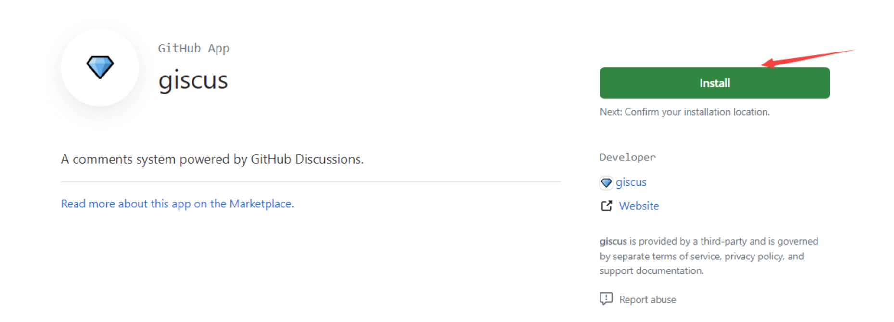
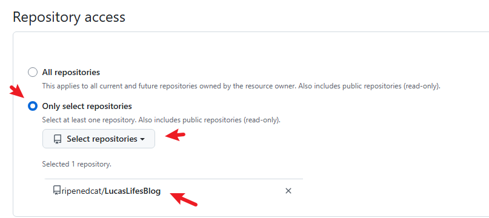
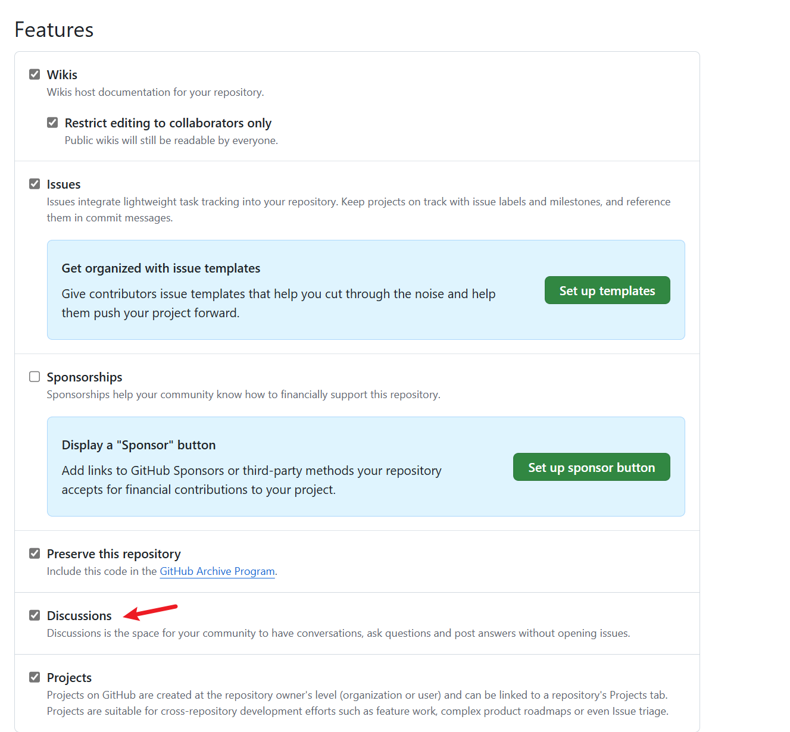
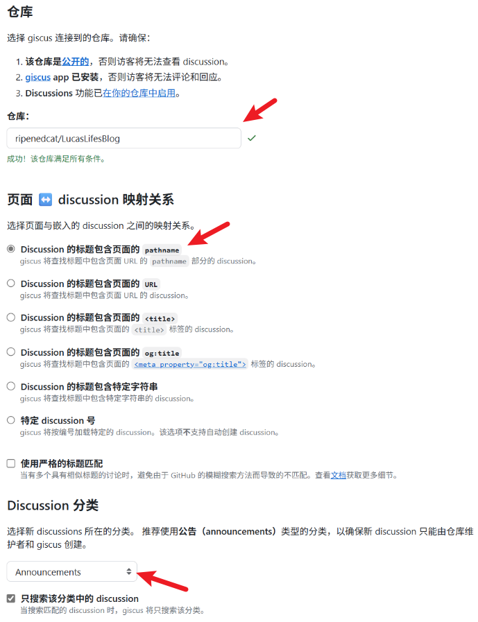
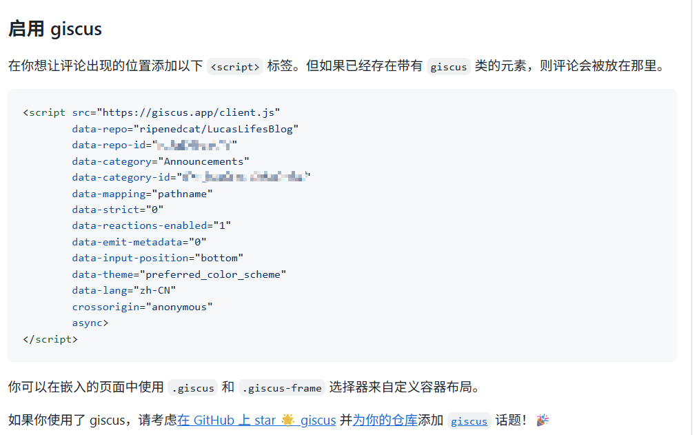

+++
author = "Lucas Huang"
date = '2025-06-22T09:52:22+08:00'
title = "Introduce Giscus to your Hugo Website"
categories = [
    "Hugo Blog"
]
tags = [
    "Giscus",
    "Stack Theme"
]
image = "cover.png"
draft = false
+++
This article mainly records how to integrate giscus to add a comment system for a Hugo blog.

## Choosing a Comment System

The current static blog is built using [hugo](https://github.com/gohugoio/hugo), with the [Theme Stack](https://github.com/CaiJimmy/hugo-theme-stack). This theme already supports various comment systems, including:

- disqus
- gitalk
- valine
- facebook
- telegram
- giscus
- ….

Initially, I used Disqus, but because it is inaccessible from mainland China, I needed an alternative. Among the options, giscus is based on Github Discussions. Since my blog content is also on Github for CI/CD, for simplicity, I chose giscus.

### What is Giscus?

[Giscus](https://link.juejin.cn/?target=https%3A%2F%2Fgiscus.app%2F) is a comment system powered by `GitHub Discussions`. According to its official website, the features of Giscus include:

- Open source.
- No tracking, no ads, always free.
- No need for a separate database. All data is stored in `GitHub Discussions`.
- Supports custom themes!
- Multi-language support.
- Highly configurable.
- Automatically fetches new comments and edits from GitHub.
- You can self-host it!

### Principle

`Giscus` uses `GitHub Discussions` as the database to store comments under each blog post.

When the Giscus plugin loads, it uses the GitHub Discussions search API to look for the discussion associated with the current page, matching it based on the chosen mapping method (such as URL, pathname, etc.). If a matching discussion cannot be found, the `giscus bot` will automatically create a new one the first time someone leaves a comment or reply.

To comment, visitors must authorize the `giscus app` through the GitHub OAuth process to post on their behalf. Alternatively, visitors can comment directly in the GitHub Discussion, and the site owner can manage comments on GitHub.

## Adding Giscus to Your Website

Since the theme already supports the giscus comment system, integrating it is quite straightforward and can be done in the following steps:

### Select a Repository to Store Discussions

Generally, you can use your blog's own repository. For example, I use [ripenedcat/LucasLifesBlog](https://github.com/ripenedcat/LucasLifesBlog).

### Install Giscus

Install giscus in the selected repository so that giscus has permission to access your data.

Click [here](https://github.com/apps/giscus) to go to the installation page for the giscus app, which looks like this:



Click Install, and you'll be prompted to select a repository. Just choose the repository you specified earlier, and from then on, giscus will read data from this repository.



### Enable GitHub Discussions

Open the repository you chose earlier, go to the settings page, and check Discussions to enable Discussions for that repository.



### Get Giscus Configuration Info from the Official Website

Once the above preparations are complete, go to the [giscus website](https://giscus.app/en) to get your configuration details:



Pay attention to the parts indicated with arrows:

- 1) Enter the selected repository.
    - Normally there will be a prompt if the conditions are met; otherwise, check the previous steps for any omissions.
- 2) Mapping between page and discussion.
    - Using the default pathname is generally sufficient.
    - This option mainly affects the name of the created discussion.
- 3) Choose the discussion category for giscus to create discussions in.
    - Usually select Announcements, because only administrators can operate discussions of type Announcements, making management easier.

Once these places are configured, scroll down the page and a config file will be generated:



This configuration file is what you’ll use later; focus on the following fields:

- data-repo
- data-repo-id
- data-category
- data-category-id
- data-mapping

### Add the Configuration Info to Your Blog

Add the configuration information above to the appropriate place in your theme’s settings. In my case, it’s in the `hugo.yaml` file.

> Note: The configuration method may differ depending on the theme, but the parameters needed should be basically the same.

```yaml
comments:
        enabled: true
        provider: giscus

        giscus:
            repo: ripenedcat/LucasLifesBlog
            repoID: xxx
            category: Announcements
            categoryID: xxx
            mapping: pathname
            lightTheme:
            darkTheme:
            reactionsEnabled: 1
            emitMetadata: 0
```

Once configured, redeploy your blog to see the effect.

## Preview

Open any post and scroll to the bottom to see the comment section, which looks like this:


You can participate in comments after logging in with GitHub.

After someone comments, giscus will automatically create a new item in the Discussions section of the configured repository to store the comment.

It looks like this:


You can manage comments there~

> Feel free to leave a message here and try it out~ 👻
