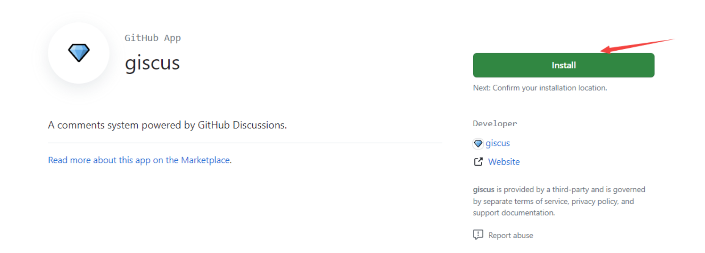
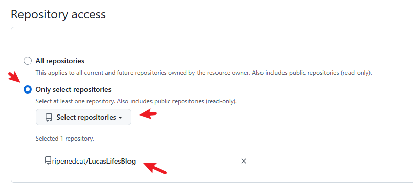
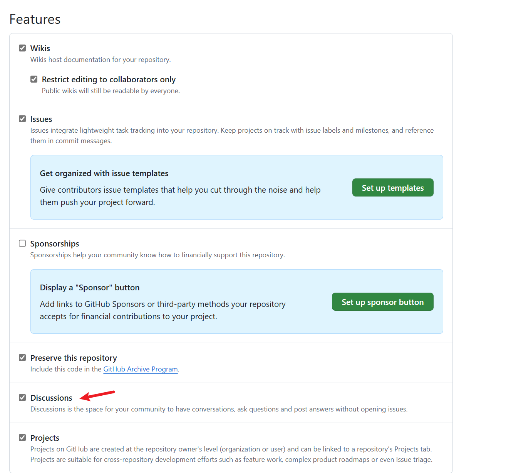
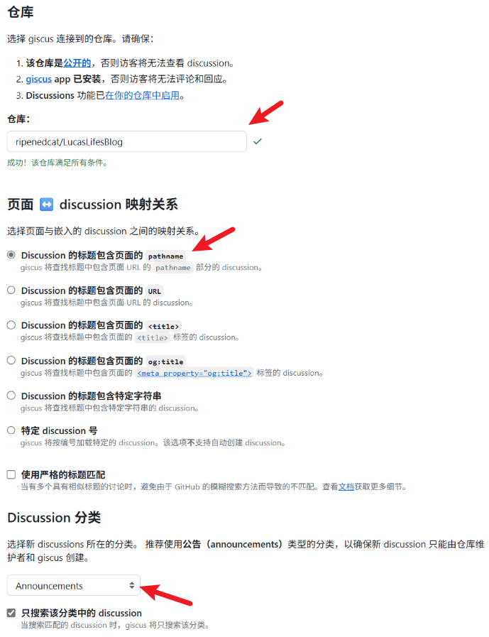
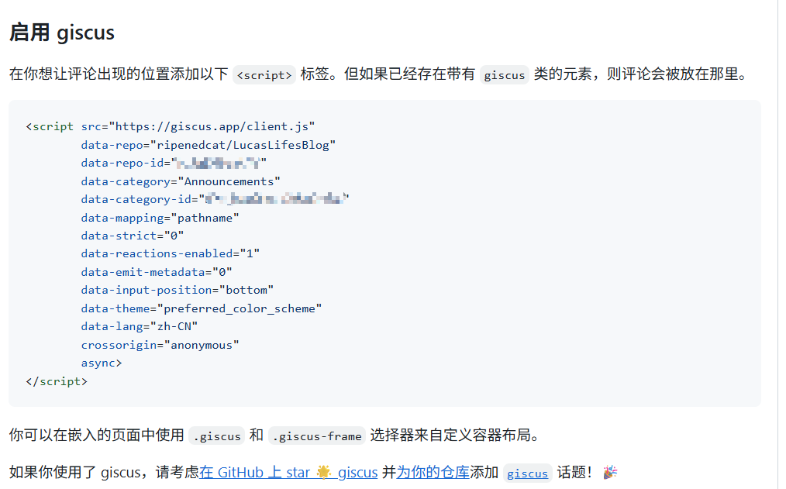
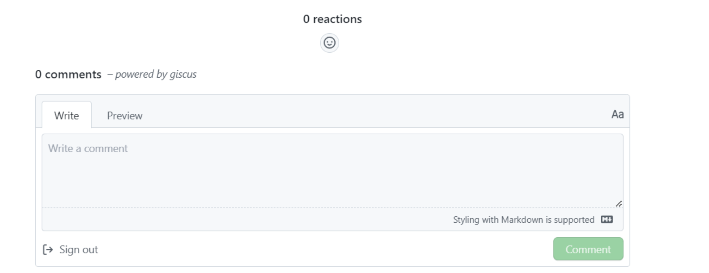
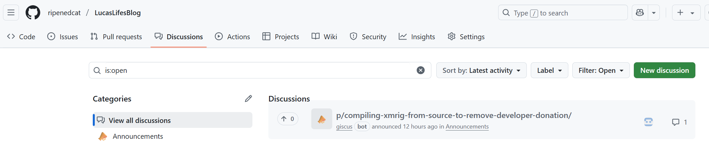

+++
author = "Lucas Huang"
date = '2025-06-22T09:52:22+08:00'
title = "Hugo 博客引入 Giscus 评论系统"
# description = "This article demonstrates how to deploy a Hugo web application to Azure Static Web Apps"
categories = [
    "Hugo博客"
]
tags = [
    "Giscus",
    "Stack主题"
]
image = "cover.png"
draft = false
+++
本文主要记录了如何引入 giscus 为Hugo博客添加评论系统。

## 选择一个评论系统

当前使用的 [hugo](https://github.com/gohugoio/hugo) 生成静态博客，主题是 [Theme Stack](https://github.com/CaiJimmy/hugo-theme-stack)。该主题已经支持了多种评论系统：

- disqus
- gitalk
- valine
- facebook
- telegram
- giscus
- ….

一开始使用的是disqus，但是由于中国大陆无法访问的关系，所以需要找一个替换。其中 giscus 是基于 Github Discussions 的，我们的博客内容也是放在 Github 做CI/CD的，那么为了简单起见就选择 giscus 吧。

### 什么是Giscus
[Giscus](https://link.juejin.cn/?target=https%3A%2F%2Fgiscus.app%2F) 是由 `GitHub Discussions` 驱动的评论系统，根据官网，`Giscus`的特性有：

- 开源。
- 无跟踪，无广告，永久免费。
- 无需数据库。全部数据均储存在 `GitHub Discussions` 中。Giscus
- 支持自定义主题！
- 支持多种语言。
- 高度可配置。
- 自动从 `GitHub` 拉取新评论与编辑。
- 可自建服务！

### 原理
`Giscus` 使用 `GitHub Discussions` 作为数据库存储博客下面的评论。

`Giscus` 插件加载时，会使用 `GitHub Discussions` 搜索 API 根据选定的映射方式（如 URL、pathname、 等）来查找与当前页面关联的 discussion。如果找不到匹配的 `discussion`，`giscus bot` 就会在第一次有人留下评论或回应时自动创建一个 `discussion`。

要评论，访客必须按 `GitHub OAuth` 流程授权 `giscus app` 代表他发帖。或者访客也可以直接在 `GitHub Discussion` 里评论，作者可以在 `GitHub` 上管理评论。
Giscus
## 为网站引入Giscus

由于主题已经支持 gitcus 评论了，因此引入其实是比较简单的，大致分为以下几个步骤：


### 选择一个仓库作为存储 Discussions 的仓库
一般选择博客本身即可，比如这里我用的就是这个 [ripenedcat/LucasLifesBlog](https://github.com/ripenedcat/LucasLifesBlog)

### 安装 Giscus
将 giscus 安装到上一步指定的仓库，这样 giscus 才有权限获取数据.

点击 [这里](https://github.com/apps/giscus) 进入 giscus app 的 安装界面，大概长这样：



点击安装，会提示选择一个仓库，这里就选择上一步中指定的仓库即可，后续 giscus 就会从该仓库读取数据。



### 开启 GitHub Discussions

然后打开之前选择的仓库，进入设置界面，勾选上 Discussions 以开启该仓库的 Discussions。



### 从 giscus 官网获取配置信息
完成上述准备工作后就可以访问 [giscus 官网](https://giscus.app/zh-CN) 获取配置信息了，具体如下：


几个标箭头的地方需要注意：

- 1）填写前面选择的仓库
    - 正常情况下填写后会提示满足条件，如果提示不满足条件就检查下前面几个步骤是不是有遗漏
- 2）页面和 discussion 的映射关系
    - 这里一般用默认的 pathname 即可
    - 该选项主要会影响创建的 discussion 的名字
- 3）最后就是选择后面 giscus 创建的 discussion 的分类
    - 一般选择 Announcements，因为 Announcements 类型的 discussion 只有管理员才有权限操作，这样便于管理

上面几个地方配置完成后，页面往下滑，会生成一个配置文件：



这个就是我们后续要用到的配置文件，主要关注以下字段：

- data-repo
- data-repo-id
- data-category
- data-category-id
- data-mapping

### 将上一步中获取的配置添加到博客配置

将上面获取到的配置信息添加博客主题对应的位置即可。我这里是 `hugo.ymal` 文件

> 这里不同的主题配置方式可能不太一样，不过需要配置的即可参数应该是相同的

```yaml
comments:
        enabled: true
        provider: giscus

        giscus:
            repo: ripenedcat/LucasLifesBlog
            repoID: xxx
            category: Announcements
            categoryID: xxx
            mapping: pathname
            lightTheme:
            darkTheme:
            reactionsEnabled: 1
            emitMetadata: 0
```

配置好之后重新部署即可看到效果。

## 效果展示

点开一篇文章，滑到底部会看到评论区，大概长这样：



通过 github 登录后即可参与评论。

有人评论后，giscus 会自动在配置好的仓库的 discussion 里创建一条数据用于保存评论。

大概长这样：



在这里可以对评论进行管理~

> 大家可以在这里留言体验一下~ 👻


