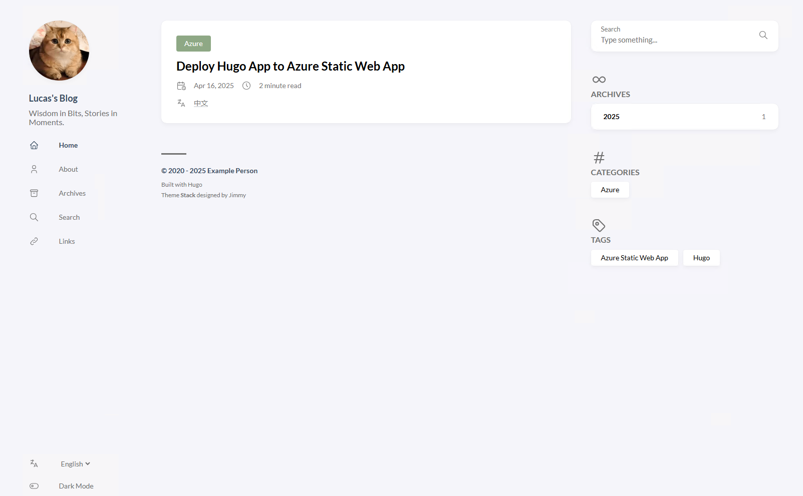
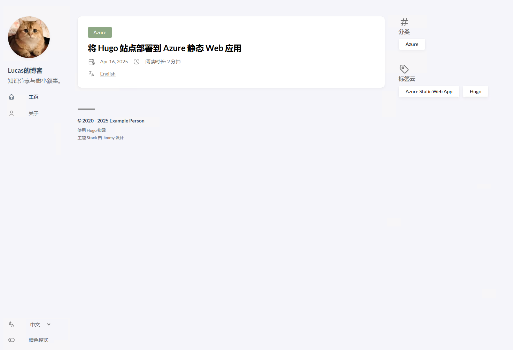

+++
author = "Lucas Huang"
date = '2025-04-16T13:52:22+08:00'
title = "Multi-Language in Hugo"
# description = "This article demonstrates how to deploy a Hugo web application to Azure Static Web Apps"
categories = [
    "Personal Blog"
]
tags = [
    "Hugo"
    
]
image = "cover.png"
draft = true
+++

多语言不生效

英语一切正常

中文少了很多元素，比如搜索，归档，标签等等

https://before80.github.io/hugo_docs_with_hugo/docs/ContentManagement/Multilingual/