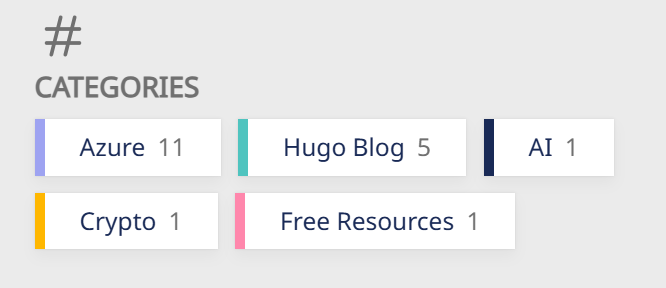

+++
author = "Lucas Huang"
date = '2025-06-22T14:52:22+08:00'
title = "Hugo Stack Theme Customization"
# description = "This article demonstrates how to deploy a Hugo web application to Azure Static Web Apps"
categories = [
    "Hugo Blog"
]
tags = [
    "Stack Theme"
]
image = "cover.png"
draft = false
+++
## Two-Column Archive Page

The original theme uses a single-column layout for archive pages on large screens, resulting in excessive blank space and making it hard to browse articles. Changing to a two-column layout makes better use of screen real estate on large displays.


Create the file `~\assets\scss\custom.scss` and add the following content:
```css
/* Two-column layout for archives page */
@media (min-width: 1024px) {
  .article-list--compact {
    display: grid;
    grid-template-columns: 1fr 1fr;
    background: none;
    box-shadow: none;
    gap: 1rem;

    article {
      background: var(--card-background);
      border: none;
      box-shadow: var(--shadow-l2);
      margin-bottom: 8px;
      border-radius: 16px;
    }
  }
}
```
## Code Blocks

### Custom Height for Code Blocks with Global Scrollbar

By default, code blocks display as many lines as there are in the code, making articles with long code blocks difficult to browse in a browser. Also, you can't simply adjust the height, otherwise the line numbers on the left and the code on the right will each have their own scrollbars. After much research, here’s the solution:

Create a new file at `~\assets\scss\custom.scss` and add the following at the end of the file:
```css
// =============================
// Code Blocks
// =============================
/* Custom variable, modify the height here as needed */
$codeblock-max-height: 25em;

/* ① Set the outermost .highlight as the “only” scrollable container */
.highlight {
  max-height: $codeblock-max-height;
  overflow: auto;                 /* Controls both X and Y directions */
  -webkit-overflow-scrolling: touch; /* Inertia scrolling on mobile */
}

/* ② Disable internal pre/code scrollbars (to avoid double scrollbars) */
.highlight pre,
.highlight code,
.highlight .chroma {
  overflow: visible !important;   /* Override Stack’s overflow-x:auto on pre */
}

/* ③ Make the line number table auto-expand with content width to enable X scroll on wide blocks */
.lntable {
  display: inline-table;          /* Keeps table property, allows content-dependent width */
  min-width: max-content;
  border-spacing: 0;
}

/* ④ Disable auto-wrapping, long lines are handled by horizontal scrolling */
.lntd:last-child code,
.highlight code {
  white-space: pre;               /* No line breaks */
}
.lntd:first-child {
  user-select: none; // Prevent selecting line numbers
}
```

### Reduce Code Block Font Size

The default font size looks too large on mobile UA 😨 — a smaller size looks better 😋

Add the following at the end of your `~\assets\scss\custom.scss` file:
```css
/* Left column (line numbers) */
.chroma .lntd, .chroma .lntd pre, .chroma .ln {
    font-size: 14px;
    font-family: var(--code-font-family);
}
/* Right column (code) */
.chroma code, .chroma pre {
    font-size: 14px;
    font-family: var(--code-font-family);
}
```

### MacOS-style Code Blocks

Find the `.highlight` section in `~/themes/hugo-theme-stack/assets/scss/partials/layout/article.scss` and modify it as follows:
```css
.highlight {
    background-color: var(--pre-background-color);
    padding: var(--card-padding);
    position: relative;
    border-radius: 10px;
    max-width: 100% !important;
    margin: 0 !important;
    box-shadow: var(--shadow-l1) !important;

```
Create the `~/static/img/code-header.svg` file:
```svg
<svg xmlns="http://www.w3.org/2000/svg" version="1.1"  x="0px" y="0px" width="450px" height="130px">
    <ellipse cx="65" cy="65" rx="50" ry="52" stroke="rgb(220,60,54)" stroke-width="2" fill="rgb(237,108,96)"/>
    <ellipse cx="225" cy="65" rx="50" ry="52"  stroke="rgb(218,151,33)" stroke-width="2" fill="rgb(247,193,81)"/>
    <ellipse cx="385" cy="65" rx="50" ry="52"  stroke="rgb(27,161,37)" stroke-width="2" fill="rgb(100,200,86)"/>
</svg>
```

Finally, add the following style for code blocks in `~/assets/scss/custom.scss`:
```css
// Add MacOS style to the top of code blocks
.article-content {
    .highlight:before {
        content: "";
        display: block;
        background: url(/img/code-header.svg);
        height: 25px;
        width: 100%;
        background-size: 52px;
        background-repeat: no-repeat;
        margin-top: -10px;
        margin-bottom: 0;
    }
}
```


## Show Icon After External Links

Preview:


In the site's root directory, create `~/layouts/_default/_markup/render-link.html` and add:
```html
<a class="link" href="{{ .Destination | safeURL }}" {{ with .Title}} title="{{ . }}"
    {{ end }}{{ if strings.HasPrefix .Destination "http" }} target="_blank" rel="noopener"
    {{ end }}>{{ .Text | safeHTML }}</a>
{{ if strings.HasPrefix .Destination "http" }}
<span style="white-space: nowrap;"><svg width=".7em"
    height=".7em" viewBox="0 0 21 21" xmlns="http://www.w3.org/2000/svg">
    <path d="m13 3l3.293 3.293l-7 7l1.414 1.414l7-7L21 11V3z" fill="currentColor" />
    <path d="M19 19H5V5h7l-2-2H5c-1.103 0-2 .897-2 2v14c0 1.103.897 2 2 2h14c1.103 0 2-.897 2-2v-5l-2-2v7z"
        fill="currentColor">
</svg></span>
{{ end }}
```

## Change the Font

The author customized fonts in `~/themes/hugo-theme-stack/layouts/partials/footer/components/custom-font.html`:
```html
<script>
    (function () {
        const customFont = document.createElement('link');
        customFont.href = "https://fonts.googleapis.com/css2?family=Lato:wght@300;400;700&display=swap";

        customFont.type = "text/css";
        customFont.rel = "stylesheet";

        document.head.appendChild(customFont);
    }());
</script>
```
They used the Lato font, which doesn't support Chinese. As a result, it defaults to Microsoft YaHei (which is set as the fallback). There are several ways to change the font:

- Use web fonts;
- Download the CSS for the font and import it;
- Use default system fonts (like Microsoft YaHei, FangSong, KaiTi, etc.).

I chose to use a web font because there is a wider selection and the CSS can be hard to find otherwise...

1. Use a VPN to visit Google Fonts and find a font you like.
2. Click `Get font`

3. Select the font(s) you want and then click Get embeded code.

4. Modify properties like Weight on the left, then click Copy Code on the right.

5. Create `~\layouts\partials\head\custom.html`, and paste the code you just copied. Font import is done.
    ```html
    <link rel="preconnect" href="https://fonts.googleapis.com">
    <link rel="preconnect" href="https://fonts.gstatic.com" crossorigin>
    <link href="https://fonts.googleapis.com/css2?family=Noto+Sans+SC&family=Noto+Sans:ital@0;1&display=swap" rel="stylesheet">
    ```
6. Now modify the style to use your imported font in articles. Add to the end of `~\assets\scss\custom.scss`:
    ```css
    // Article font
    body, .article-content {
        font-family: 'Noto Sans', 'Noto Sans SC', sans-serif;
    }
    ```
7. (Optional) Change fonts in other parts of the site
    ```css
    // Article font
    body, .article-content {
        font-family: 'Noto Sans', 'Noto Sans SC', sans-serif;
    }

    // Title font
    body, .article-title {
        font-family: "LXGW WenKai Screen", sans-serif;
    }

    // Homepage font
    body, .article-page {
        font-family: "HarmonyOS_Regular", sans-serif;
    }
    ```

## Add Back-to-Top Button

Effect:


1. In `~/layouts/partials/footer/components/script.html`, add the following code:
    ```html
    <!-- Add back to top button -->
    <script>
        function backToTop() {
        document.documentElement.scrollIntoView({
            behavior: 'smooth',
        })
        }
    
        window.onload = function () {
        let scrollTop =
            this.document.documentElement.scrollTop || this.document.body.scrollTop
        let totopBtn = this.document.getElementById('back-to-top')
        if (scrollTop > 0) {
            totopBtn.style.display = 'inline'
        } else {
            totopBtn.style.display = 'none'
        }
        }
    
        window.onscroll = function () {
        let scrollTop =
            this.document.documentElement.scrollTop || this.document.body.scrollTop
        let totopBtn = this.document.getElementById('back-to-top')
        if (scrollTop < 200) {
            totopBtn.style.display = 'none'
        } else {
            totopBtn.style.display = 'inline'
            totopBtn.addEventListener('click', backToTop, false)
        }
        }
    </script>
    ```
2. In `~/layouts/partials/footer/custom.html`, add the following code. The button color (`background-color` and `border-color`) has been tweaked to match the theme.
    ```html
    <!-- Add back to top button -->
    <a href="#" id="back-to-top" title="Back to top"></a>

    <!-- Back to top button CSS -->
    <style>
    #back-to-top {
        display: none;
        position: fixed;
        bottom: 5px;
        right: 15px;
        width: 40px; /* Reduced size */
        height: 40px; /* Reduced size */
        border-radius: 50%; /* Circular button for modern look */
        background-color: var(--body-background);
        box-shadow: var(--shadow-l2);
        font-size: 20px; /* Adjusted for smaller button */
        text-align: center;
        line-height: 38px; /* Center align arrow */
        cursor: pointer;
        transition:
        transform 0.3s ease,
        background-color 0.3s ease; /* Added smooth interaction */
    }

    #back-to-top:before {
        content: "";
        display: inline-block;
        position: relative;
        transform: rotate(135deg);
        height: 8px; /* Reduced size */
        width: 8px; /* Reduced size */
        border-width: 0 0 2px 2px;
        border-color: var(--back-to-top-color);
        border-style: solid;
    }

    #back-to-top:hover {
        transform: scale(1.1); /* Slightly larger on hover */
        background-color: var(--accent-background); /* Optional hover effect */
    }

    #back-to-top:hover:before {
        border-color: var(--accent-color); /* Change arrow color on hover */
    }

    /* Responsive styles */
    @media screen and (max-width: 768px) {
        #back-to-top {
        bottom: 5px;
        right: var(--container-padding);
        width: 30px; /* Slightly smaller for mobile */
        height: 30px;
        font-size: 16px;
        line-height: 32px;
        }
    }

    @media screen and (min-width: 1024px) {
        #back-to-top {
        bottom: 10px;
        right: 20px;
        }
    }

    @media screen and (min-width: 1280px) {
        #back-to-top {
        bottom: 15px;
        right: 25px;
        }
    }

    @media screen and (min-width: 1536px) {
        #back-to-top {
        bottom: 15px;
        right: 25px;
        /* visibility: hidden; */
        }
    }
    </style>
    ```

## Integrate Giscus Comment System
For more details, please refer to [here]().

## Add Colored Stripes and Item Counts to Home Page Category Cards
Preview:



First, you need to define the background color for each category in its respective `_index.md` file. We'll use this later. For nice color palettes, I usually get inspiration from [Color Hunt](http://colorhunt.co/) and fine-tune as needed with [Color Hex](http://color-hex.com/).
Format example:
```css
---
# content/categories/life/_index.md
title: Daily Life
# Badge style
style:
    background: "#d09daa"
    color: "#fff"
---
```
In `~/themes/hugo-theme-stack/assets/scss/partials/article.scss`, find `.article-category` and replace with the following code:
```css
.article-category {
        display: flex;
        flex-wrap: wrap;
        gap: 10px;

        a {
            background: var(--card-background);
            box-shadow: var(--shadow-l1);
            border-radius: var(--category-border-radius);
            padding: 8px 20px;
            color: var(--card-text-color-main);
            font-size: 1.4rem;
            transition: box-shadow 0.3s ease;

            &:hover {
                box-shadow: var(--shadow-l2);
            }
        }
    }

```
Then in `~/themes/hugo-theme-stack/assets/scss/partials/widgets.scss`, add the following code:
```css
/* Category widget */
.category {
    .category-label {
        display: flex;
        flex-wrap: wrap;
        gap: 10px;

        a {
            border-left: 6px solid; // Set border for category widget
            background: var(--card-background);
            box-shadow: var(--shadow-l1);
            border-radius: var(--category-border-radius);
            padding: 8px 20px;
            color: var(--card-text-color-main);
            font-size: 1.4rem;
            transition: box-shadow 0.3s ease;

            &:hover {
                box-shadow: var(--shadow-l2);
            }
        }
    }
    .category-count {
        margin-left: 7px;
        color: var(--body-text-color);
    }
}
```
Finally, in `~/themes/hugo-theme-stack/layouts/partials/widget/categories.html`, replace the `Section` content with the following. I’ve added `{{ .Count }}` to show the number of items in each category.
```css
<section class="widget category">
     <div class="widget-icon">
         {{ partial "helper/icon" "categories" }}
     </div>
     <h2 class="widget-title section-title">{{ T "widget.categoriesCloud.title" }}</h2>

     <div class="category-label">
         {{ range first $limit $context.Site.Taxonomies.categories.ByCount }}
        <a href="{{ .Page.RelPermalink }}" class="font_size_{{ .Count }}"
            style="border-left-color: {{ .Page.Params.style.background }}; filter:saturate(1.7);">
            {{ .Page.Title }}<span class="category-count">{{ .Count }}</span>
        </a>
        {{ end }}
     </div>
</section>
```
> Since the background colors I set are relatively grayish, but I want the stripe to be more vibrant, I added `filter:saturate(1.7);` to bump up the color saturation. You can remove it if you don’t need it.


## More

If there are more customization projects in the future, I will keep updating here!

---

References:

- https://thirdshire.com/hugo-stack-renovation/#
- https://blog.lufei.de/p/stack%E4%B8%BB%E9%A2%98%E7%9A%84%E8%87%AA%E5%AE%9A%E4%B9%89/
- https://www.blain.top/p/renovation
