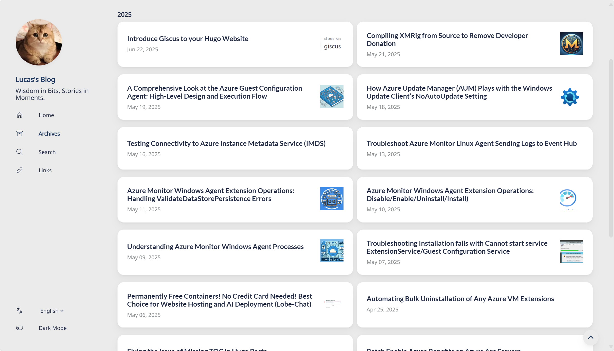
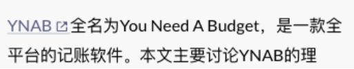
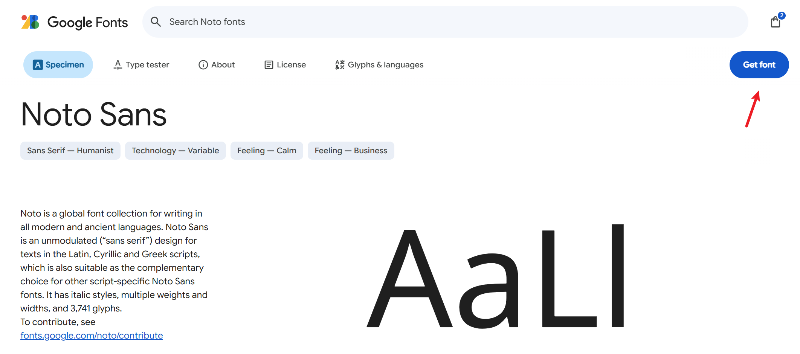
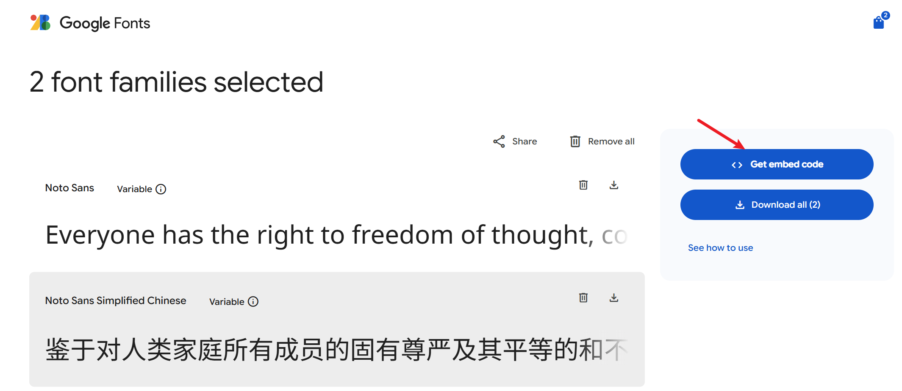
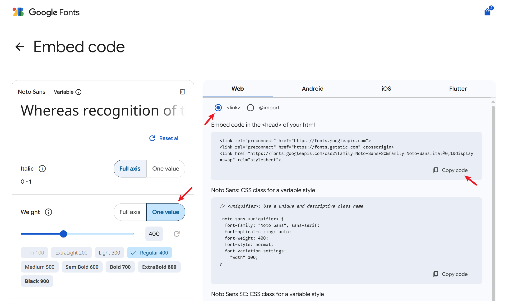
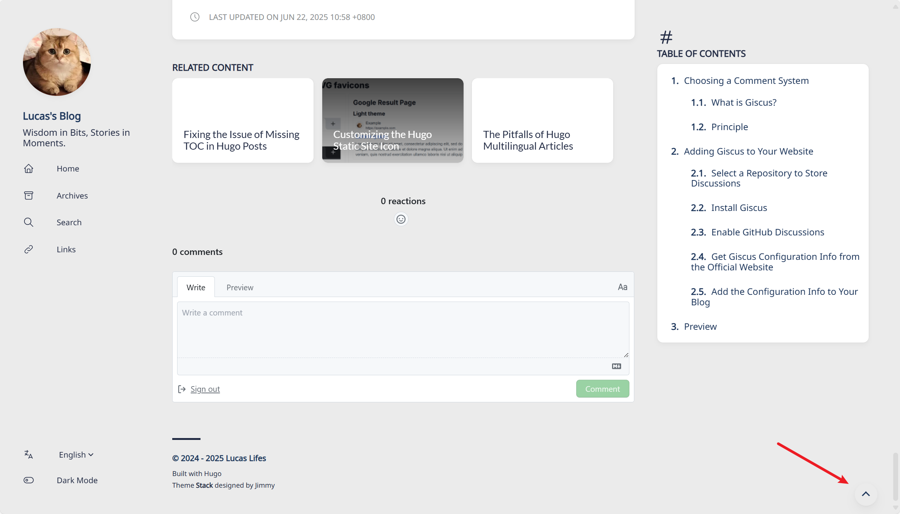

+++
author = "Lucas Huang"
date = '2025-06-22T14:52:22+08:00'
title = "Hugo Stack Theme Customization"
# description = "This article demonstrates how to deploy a Hugo web application to Azure Static Web Apps"
categories = [
    "Hugo Blog"
]
tags = [
    "Stack Theme"
]
image = "cover.png"
draft = false
+++
## Two-Column Archive Page

The original theme uses a single-column layout for archive pages on large screens, resulting in excessive blank space and making it hard to browse articles. Changing to a two-column layout makes better use of screen real estate on large displays.



Create the file `~\assets\scss\custom.scss` and add the following content:
```css
/* Two-column layout for archives page */
@media (min-width: 1024px) {
  .article-list--compact {
    display: grid;
    grid-template-columns: 1fr 1fr;
    background: none;
    box-shadow: none;
    gap: 1rem;

    article {
      background: var(--card-background);
      border: none;
      box-shadow: var(--shadow-l2);
      margin-bottom: 8px;
      border-radius: 16px;
    }
  }
}
```

## Reduce Font Size of Code Blocks

By default, the code block font size appears too large on mobile UAs 😨, so making it smaller looks better 😋.

Create `~/assets/scss/partials/article.scss`.

Copy all the contents of the file with the same name from the theme directory into this file, and add the following at the end:
```css
code {
    border-radius: var(--tag-border-radius);
    font-size: 14px; // Add font size setting for code block
    font-family: var(--code-font-family);
}
```

## Show Icon After External Links

Preview:



In the site's root directory, create `~/layouts/_default/_markup/render-link.html` and add:
```html
<a class="link" href="{{ .Destination | safeURL }}" {{ with .Title}} title="{{ . }}"
    {{ end }}{{ if strings.HasPrefix .Destination "http" }} target="_blank" rel="noopener"
    {{ end }}>{{ .Text | safeHTML }}</a>
{{ if strings.HasPrefix .Destination "http" }}
<span style="white-space: nowrap;"><svg width=".7em"
    height=".7em" viewBox="0 0 21 21" xmlns="http://www.w3.org/2000/svg">
    <path d="m13 3l3.293 3.293l-7 7l1.414 1.414l7-7L21 11V3z" fill="currentColor" />
    <path d="M19 19H5V5h7l-2-2H5c-1.103 0-2 .897-2 2v14c0 1.103.897 2 2 2h14c1.103 0 2-.897 2-2v-5l-2-2v7z"
        fill="currentColor">
</svg></span>
{{ end }}
```

## Change the Font

The author customized fonts in `~/themes/hugo-theme-stack/layouts/partials/footer/components/custom-font.html`:
```html
<script>
    (function () {
        const customFont = document.createElement('link');
        customFont.href = "https://fonts.googleapis.com/css2?family=Lato:wght@300;400;700&display=swap";

        customFont.type = "text/css";
        customFont.rel = "stylesheet";

        document.head.appendChild(customFont);
    }());
</script>
```
They used the Lato font, which doesn't support Chinese. As a result, it defaults to Microsoft YaHei (which is set as the fallback). There are several ways to change the font:

- Use web fonts;
- Download the CSS for the font and import it;
- Use default system fonts (like Microsoft YaHei, FangSong, KaiTi, etc.).

I chose to use a web font because there is a wider selection and the CSS can be hard to find otherwise...

1. Use a VPN to visit Google Fonts and find a font you like.
2. Click `Get font`

3. Select the font(s) you want and then click Get embeded code.

4. Modify properties like Weight on the left, then click Copy Code on the right.

5. Create `~\layouts\partials\head\custom.html`, and paste the code you just copied. Font import is done.
    ```html
    <link rel="preconnect" href="https://fonts.googleapis.com">
    <link rel="preconnect" href="https://fonts.gstatic.com" crossorigin>
    <link href="https://fonts.googleapis.com/css2?family=Noto+Sans+SC&family=Noto+Sans:ital@0;1&display=swap" rel="stylesheet">
    ```
6. Now modify the style to use your imported font in articles. Add to the end of `~\assets\scss\custom.scss`:
    ```css
    // Article font
    body, .article-content {
        font-family: 'Noto Sans', 'Noto Sans SC', sans-serif;
    }
    ```
7. (Optional) Change fonts in other parts of the site
    ```css
    // Article font
    body, .article-content {
        font-family: 'Noto Sans', 'Noto Sans SC', sans-serif;
    }

    // Title font
    body, .article-title {
        font-family: "LXGW WenKai Screen", sans-serif;
    }

    // Homepage font
    body, .article-page {
        font-family: "HarmonyOS_Regular", sans-serif;
    }
    ```

## Add Back-to-Top Button

Effect:



1. In `~/layouts/partials/footer/components/script.html`, add the following code:
    ```html
    <!-- Add back to top button -->
    <script>
        function backToTop() {
        document.documentElement.scrollIntoView({
            behavior: 'smooth',
        })
        }
    
        window.onload = function () {
        let scrollTop =
            this.document.documentElement.scrollTop || this.document.body.scrollTop
        let totopBtn = this.document.getElementById('back-to-top')
        if (scrollTop > 0) {
            totopBtn.style.display = 'inline'
        } else {
            totopBtn.style.display = 'none'
        }
        }
    
        window.onscroll = function () {
        let scrollTop =
            this.document.documentElement.scrollTop || this.document.body.scrollTop
        let totopBtn = this.document.getElementById('back-to-top')
        if (scrollTop < 200) {
            totopBtn.style.display = 'none'
        } else {
            totopBtn.style.display = 'inline'
            totopBtn.addEventListener('click', backToTop, false)
        }
        }
    </script>
    ```
2. In `~/layouts/partials/footer/custom.html`, add the following code. The button color (`background-color` and `border-color`) has been tweaked to match the theme.
    ```html
    <!-- Add back to top button -->
    <a href="#" id="back-to-top" title="Back to top"></a>

    <!-- Back to top button CSS -->
    <style>
    #back-to-top {
        display: none;
        position: fixed;
        bottom: 5px;
        right: 15px;
        width: 40px; /* Reduced size */
        height: 40px; /* Reduced size */
        border-radius: 50%; /* Circular button for modern look */
        background-color: var(--body-background);
        box-shadow: var(--shadow-l2);
        font-size: 20px; /* Adjusted for smaller button */
        text-align: center;
        line-height: 38px; /* Center align arrow */
        cursor: pointer;
        transition:
        transform 0.3s ease,
        background-color 0.3s ease; /* Added smooth interaction */
    }

    #back-to-top:before {
        content: "";
        display: inline-block;
        position: relative;
        transform: rotate(135deg);
        height: 8px; /* Reduced size */
        width: 8px; /* Reduced size */
        border-width: 0 0 2px 2px;
        border-color: var(--back-to-top-color);
        border-style: solid;
    }

    #back-to-top:hover {
        transform: scale(1.1); /* Slightly larger on hover */
        background-color: var(--accent-background); /* Optional hover effect */
    }

    #back-to-top:hover:before {
        border-color: var(--accent-color); /* Change arrow color on hover */
    }

    /* Responsive styles */
    @media screen and (max-width: 768px) {
        #back-to-top {
        bottom: 5px;
        right: var(--container-padding);
        width: 30px; /* Slightly smaller for mobile */
        height: 30px;
        font-size: 16px;
        line-height: 32px;
        }
    }

    @media screen and (min-width: 1024px) {
        #back-to-top {
        bottom: 10px;
        right: 20px;
        }
    }

    @media screen and (min-width: 1280px) {
        #back-to-top {
        bottom: 15px;
        right: 25px;
        }
    }

    @media screen and (min-width: 1536px) {
        #back-to-top {
        bottom: 15px;
        right: 25px;
        /* visibility: hidden; */
        }
    }
    </style>
    ```


## More

If there are more customization projects in the future, I will keep updating here!

---

References:

- https://thirdshire.com/hugo-stack-renovation/#
- https://blog.lufei.de/p/stack%E4%B8%BB%E9%A2%98%E7%9A%84%E8%87%AA%E5%AE%9A%E4%B9%89/
