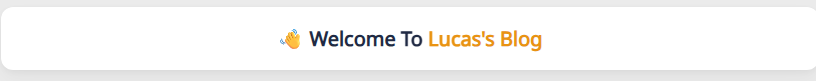

+++
author = "Lucas Huang"
date = '2025-06-22T14:52:22+08:00'
title = "Hugo Stack主题美化记录"
# description = "This article demonstrates how to deploy a Hugo web application to Azure Static Web Apps"
categories = [
    "Hugo Blog"
]
tags = [
    "Stack主题"
]
image = "cover.png"
draft = false
+++


## 双栏归档页
原主题在大屏下的归档页面使用了单栏设计，这将会产生大量的空白占用页面并且不利于文章的查找，因此将其改为双栏则能够很好的利用大屏下的页面空间.


新建文件`~\assets\scss\custom.scss`, 写入以下内容:
```css
/* 归档页面两栏 */
@media (min-width: 1024px) {
  .article-list--compact {
    display: grid;
    grid-template-columns: 1fr 1fr;
    background: none;
    box-shadow: none;
    gap: 1rem;

    article {
      background: var(--card-background);
      border: none;
      box-shadow: var(--shadow-l2);
      margin-bottom: 8px;
      border-radius: 16px;
    }
  }
}

```
## 代码块
### 代码块自定义高度，全局滚动条
原本的代码块默认有多少行展示多少行，含有长代码块的文章浏览器体验很差。 而且也不能简单只调整高度，否则左侧行号和右侧代码部分都会出现独立的滚动条。研究许久，下面是解决方案：

新建`~\assets\scss\custom.scss`，在文件最后加入以下内容
```css
// =============================
// 代码块
// =============================
/* 自定义变量，想改高度改这里即可 */
$codeblock-max-height: 25em;

/* ① 把最外层 .highlight 作为“唯一”滚动容器 */
.highlight {
  max-height: $codeblock-max-height;
  overflow: auto;                 /* 同时控制 X / Y 两个方向 */
  -webkit-overflow-scrolling: touch; /* 移动端惯性滚动 */
}

/* ② 关闭内部 pre / code 自己的滚动（否则会出现双滚动条） */
.highlight pre,
.highlight code,
.highlight .chroma {
  overflow: visible !important;   /* 覆盖 Stack 里对 pre 的 overflow-x:auto */
}

/* ③ 让行号用的表格按内容宽度自增，保证超宽时能触发 X 滚动 */
.lntable {
  display: inline-table;          /* 仍然保持表格特性但可随内容变宽 */
  min-width: max-content;
  border-spacing: 0;
}

/* ④ 禁止自动换行，超长行通过横向滚动处理 */
.lntd:last-child code,
.highlight code {
  white-space: pre;               /* 不折行 */
}
.lntd:first-child {
  user-select: none; // 禁止选中行号
}
```


### 缩小代码块的字体大小
默认的在移动端UA下看起来实在是太大了😨，还是小一点比较好看😋

在`~\assets\scss\custom.scss`文件最后加入以下内容
```css
/* 左列行号 */
.chroma .lntd, .chroma .lntd pre, .chroma .ln {
    font-size: 14px;
    font-family: var(--code-font-family);
}
/* 右列代码 */
.chroma code, .chroma pre {
    font-size: 14px;
    font-family: var(--code-font-family);
}
```

### MacOS风格代码块
在 `~/themes/hugo-theme-stack/assets/scss/partials/layout/article.scss`文件中找到 `.highlight` 部分并修改成如下：
```css
.highlight {
    background-color: var(--pre-background-color);
    padding: var(--card-padding);
    position: relative;
    border-radius: 10px;
    max-width: 100% !important;
    margin: 0 !important;
    box-shadow: var(--shadow-l1) !important;

```
创建 `~/static/img/code-header.svg` 文件：
```svg
<svg xmlns="http://www.w3.org/2000/svg" version="1.1"  x="0px" y="0px" width="450px" height="130px">
    <ellipse cx="65" cy="65" rx="50" ry="52" stroke="rgb(220,60,54)" stroke-width="2" fill="rgb(237,108,96)"/>
    <ellipse cx="225" cy="65" rx="50" ry="52"  stroke="rgb(218,151,33)" stroke-width="2" fill="rgb(247,193,81)"/>
    <ellipse cx="385" cy="65" rx="50" ry="52"  stroke="rgb(27,161,37)" stroke-width="2" fill="rgb(100,200,86)"/>
</svg>
```

最后在 `~/assets/scss/custom.scss` 添加代码块的样式：
```css
// 为代码块顶部添加 macos 样式
.article-content {
    .highlight:before {
        content: "";
        display: block;
        background: url(/img/code-header.svg);
        height: 25px;
        width: 100%;
        background-size: 52px;
        background-repeat: no-repeat;
        margin-top: -10px;
        margin-bottom: 0;
    }
}
```

## 外部链接后面会显示图标
显示效果：


在网站根目录新建`~/layouts/_default/_markup/render-link.html`，并填入 
```css
<a class="link" href="{{ .Destination | safeURL }}" {{ with .Title}} title="{{ . }}"
    {{ end }}{{ if strings.HasPrefix .Destination "http" }} target="_blank" rel="noopener"
    {{ end }}>{{ .Text | safeHTML }}</a>
{{ if strings.HasPrefix .Destination "http" }}
<span style="white-space: nowrap;"><svg width=".7em"
    height=".7em" viewBox="0 0 21 21" xmlns="http://www.w3.org/2000/svg">
    <path d="m13 3l3.293 3.293l-7 7l1.414 1.414l7-7L21 11V3z" fill="currentColor" />
    <path d="M19 19H5V5h7l-2-2H5c-1.103 0-2 .897-2 2v14c0 1.103.897 2 2 2h14c1.103 0 2-.897 2-2v-5l-2-2v7z"
        fill="currentColor">
</svg></span>
{{ end }}
```
## 更换字体
作者在 `~/themes/hugo-theme-stack/layouts/partials/footer/components/custom-font.html` 中进行了字体的自定义：
```css
<script>
    (function () {
        const customFont = document.createElement('link');
        customFont.href = "https://fonts.googleapis.com/css2?family=Lato:wght@300;400;700&display=swap";

        customFont.type = "text/css";
        customFont.rel = "stylesheet";

        document.head.appendChild(customFont);
    }());
</script>
```
他使用的字体是 Lato ，这个字体不支持中文，因此最终呈现出来的字体是平平无奇的微软雅黑（其实是作者放置的默认选项）。
更改字体的方式有几种：

- 使用在线字体；
- 下载字体CSS并引入；
- 使用正常PC都会有的字体（如微软雅黑、仿宋、楷体等）。
我决定使用在线字体，首先是因为在线字体的样式比较丰富，其次是字体CSS并没有那么好找……

1. 科学上网 去到 Google fonts ，找到满意的字体
2. 点击`Get font`

3. 可选择选择自己想要的字体，选择 Get embeded code

4. 可以在左侧调整字体的属性，比如Weight等。最后点击右侧第一个Copy Code

5. 新建文件`~\layouts\partials\head\custom.html`, 并把刚才复制的内容黏贴。这样字体即导入完毕。
    ```css
    <link rel="preconnect" href="https://fonts.googleapis.com">
    <link rel="preconnect" href="https://fonts.gstatic.com" crossorigin>
    <link href="https://fonts.googleapis.com/css2?family=Noto+Sans+SC&family=Noto+Sans:ital@0;1&display=swap" rel="stylesheet">
    ```
6. 现在开始修改样式让文章使用我们的导入的字体。新建文件`~\assets\scss\custom.scss`, 在末尾添加如下代码
    ```css
    // 文章页字体
    body, .article-content {
        font-family: 'Noto Sans', 'Noto Sans SC', sans-serif;
    }
    ```
7. 可选更换网站其他部分字体
    ```css
    // 文章页字体
    body, .article-content {
        font-family: 'Noto Sans', 'Noto Sans SC', sans-serif;
    }

    // 标题字体
    body, .article-title {
        font-family: "LXGW WenKai Screen", sans-serif;
    }


    // 首页字体
    body, .article-page {
        font-family: "HarmonyOS_Regular", sans-serif;
    }
    ```

## 增加返回顶部按钮
效果:


1. 新建`~/layouts/partials/footer/components/script.html`,增加如下代码
    ```css
    <!-- Add back to top button -->
    <script>
        function backToTop() {
        document.documentElement.scrollIntoView({
            behavior: 'smooth',
        })
        }
    
        window.onload = function () {
        let scrollTop =
            this.document.documentElement.scrollTop || this.document.body.scrollTop
        let totopBtn = this.document.getElementById('back-to-top')
        if (scrollTop > 0) {
            totopBtn.style.display = 'inline'
        } else {
            totopBtn.style.display = 'none'
        }
        }
    
        window.onscroll = function () {
        let scrollTop =
            this.document.documentElement.scrollTop || this.document.body.scrollTop
        let totopBtn = this.document.getElementById('back-to-top')
        if (scrollTop < 200) {
            totopBtn.style.display = 'none'
        } else {
            totopBtn.style.display = 'inline'
            totopBtn.addEventListener('click', backToTop, false)
        }
        }
    </script>
    ```
2. 新建`~/layouts/partials/footer/custom.html`, 将`~/themes/hugo-theme-stack/layouts/partials/footer/custom.html`里的内容全部复制过去，并在最后增加如下代码。改了一下按钮的颜色（`background-color` 和 `border-color`)，跟主题色系统一。
    ```css
    <!-- Add back to top button -->
    <a href="#" id="back-to-top" title="返回顶部"></a>

    <!--返回顶部 CSS -->
    <style>
    #back-to-top {
        display: none;
        position: fixed;
        bottom: 5px;
        right: 15px;
        width: 40px; /* Reduced size */
        height: 40px; /* Reduced size */
        border-radius: 50%; /* Circular button for modern look */
        background-color: var(--body-background);
        box-shadow: var(--shadow-l2);
        font-size: 20px; /* Adjusted for smaller button */
        text-align: center;
        line-height: 38px; /* Center align arrow */
        cursor: pointer;
        transition:
        transform 0.3s ease,
        background-color 0.3s ease; /* Added smooth interaction */
    }

    #back-to-top:before {
        content: "";
        display: inline-block;
        position: relative;
        transform: rotate(135deg);
        height: 8px; /* Reduced size */
        width: 8px; /* Reduced size */
        border-width: 0 0 2px 2px;
        border-color: var(--back-to-top-color);
        border-style: solid;
    }

    #back-to-top:hover {
        transform: scale(1.1); /* Slightly larger on hover */
        background-color: var(--accent-background); /* Optional hover effect */
    }

    #back-to-top:hover:before {
        border-color: var(--accent-color); /* Change arrow color on hover */
    }

    /* Responsive styles */
    @media screen and (max-width: 768px) {
        #back-to-top {
        bottom: 5px;
        right: var(--container-padding);
        width: 30px; /* Slightly smaller for mobile */
        height: 30px;
        font-size: 16px;
        line-height: 32px;
        }
    }

    @media screen and (min-width: 1024px) {
        #back-to-top {
        bottom: 10px;
        right: 20px;
        }
    }

    @media screen and (min-width: 1280px) {
        #back-to-top {
        bottom: 15px;
        right: 25px;
        }
    }

    @media screen and (min-width: 1536px) {
        #back-to-top {
        bottom: 15px;
        right: 25px;
        /* visibility: hidden; */
        }
    }
    </style>
    ```
## 接入Giscus评论系统
详情请参考 [这里]()

## 给首页的分类卡增加对应的颜色条和条目数量
效果预览：


首先需要在分类卡的_index.md文件里定义每个类别的背景色，这个之后会用到。好看的配色我一般会去 [Color Hunt](http://colorhunt.co/) 找找灵感，需要微调的话可以参考 [Color Hex](http://color-hex.com/) 。
格式如下：
```css
---
# content/categories/life/_index.md
title: 生活日常
# Badge style
style:
    background: "#d09daa"
    color: "#fff"
---
```
在`~/themes/hugo-theme-stack/assets/scss/partials/article.scss`里找到`.article-category`并替换成以下代码：
```css
.article-category {
        display: flex;
        flex-wrap: wrap;
        gap: 10px;

        a {
            background: var(--card-background);
            box-shadow: var(--shadow-l1);
            border-radius: var(--category-border-radius);
            padding: 8px 20px;
            color: var(--card-text-color-main);
            font-size: 1.4rem;
            transition: box-shadow 0.3s ease;

            &:hover {
                box-shadow: var(--shadow-l2);
            }
        }
    }

```
在`~/themes/hugo-theme-stack/assets/scss/partials/widgets.scss`增加如下代码：
```css
/* Category widget */
.category {
    .category-label {
        display: flex;
        flex-wrap: wrap;
        gap: 10px;

        a {
            border-left: 6px solid; // Set border for category widget
            background: var(--card-background);
            box-shadow: var(--shadow-l1);
            border-radius: var(--category-border-radius);
            padding: 8px 20px;
            color: var(--card-text-color-main);
            font-size: 1.4rem;
            transition: box-shadow 0.3s ease;

            &:hover {
                box-shadow: var(--shadow-l2);
            }
        }
    }
    .category-count {
        margin-left: 7px;
        color: var(--body-text-color);
    }
}
```
最后在`~/themes/hugo-theme-stack/layouts/partials/widget/categories.html`将`Section`的内容替换为如下。其中我加上了{{ .Count }}来显示分类的条目数量。
```css
<section class="widget category">
     <div class="widget-icon">
         {{ partial "helper/icon" "categories" }}
     </div>
     <h2 class="widget-title section-title">{{ T "widget.categoriesCloud.title" }}</h2>

     <div class="category-label">
         {{ range first $limit $context.Site.Taxonomies.categories.ByCount }}
        <a href="{{ .Page.RelPermalink }}" class="font_size_{{ .Count }}"
            style="border-left-color: {{ .Page.Params.style.background }}; filter:saturate(1.7);">
            {{ .Page.Title }}<span class="category-count">{{ .Count }}</span>
        </a>
        {{ end }}
     </div>
</section>
```
> 由于我设置的背景色都偏灰，但颜色条我想让它亮眼一些，所以这里加了个让颜色饱和度更高的`filter:saturate(1.7);`，不需要的话可以删掉。

## 首页欢迎横幅
效果:



在 `~/themes/hugo-theme-stack/layouts/index.html` 的 `<section class="article-list">` 前添加以下代码：
```css
<!-- 首页欢迎字幅 -->
<div class="welcome">
<p style="font-size: 2rem; text-align: center; font-weight: bold">
    <span class="shake">👋</span>
    <span class="jump-text1" > Welcome</span>
    <span class="jump-text2"> To </span>
    <span class="jump-text3" style="color:#e99312"> L</span><span class="jump-text4" style="color:#e99312">u</span><span class="jump-text5" style="color:#e99312">c</span><span class="jump-text6" style="color:#e99312">a</span><span class="jump-text7" style="color:#e99312">s</span><span class="jump-text8" style="color:#e99312">'s</span>
    <span class="jump-text9" style="color:#e99312">Blog</span>
</p>
</div>
<!-- 首页欢迎字幅 -->
```
在 `~/assets/scss/custom.scss` 中加入以下代码：
```css
//首页欢迎板块样式
.welcome {
  color: var(--card-text-color-main);
  background: var(--card-background);
  box-shadow: var(--shadow-l2);
  border-radius: 30px;
  display: inline-block;
}

// 👋emoji实现摆动效果
.shake {
  display: inline-block;
  animation: shake 1s;
  animation-duration: 1s;
  animation-timing-function: ease;
  animation-delay: 0s;
  animation-iteration-count: 1;
  animation-direction: normal;
  animation-fill-mode: none;
  animation-play-state: running;
  animation-name: shake;
  animation-timeline: auto;
  animation-range-start: normal;
  animation-range-end: normal;
  animation-delay: 2s;
  @keyframes shake {
    0% {
      transform: rotate(0);
    }
    25% {
      transform: rotate(45deg) scale(1.2);
    }
    50% {
      transform: rotate(0) scale(1.2);
    }
    75% {
      transform: rotate(45deg) scale(1.2);
    }
    100% {
      transform: rotate(0);
    }
  }
}
// 实现字符跳动动画
.jump-text1 {
  display: inline-block;
  animation: jump 0.5s 1;
}

.jump-text2 {
  display: inline-block;
  animation: jump 0.5s 1;
  animation-delay: 0.1s;
}

.jump-text3 {
  display: inline-block;
  animation: jump 0.5s 1;
  animation-delay: 0.2s;
}

.jump-text4 {
  display: inline-block;
  animation: jump 0.5s 1;
  animation-delay: 0.3s;
}

.jump-text5 {
  display: inline-block;
  animation: jump 0.5s 1;
  animation-delay: 0.4s;
}

.jump-text6 {
  display: inline-block;
  animation: jump 0.5s 1;
  animation-delay: 0.5s;
}

.jump-text7 {
  display: inline-block;
  animation: jump 0.5s 1;
  animation-delay: 0.6s;
}

.jump-text8 {
  display: inline-block;
  animation: jump 0.5s 1;
  animation-delay: 0.7s;
}

.jump-text9 {
  display: inline-block;
  animation: jump 0.5s 1;
  animation-delay: 0.9s;
}

@keyframes jump {
  0% {
    transform: translateY(0);
  }
  50% {
    transform: translateY(-20px);
  }
  100% {
    transform: translateY(0);
  }
}
```

## More
之后还有其他装修项目的话，我会持续更新在这里！


---
参考：

- https://thirdshire.com/hugo-stack-renovation/#
- https://blog.lufei.de/p/stack%E4%B8%BB%E9%A2%98%E7%9A%84%E8%87%AA%E5%AE%9A%E4%B9%89/
- https://www.blain.top/p/renovation
- https://www.xalaok.top/post/stack-modify