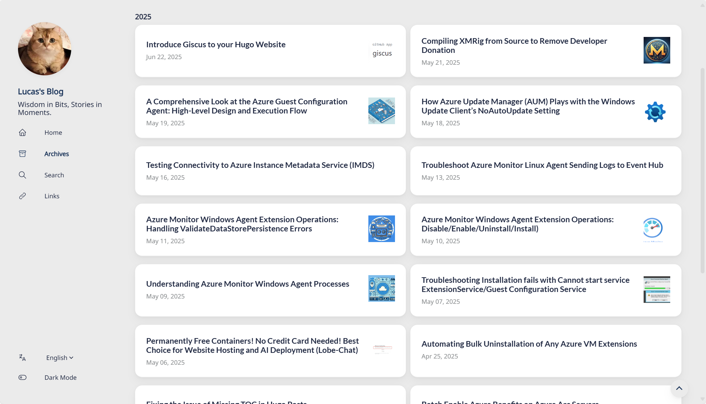
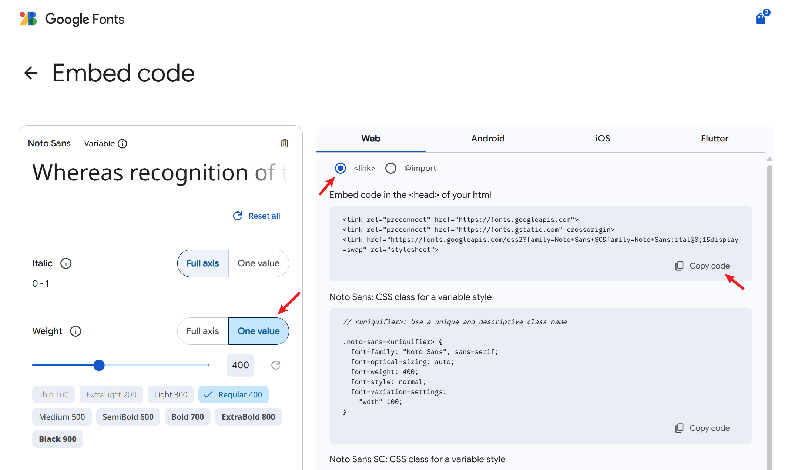

+++
author = "Lucas Huang"
date = '2025-06-22T14:52:22+08:00'
title = "Hugo Stack主题美化记录"
# description = "This article demonstrates how to deploy a Hugo web application to Azure Static Web Apps"
categories = [
    "Hugo博客"
]
tags = [
    "Stack主题"
]
image = "cover.png"
draft = false
+++


## 双栏归档页
原主题在大屏下的归档页面使用了单栏设计，这将会产生大量的空白占用页面并且不利于文章的查找，因此将其改为双栏则能够很好的利用大屏下的页面空间.



新建文件`~\assets\scss\custom.scss`, 写入以下内容:
```css
/* 归档页面两栏 */
@media (min-width: 1024px) {
  .article-list--compact {
    display: grid;
    grid-template-columns: 1fr 1fr;
    background: none;
    box-shadow: none;
    gap: 1rem;

    article {
      background: var(--card-background);
      border: none;
      box-shadow: var(--shadow-l2);
      margin-bottom: 8px;
      border-radius: 16px;
    }
  }
}

```

## 缩小代码块的字体大小
默认的在移动端UA下看起来实在是太大了😨，还是小一点比较好看😋

新建`~/assets/scss/partials/article.scss`

并将主题同目录下的同名文件内的内容全部复制粘贴进此文件夹，在文件最后加入以下内容
```css
code {
    border-radius: var(--tag-border-radius);
    font-size: 14px; // Add font size setting for code block
    font-family: var(--code-font-family);
}
```

## 外部链接后面会显示图标
显示效果：


在网站根目录新建`~/layouts/_default/_markup/render-link.html`，并填入 
```css
<a class="link" href="{{ .Destination | safeURL }}" {{ with .Title}} title="{{ . }}"
    {{ end }}{{ if strings.HasPrefix .Destination "http" }} target="_blank" rel="noopener"
    {{ end }}>{{ .Text | safeHTML }}</a>
{{ if strings.HasPrefix .Destination "http" }}
<span style="white-space: nowrap;"><svg width=".7em"
    height=".7em" viewBox="0 0 21 21" xmlns="http://www.w3.org/2000/svg">
    <path d="m13 3l3.293 3.293l-7 7l1.414 1.414l7-7L21 11V3z" fill="currentColor" />
    <path d="M19 19H5V5h7l-2-2H5c-1.103 0-2 .897-2 2v14c0 1.103.897 2 2 2h14c1.103 0 2-.897 2-2v-5l-2-2v7z"
        fill="currentColor">
</svg></span>
{{ end }}
```
## 更换字体
作者在 `~/themes/hugo-theme-stack/layouts/partials/footer/components/custom-font.html` 中进行了字体的自定义：
```css
<script>
    (function () {
        const customFont = document.createElement('link');
        customFont.href = "https://fonts.googleapis.com/css2?family=Lato:wght@300;400;700&display=swap";

        customFont.type = "text/css";
        customFont.rel = "stylesheet";

        document.head.appendChild(customFont);
    }());
</script>
```
他使用的字体是 Lato ，这个字体不支持中文，因此最终呈现出来的字体是平平无奇的微软雅黑（其实是作者放置的默认选项）。
更改字体的方式有几种：

- 使用在线字体；
- 下载字体CSS并引入；
- 使用正常PC都会有的字体（如微软雅黑、仿宋、楷体等）。
我决定使用在线字体，首先是因为在线字体的样式比较丰富，其次是字体CSS并没有那么好找……

1. 科学上网 去到 Google fonts ，找到满意的字体
2. 点击`Get font`

3. 可选择选择自己想要的字体，选择 Get embeded code

4. 可以在左侧调整字体的属性，比如Weight等。最后点击右侧第一个Copy Code

5. 新建文件`~\layouts\partials\head\custom.html`, 并把刚才复制的内容黏贴。这样字体即导入完毕。
    ```css
    <link rel="preconnect" href="https://fonts.googleapis.com">
    <link rel="preconnect" href="https://fonts.gstatic.com" crossorigin>
    <link href="https://fonts.googleapis.com/css2?family=Noto+Sans+SC&family=Noto+Sans:ital@0;1&display=swap" rel="stylesheet">
    ```
6. 现在开始修改样式让文章使用我们的导入的字体。新建文件`~\assets\scss\custom.scss`, 在末尾添加如下代码
    ```css
    // 文章页字体
    body, .article-content {
        font-family: 'Noto Sans', 'Noto Sans SC', sans-serif;
    }
    ```
7. 可选更换网站其他部分字体
    ```css
    // 文章页字体
    body, .article-content {
        font-family: 'Noto Sans', 'Noto Sans SC', sans-serif;
    }

    // 标题字体
    body, .article-title {
        font-family: "LXGW WenKai Screen", sans-serif;
    }


    // 首页字体
    body, .article-page {
        font-family: "HarmonyOS_Regular", sans-serif;
    }
    ```

## 增加返回顶部按钮
效果:


1. 新建`~/layouts/partials/footer/components/script.html`,增加如下代码
    ```css
    <!-- Add back to top button -->
    <script>
        function backToTop() {
        document.documentElement.scrollIntoView({
            behavior: 'smooth',
        })
        }
    
        window.onload = function () {
        let scrollTop =
            this.document.documentElement.scrollTop || this.document.body.scrollTop
        let totopBtn = this.document.getElementById('back-to-top')
        if (scrollTop > 0) {
            totopBtn.style.display = 'inline'
        } else {
            totopBtn.style.display = 'none'
        }
        }
    
        window.onscroll = function () {
        let scrollTop =
            this.document.documentElement.scrollTop || this.document.body.scrollTop
        let totopBtn = this.document.getElementById('back-to-top')
        if (scrollTop < 200) {
            totopBtn.style.display = 'none'
        } else {
            totopBtn.style.display = 'inline'
            totopBtn.addEventListener('click', backToTop, false)
        }
        }
    </script>
    ```
2. 新建`~/layouts/partials/footer/custom.html`里增加如下代码。改了一下按钮的颜色（`background-color` 和 `border-color`)，跟主题色系统一。
    ```css
    <!-- Add back to top button -->
    <a href="#" id="back-to-top" title="返回顶部"></a>

    <!--返回顶部 CSS -->
    <style>
    #back-to-top {
        display: none;
        position: fixed;
        bottom: 5px;
        right: 15px;
        width: 40px; /* Reduced size */
        height: 40px; /* Reduced size */
        border-radius: 50%; /* Circular button for modern look */
        background-color: var(--body-background);
        box-shadow: var(--shadow-l2);
        font-size: 20px; /* Adjusted for smaller button */
        text-align: center;
        line-height: 38px; /* Center align arrow */
        cursor: pointer;
        transition:
        transform 0.3s ease,
        background-color 0.3s ease; /* Added smooth interaction */
    }

    #back-to-top:before {
        content: "";
        display: inline-block;
        position: relative;
        transform: rotate(135deg);
        height: 8px; /* Reduced size */
        width: 8px; /* Reduced size */
        border-width: 0 0 2px 2px;
        border-color: var(--back-to-top-color);
        border-style: solid;
    }

    #back-to-top:hover {
        transform: scale(1.1); /* Slightly larger on hover */
        background-color: var(--accent-background); /* Optional hover effect */
    }

    #back-to-top:hover:before {
        border-color: var(--accent-color); /* Change arrow color on hover */
    }

    /* Responsive styles */
    @media screen and (max-width: 768px) {
        #back-to-top {
        bottom: 5px;
        right: var(--container-padding);
        width: 30px; /* Slightly smaller for mobile */
        height: 30px;
        font-size: 16px;
        line-height: 32px;
        }
    }

    @media screen and (min-width: 1024px) {
        #back-to-top {
        bottom: 10px;
        right: 20px;
        }
    }

    @media screen and (min-width: 1280px) {
        #back-to-top {
        bottom: 15px;
        right: 25px;
        }
    }

    @media screen and (min-width: 1536px) {
        #back-to-top {
        bottom: 15px;
        right: 25px;
        /* visibility: hidden; */
        }
    }
    </style>
    ```

## More
之后还有其他装修项目的话，我会持续更新在这里！


---
参考：

- https://thirdshire.com/hugo-stack-renovation/#
- https://blog.lufei.de/p/stack%E4%B8%BB%E9%A2%98%E7%9A%84%E8%87%AA%E5%AE%9A%E4%B9%89/