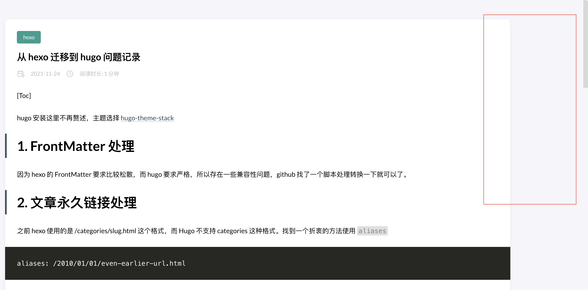

+++
author = "Lucas Huang"
date = '2025-04-20T16:52:22+08:00'
title = "Fixing the Issue of Missing TOC in Hugo Posts"
# description = "This article demonstrates how to deploy a Hugo web application to Azure Static Web Apps"
categories = [
    "Personal Blog"
]
tags = [
    "Hugo",
    "Stack Theme"
]
draft = false
+++

This post documents the troubleshooting and resolution process for an issue with the Table of Contents (TOC) in Hugo when using the Stack Theme. Occasionally, the TOC may not display at all or only show part of the headings. I hope this guide can help others facing similar issues.

# Background

While building a site with Hugo using the Stack Theme, I encountered a problem where the TOC of some posts did not appear. Although the local Markdown file displayed all the headings correctly, once the content was published online, the TOC was either empty or incomplete.

Below are examples from the official issue:



# Resolution

The root cause of this issue is that the Stack Theme is configured by default to generate the TOC starting from level 2 headings (##), thereby omitting level 1 headings (#). To fix this issue, follow these steps:

1. In your configuration file (e.g., config.yaml), locate the following setting and change the value of startLevel to 1:
    ```yaml
    markup:
      tableOfContents:
        startLevel: 1 # The default is 2; change it to 1
    ```
2. Ensure that the TOC feature is enabled:
    ```yaml
    article:
      toc: true
    ```

3. Save your changes and regenerate the site. The TOC should now display all levels of headings as expected.

# Lessons Learned

- The Stack Theme's TOC is configured by default to display only level 2 and lower headings. If your Markdown uses a level 1 heading (#) as the main title, be sure to set startLevel to 1.
- This issue and its solution were originally discussed in detail at: [Github Issue #424](https://github.com/CaiJimmy/hugo-theme-stack/issues/424)