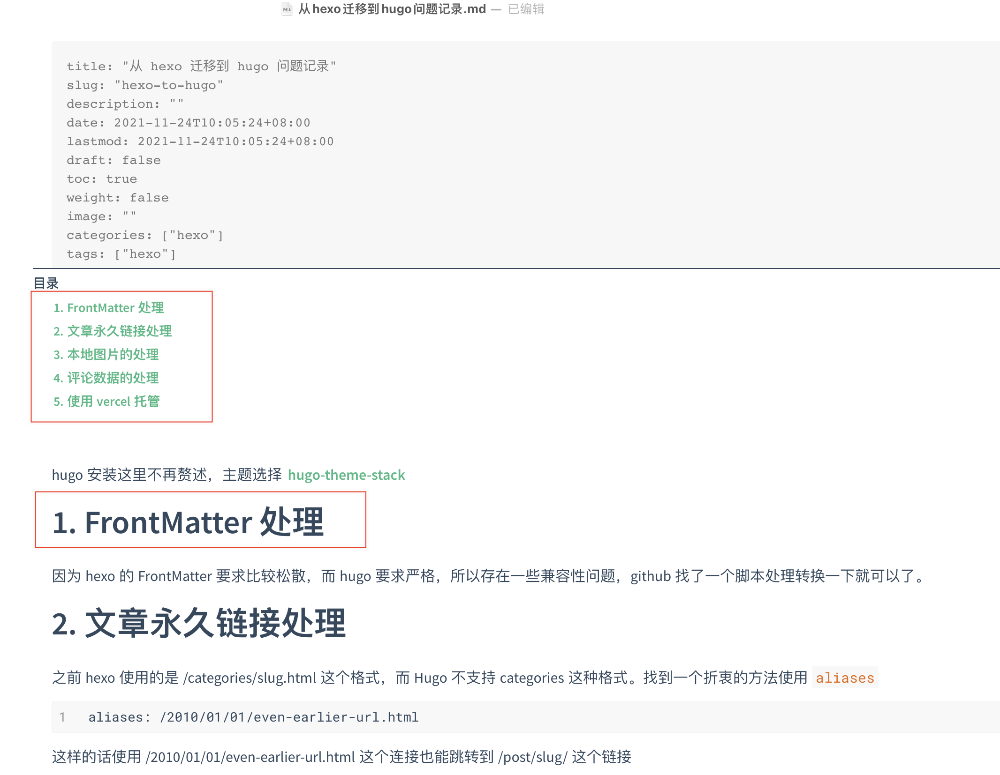
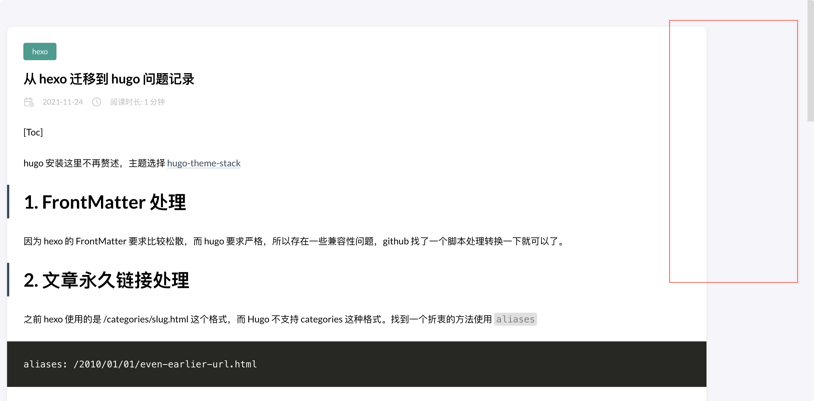

+++
author = "Lucas Huang"
date = '2025-04-20T16:52:22+08:00'
title = "解决Hugo文章目录不显示"
# description = "This article demonstrates how to deploy a Hugo web application to Azure Static Web Apps"
categories = [
    "个人博客"
]
tags = [
    "Hugo",
    "Stack主题"
]
draft = false
+++

记录一次 Hugo + Stack Theme 在使用过程中关于文章目录（TOC）不显示或只显示部分标题的问题排查与解决，供碰到类似问题的同学参考。

## 问题背景

在采用 Hugo 的 Stack 主题建站时，我遇到了一些文章的 TOC 目录不显示。本地 Markdown 可正常显示所有标题，但发布上线后 TOC 栏目为空或者不完整。

官方 issue 中的示例：




## 解决方法
这个问题的根本原因在于 Stack 主题默认仅从二级标题（##）开始生成目录，而一级标题（#）会被省略。以下为解决步骤：
1. 在 `config.yaml` 或配置文件中找到如下设置，并将 `startLevel` 修改为1：：
    ```yaml
    markup:
      tableOfContents:
        startLevel: 1 # 默认是2，需改为1
    ```
2. 并确保已启用 TOC 功能：
    ```yaml
    article:
      toc: true
    ```

3. 修改后保存并重新生成站点，TOC 就会按预期显示所有级别的标题。

## 经验总结

- Stack 主题 TOC 默认只显示二级及以上标题，若 Markdown 特别用了 # 作为内容主标题，需将 `startLevel` 设为1。
- 本问题及解决方案原始讨论见：[Github Issue #424](https://github.com/CaiJimmy/hugo-theme-stack/issues/424)

