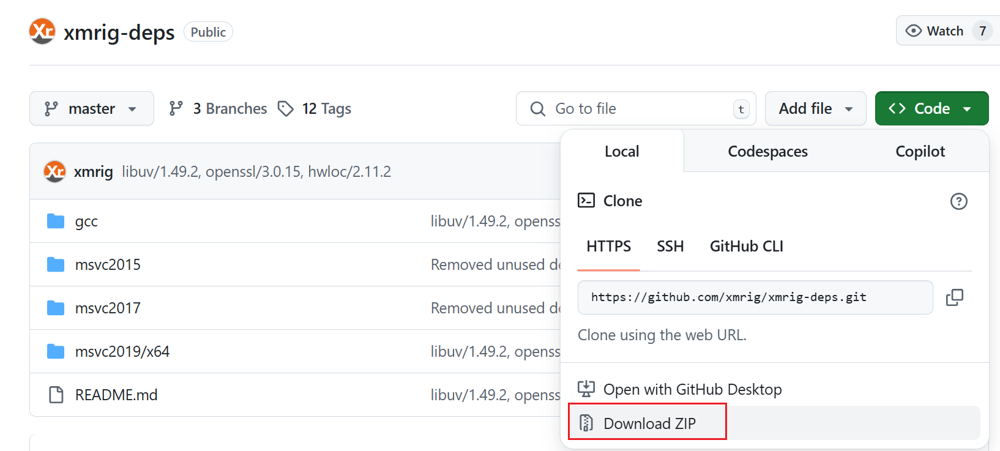
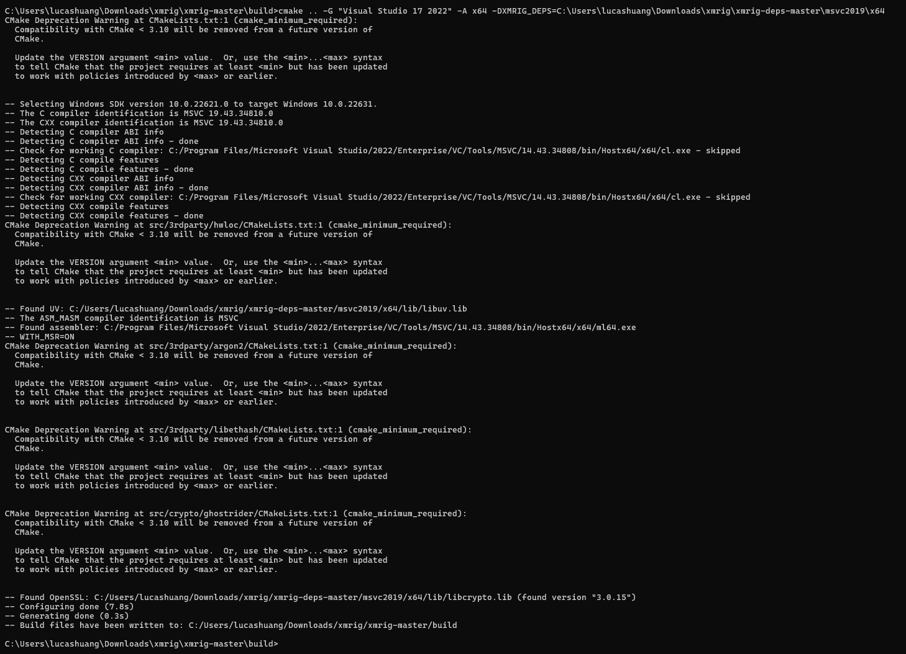
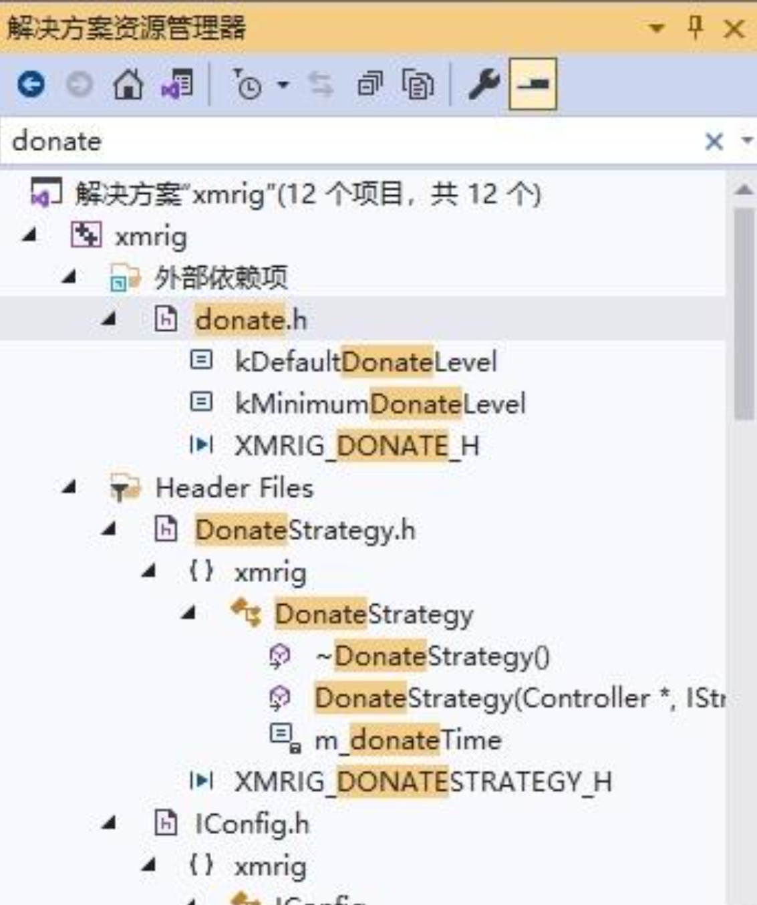
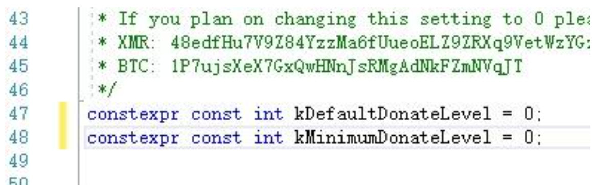
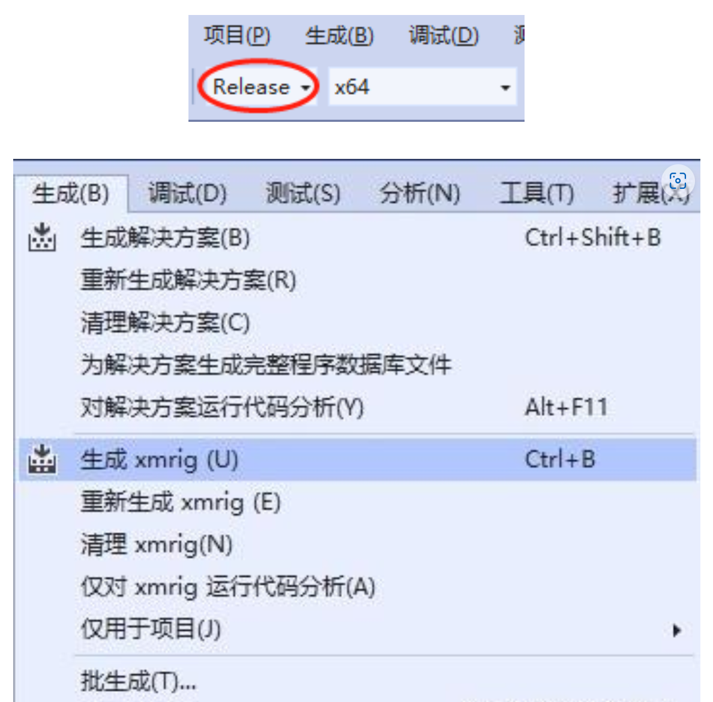
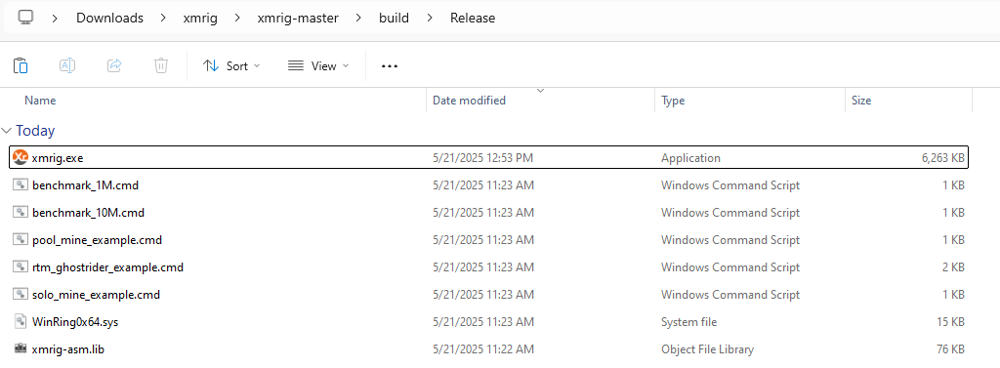
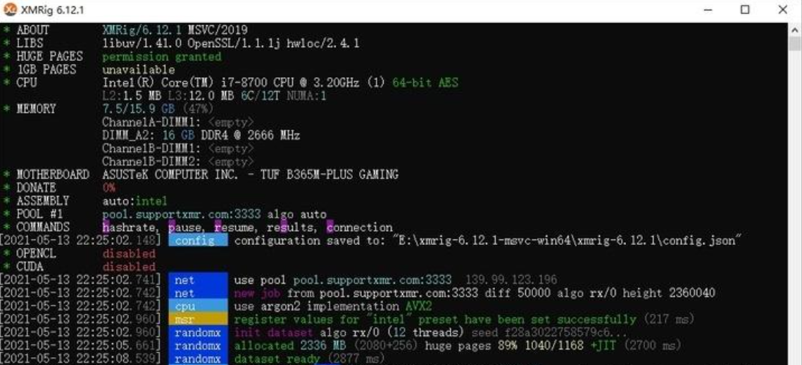

+++
author = "Lucas Huang"
date = '2025-05-21T10:49:22+08:00'
title = "Compiling XMRig from Source to Remove Developer Donation"
# description = "This article demonstrates how to deploy a Hugo web application to Azure Static Web Apps"
categories = [
    "Crypto",
    "Crypto Mining"
]
tags = [
    "Menoro",
    "XMrig"
    
]
image = "cover.png"
# draft = true
+++
Below is a step-by-step guide on how to compile XMRig from source code to remove the developer donation. By setting your donation level to 0, you can mine without contributing the default fee to XMRig’s developers.


## Prerequisites

- Visual Studio 2022  
- [CMake](https://cmake.org/download/)
- XMRig dependency package ([xmrig-deps](https://github.com/xmrig/xmrig-deps))  
- XMRig source code ([Download xmrig source](https://github.com/xmrig/xmrig/releases))

After downloading, it’s recommended to extract the source code and the dependency package into well-organized folders to keep everything tidy.




## Generating the .sln File

1. Create a new “build” folder in the extracted XMRig folder. For example:
   ```
   C:\Users\lucashuang\Downloads\xmrig\xmrig-master\build
   ```

2. Open the command prompt (cmd) and navigate to that directory:
   ```
   cd "C:\Users\lucashuang\Downloads\xmrig\xmrig-master\build"
   ```

3. According to the README instructions in xmrig-deps, run the following command (replace “DXMRIG_DEPS” with the actual path to your extracted xmrig-deps):
   ```
   cmake .. -G "Visual Studio 17 2022" -A x64 -DXMRIG_DEPS=c:\xmrig-deps\msvc2019\x64
   ```
   

4. After running the command, an xmrig.sln file will be generated in the “build” folder. You can then use this file to compile the project.


## Editing the Source Code in Visual Studio 2022

1. Open “xmrig.sln” in VS2022. In the Solution Explorer panel on the right, search for “donate” and locate the file donate.h.  
   

2. In donate.h, set both the default donation level and the minimum donation level to 0. This will effectively disable the developer donation.  
   

3. Switch to “Release” mode in the dropdown at the top, then go to the menu bar and select Build → Build Solution to compile.  
   

4. Upon successful compilation, you’ll find the newly generated xmrig.exe file in the build\Release folder.  
   


## Replacing the Old File and Testing

1. Replace the old xmrig.exe you used previously with the newly compiled xmrig.exe.  
2. In config.json, set "donate-level" to 0. Also double-check that your “wallet address” and “pool address” are configured correctly.  
3. Run xmrig.exe. If you see the DONATE level in red showing 0%, you’ve successfully removed the developer donation.  
   

---

You’ve now successfully compiled XMRig from source with the donation completely removed. Enjoy your mining!!