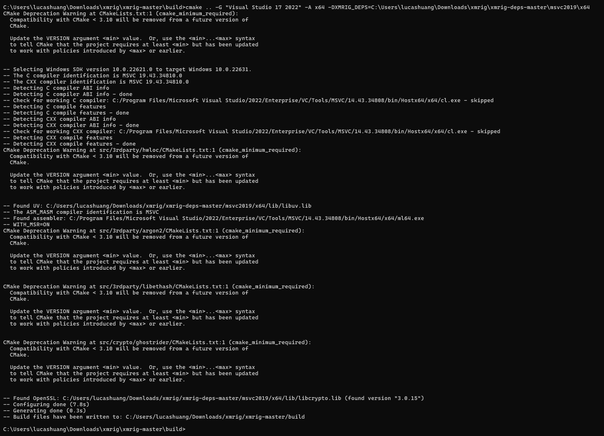
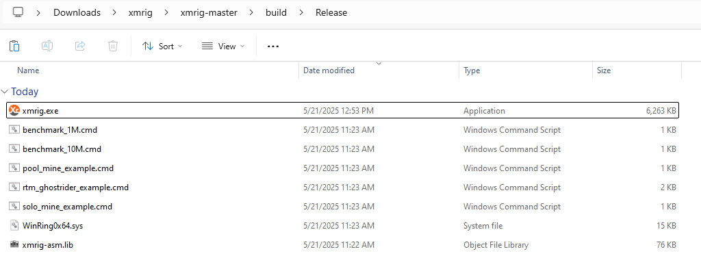
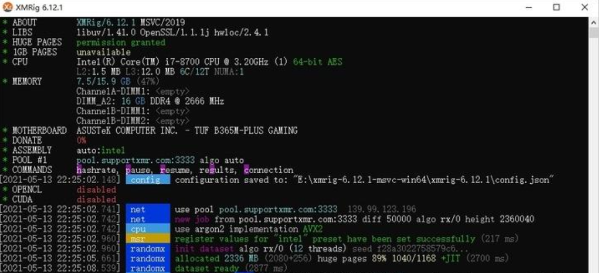

+++
author = "Lucas Huang"
date = '2025-05-21T10:49:22+08:00'
title = "自编译源代码去除XMRig抽水"
# description = "This article demonstrates how to deploy a Hugo web application to Azure Static Web Apps"
categories = [
    "虚拟货币"
]
tags = [
    "门罗币",
    "XMrig",
    "挖矿"
]
image = "cover.png"
# draft = true
+++
## 一、准备工具

- Visual Studio 2022  
- [CMake](https://cmake.org/download/)
- XMRig 依赖包（[xmrig-deps](https://github.com/xmrig/xmrig-deps)）  
- XMRig 源码（[xmrig 源码下载](https://github.com/xmrig/xmrig/releases)）  

下载完后，建议将源码和依赖包分别解压到合理的位置，便于后续操作。  


## 二、生成 .sln 工程文件

1. 在解压后的 XMRig 文件夹中，新建一个 build 文件夹。示例路径：  
   ```
   C:\Users\lucashuang\Downloads\xmrig\xmrig-master\build
   ```

2. 打开命令行（cmd），定位到该目录：  
   ```
   cd "C:\Users\lucashuang\Downloads\xmrig\xmrig-master\build"
   ```

3. 根据 xmrig-deps-masters 中的 README 提示，执行以下命令（请自行替换 “DXMRIG_DEPS” 参数至你实际的解压路径）：  
   ```
   cmake .. -G "Visual Studio 17 2022" -A x64 -DXMRIG_DEPS=c:\xmrig-deps\msvc2019\x64
   ```
   

4. 执行完毕后，build 文件夹内会生成 xmrig.sln 文件。随后可在此基础上编译项目。


## 三、使用 VS2022 编辑源码

1. 用 VS2022 打开 “xmrig.sln”，在右侧的解决方案资源管理器中搜索 “donate”。找到并打开 donate.h 文件。  
   

2. 将官方写死的默认捐献比例和最低捐献比例全部设为 0，即可让抽水完全变为 0。  
   

3. 切换到 Release 模式，然后在菜单栏中选择 Build -> Build Solution，开始编译。  
   

4. 编译成功后，在 build\Release 文件夹中可以找到新生成的 xmrig.exe。  
   


## 四、替换文件并测试

1. 将编译好的 xmrig.exe 替换你之前使用的旧版本。  
2. 在 config.json 中设置 "donate-level" 为 0，并确认“钱包地址”和“矿池地址”已正确配置。  
3. 打开 xmrig.exe，如果 DONATE 显示为红色的 0%，说明成功去除了抽水。  
   

---

至此，你就实现了通过修改源码彻底去除 XMRig 抽水。祝挖矿愉快！ 