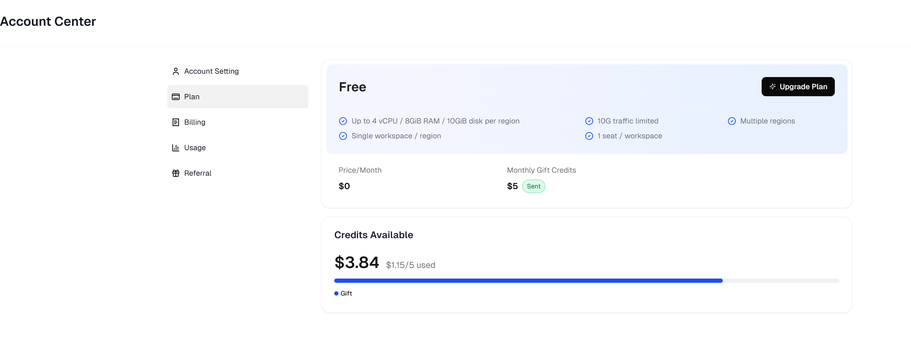

+++
author = "Lucas Huang"
date = '2025-05-06T13:52:22+08:00'
title = "Permanently Free Containers! No Credit Card Needed! Best Choice for Website Hosting and AI Deployment (Lobe-Chat)"
# description = "This article demonstrates how to deploy a Hugo web application to Azure Static Web Apps"
categories = [
    "Free Resources"
]
tags = [
    "ClawCloud",
    "Container"
]
image = "claw-cloud-free-register.png"
# draft = true
+++

# Background

First, let me introduce ClawCloud, a cloud service launched by Alibaba in Singapore. ClawCloud's *Claw Cloud Run* has recently gone live. This is an online development platform similar to Vercel and Netlify, designed for developers and individual users. With Claw Cloud Run, users can quickly deploy all kinds of popular applications and open-source projects, such as Alist, Dify, frp, and more, all without complicated configurations or high costs. Currently, **the platform offers a permanently free $5 per month credit**—all you need is a GitHub account that has been registered for over 180 days.

# How to Get a Free Container

1. Register with this link: [https://console.run.claw.cloud/signin](https://console.run.claw.cloud/signin?link=M9LO08K7ZTR3)

   

2. During your first registration, you’ll be asked to set a region and workspace name. You can choose Japan or Singapore for faster access. In my tests, the Japan region can be directly accessed from mainland China!

3. Once your workspace is created, you can start creating containers! Click on **App Launchpad**.
   

4. Click **Create App** to spin up a new container.

   

5. Name your app. Most importantly, in the **Image Name** field, you can enter any image from DockerHub. Here, I’ll use the popular *Lobe-Chat* as an example.  
   Meanwhile, you can freely adjust the CPU and memory as needed. Since you get $5 credit per month, just ensure the **Total** cost on the left stays at $0.16 (per day) or less. This way, your monthly expenditure will be about $4.8 and will not exceed the $5 free quota—meaning it’ll be permanently free!

   

6. Finally, click **Create**, and you’ll see your container up and running!

   

Just a final reminder to keep an eye on your quota! The $5/month may not sound like a lot, but it's enough to test various applications. Have fun exploring!

