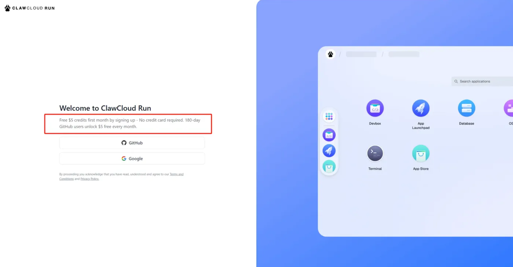
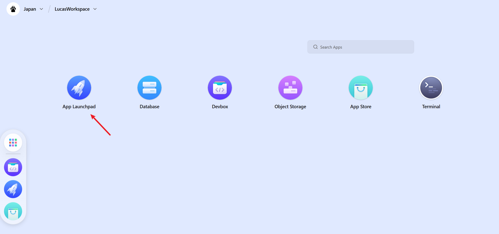

+++
author = "Lucas Huang"
date = '2025-05-06T13:52:22+08:00'
title = "永久免费的容器！4核 CPU、8G内存、10G网络！无需信用卡！搭建网站、部署AI (Lobe-Chat) 首选"
# description = "This article demonstrates how to deploy a Hugo web application to Azure Static Web Apps"
categories = [
    "免费资源"
]
tags = [
    "爪云",
    "容器"
]
image = "claw-cloud-free-register.png"
# draft = true
+++

## 背景
首先介绍一下ClawCloud，这是阿里在新加坡推出的云服务 Claw Cloud旗下的 Claw Cloud Run 近日正式上线，这是一款类似于 Vercel 和 Netlify 的在线开发平台，专为开发者和个人用户设计。通过 Claw Cloud Run，用户可以快速部署各种流行的应用程序和开源项目，如 Alist、Dify、frp 等，无需复杂的配置或高昂的成本。目前，**平台提供永久免费的 5 刀/月额度**，只需绑定一个注册超过 180 天的 GitHub 账号即可享受。

## 免费容器获取
1. 注册链接如下：[https://console.run.claw.cloud/signin](https://console.run.claw.cloud/signin?link=M9LO08K7ZTR3)

   

2. 第一次注册会要求你设置地区还有工作区的名称。我们可以选择日本或者新加坡，访问速度较快。实测日本可以国内直连！

3. 工作区创建完成后，我们就可以创建容器了！这里点击App Lauchpad
   

4. 点击Create App来新建一个新的容器。

   

5. 我们给应用去一个名称，随后重要的是Image Name这边，可以填入任意的DockerHub上的镜像。我们这边用当下比较火的Lobe-Chat来举例。
同时，我们可以自由调整所需要使用的CPU和内存。因为我们每个月有5$的免费额度，我们只需要把左侧的Total控制在0.16$即可。这样每个月的花费在4.8$， 不会超过赠送的5$，也就是永久免费！

   

6. 最后我们点击创建，即可看到容器已经成功创建并运行！

   

最后要提醒大家控制好额度使用哦！毕竟每个月只有5$，虽说不多，但是用来测试一些应用已经是足够了~ 祝大家玩的愉快！

