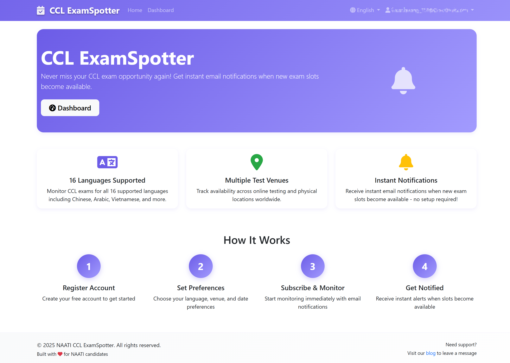
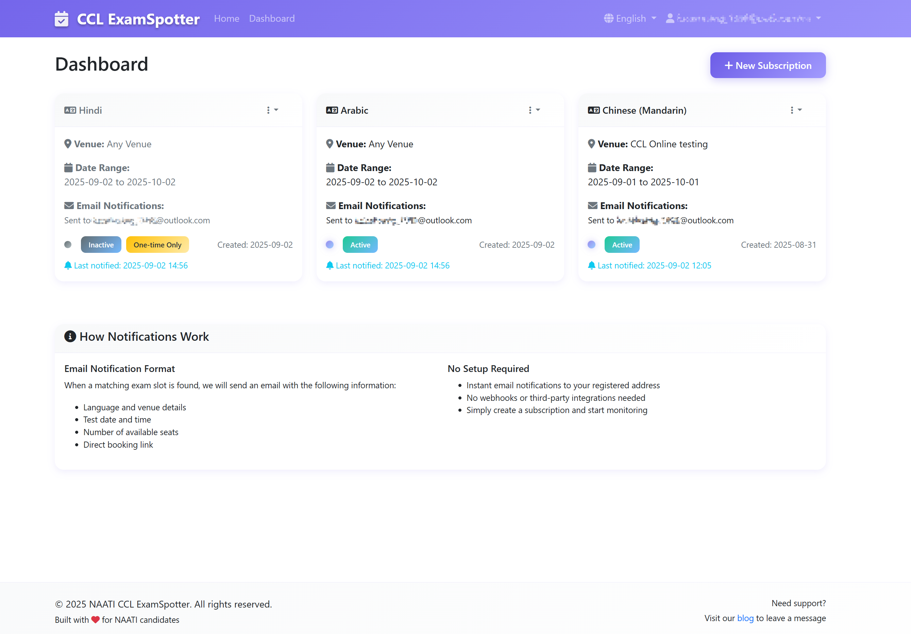

+++ 
author = "Lucas Huang"  
date = '2025-09-02T14:00:00+08:00'  
title = "NAATI CCL ExamSpotter – Your Personal Exam-Slot Monitoring Assistant"  
categories = [
    "Other Tech"
]  
tags = [
    "NAATI CCL",
    "ExamSpotter"
]  
image = "cover.png"  
# draft = true  
+++

## 🌟 Why Choose ExamSpotter?

Still battling to secure a NAATI CCL test slot? Worried you’ll get stuck in the question-bank rotation and be unable to reschedule?

ExamSpotter is an intelligent monitoring service created specifically for CCL candidates, helping you effortlessly find the session that suits you best!

### ✨ Core Highlights

- **🔔 Real-Time Smart Alerts** – The moment a slot appears, you’ll get an email  
- **🎯 Precisely Tailored Subscriptions** – Filter by language, city, date and more  
- **🚫 Zero Spam** – Emails only when seats are truly available  
- **📱 Cross-Platform** – Smooth on both mobile and desktop

## 🎉 Free Service, Powered by Passion!

### 💖 A Note from the Developer: Why Free?

ExamSpotter is completely free for every user! As a former CCL candidate, I know how painful it is to want an early exam but find nothing for three months.

The goal is simple: let technology brighten life and share warmth through code. Each success story from a user is my biggest encouragement.

May this little tool help more people finish the CCL exam and chase their immigration dreams.

A love-powered project:
- ❤️ **Absolutely Free** – No hidden fees for basic functions  
- 🤝 **Community Service** – Built for CCL candidates  
- 🔧 **Continuously Maintained** – Improved in my spare time  

## 🌍 Access Our Service

### 🔗 Official Links

- **🏠 ExamSpotter Main Site**: [ccl.examspotter.com](https://ccl.examspotter.com)  
- **📝 Blog & Contact**: [blogs.lucaslifes.com](https://blogs.lucaslifes.com)

### 🎯 Three Steps to Get Started

1. **Sign Up** – Register with your email  
2. **Create a Subscription** – Set your monitoring criteria  
3. **Wait for Alerts** – Sit back while seat notices arrive in your inbox!

## 🚀 Feature Details
### 🎯 Smart Subscription System

Configure monitoring exactly the way you want:
- **Language Selection** – All NAATI CCL languages supported  
- **Test-Centre Filters** – Target a specific centre or all centres  
- **Date Range** – Decide when monitoring starts and ends  
- **Notification Modes**  
  - 🔄 **Continuous** – Receive alerts for every update  
  - 1️⃣ **One-time** – Auto-pause after the first alert  

### 📊 Personal Dashboard

Manage everything at a glance:
- 📋 View the status of all subscriptions  
- ✏️ Edit criteria anytime  
- ⏸️ Pause/Resume monitoring with one click  
- 🗑️ Delete unneeded subscriptions  
- 📅 Track the last alert time  

## 📧 Thoughtful Email Notifications

### 💌 Professional Email Design

Every alert email includes:
- **🎯 Session Details** – Language, date, time—all clear  
- **📍 Venue Info** – Full address and map link  
- **💺 Available Seats** – Exact number of spots open  
- **🔗 Book Now** – One click to NAATI’s site  
- **📱 Mobile Friendly** – Perfect on any phone  

### 🛡️ Smart Filtering

Making sure every email is worthwhile:
- ✅ Sent only when a slot changes from unavailable to available  
- ✅ Strictly follows your subscription rules  
- ✅ Skips full or expired sessions  

## ❤️ Support & Feedback

### 🤝 How to Support the Project

Though the service is entirely free, you can help by:
- 📢 **Sharing** – Let more people discover the service
- 💌 **Sending Feedback** – Help us improve  
- ⭐ **Leaving a Review** – Your praise is our driving force  
- 🔄 **Donating** – Every bit of support you provide will be devoted to continually enhancing our services.
  

## 🏆 User Praise & Success Stories
### 💬 User Feedback

> “With ExamSpotter I finally grabbed a slot! I used to refresh the site all day—now I can focus on other things.” – Zhang  

> “Clean interface, easy setup, and timely alerts. Highly recommend to anyone taking CCL!” – Ms. Li  

> “Free and so useful—huge thanks to the developer!” – Mr. Wang  

## 📞 Contact Us

- **💻 Technical Issues / Suggestions** – Please leave a comment below

## 🎊 Special Thanks

Thank you to everyone who uses ExamSpotter! Your support and feedback keep the project growing. I hope this little tool helps more candidates pass the CCL exam and begin a wonderful life in Australia.

May each of you find your own piece of sky in Australia! 🌅