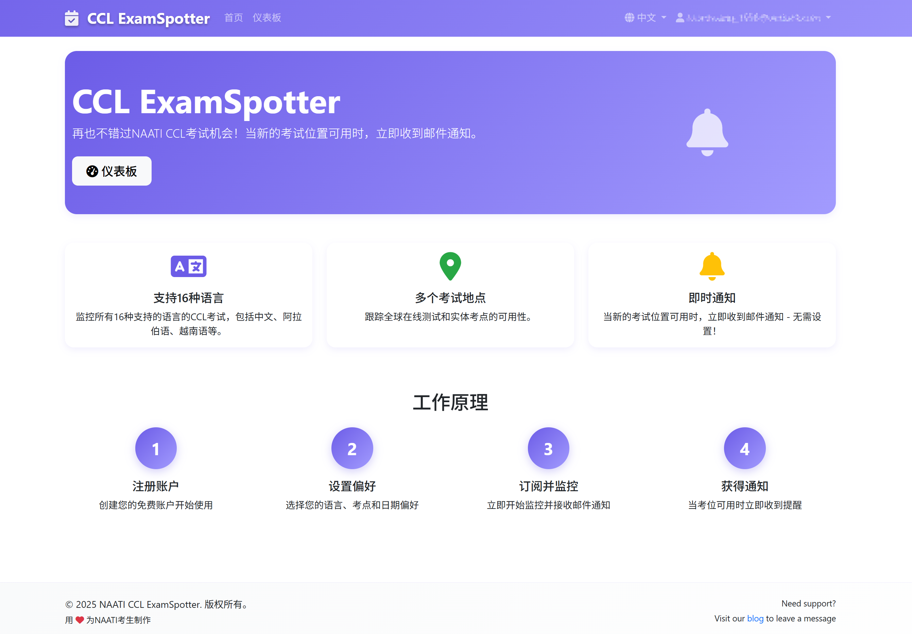
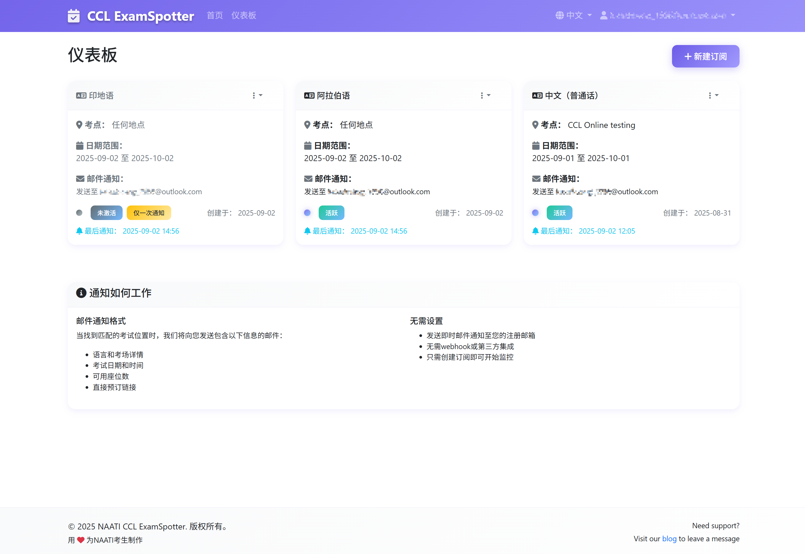
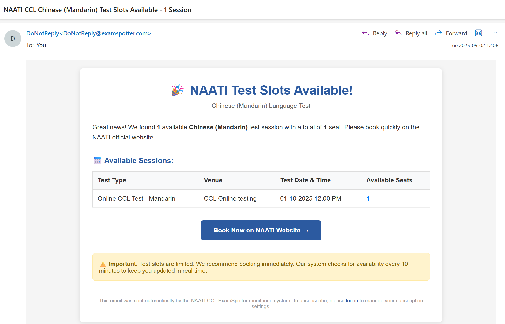

+++ 
author = "Lucas Huang"  
date = '2025-09-02T14:00:00+08:00'  
title = "NAATI CCL ExamSpotter - 您的专属考试位置监控助手"  
categories = [
    "Other Tech"
]  
tags = [
    "NAATI CCL",
    "ExamSpotter"
]  
image = "cover.png"  
# draft = true  
+++

## 🌟 为什么选择ExamSpotter？

还在为抢不到NAATI CCL考试位置而烦恼吗？还在担心遇上换题季而无法改约考试时间吗？

ExamSpotter是专为CCL考生打造的智能考试监控服务，让您轻松找到心宜的考试时间！

### ✨ 核心服务亮点

- **🔔 实时智能通知** - 可用考试位置一出现，立即邮件通知您
- **🎯 精准匹配订阅** - 按您的语言、地点、时间需求定制监控  
- **🚫 零垃圾邮件** - 只在真正有位置时才通知，绝不打扰
- **📱 全平台支持** - 手机、电脑都能轻松使用

## 🎉 免费服务，用爱发电！

### 💖 开发者寄语: 为什么免费？

ExamSpotter完全免费为所有用户提供服务！作为一名曾经的CCL考生，我深知考试预约的困难，想要尽快考试但是只能预约到三个月后的位置的痛苦谁懂啊！

开发ExamSpotter的初衷很简单：让技术服务于生活，用代码传递温暖。每当收到用户成功预约的反馈，都是对我最大的鼓励。

希望通过这个小工具，让更多朋友能顺利完成CCL考试，实现移民梦想。

这是一个用爱发电的项目：
- ❤️ **完全免费** - 基础功能无任何收费
- 🤝 **服务社区** - 专为CCL考生群体服务
- 🔧 **持续维护** - 业余时间持续更新优化

## 🌍 访问我们的服务

### 🔗 官方链接

- **🏠 ExamSpotter主站**: [ccl.examspotter.com](https://ccl.examspotter.com)
- **📝 博客&联系我们**: [blogs.lucaslifes.com](https://blogs.lucaslifes.com)

### 🎯 开始使用三步骤

1. **注册账户** - 访问网站，填写邮箱密码
2. **创建订阅** - 设置您的监控条件
3. **等待通知** - 坐等考位信息发送到邮箱！

## 🚀 服务功能详解
### 🎯 智能订阅系统

**灵活配置您的监控需求：**
- **考试语言选择** - 支持所有NAATI CCL语言
- **考场位置筛选** - 可选特定考场或不限考场
- **时间范围设定** - 自定义监控开始和结束日期
- **通知模式选择**：
  - 🔄 **持续通知** - 监控期间持续接收位置更新
  - 1️⃣ **一次通知** - 收到一次通知后自动暂停，避免重复

### 📊 个人仪表板

**一目了然管理所有订阅：**
- 📋 查看所有监控订阅状态
- ✏️ 随时编辑订阅条件
- ⏸️ 灵活暂停/恢复监控
- 🗑️ 方便删除不需要的订阅
- 📅 追踪最后通知时间

## 📧 贴心的邮件通知服务

### 💌 专业邮件设计

收到的通知邮件包含所有您需要的信息：
- **🎯 考试详情** - 语言、场次、时间一目了然
- **📍 考场信息** - 详细地址和位置
- **💺 座位数量** - 准确的可预约位置数
- **🔗 直接预约** - 点击即可跳转NAATI官网
- **📱 移动友好** - 手机邮箱完美显示

### 🛡️ 智能过滤机制

**确保每封邮件都有价值：**
- ✅ 只在位置从无到有时通知
- ✅ 严格按您的订阅条件筛选
- ✅ 自动跳过已满或已结束的考试

## ❤️ 支持与反馈

### 🤝 如何支持项目

虽然服务完全免费，但您可以通过以下方式支持项目：
- 📢 **分享推荐** - 告诉朋友们这个好用的工具
- 💌 **反馈建议** - 帮助我们改进服务
- ⭐ **好评鼓励** - 您的认可是最大的动力
- 🔄 **爱心捐赠** - 您所给予的每一份支持，都将用于持续优化我们的服务

## 🏆 用户好评与成功案例
### 💬 用户反馈

> "用了ExamSpotter后终于抢到位置了！以前要一直刷网页，现在可以安心做别的事情。" - 张同学

> "界面很友好，设置很简单，通知也很及时。推荐给所有要考CCL的朋友！" - 李女士

> "免费还这么好用，真的很感谢开发者！" - 王先生

## 📞 联系我们

- **💻 技术问题/改进建议** - 请在下方评论区留言

## 🎊 特别致谢

感谢所有使用ExamSpotter的朋友们！您们的支持和反馈让这个项目越来越好。希望这个小工具能帮助更多朋友顺利通过CCL考试，实现在澳洲的美好生活！

**愿每一位朋友都能在澳洲找到属于自己的那片天空！** 🌅
